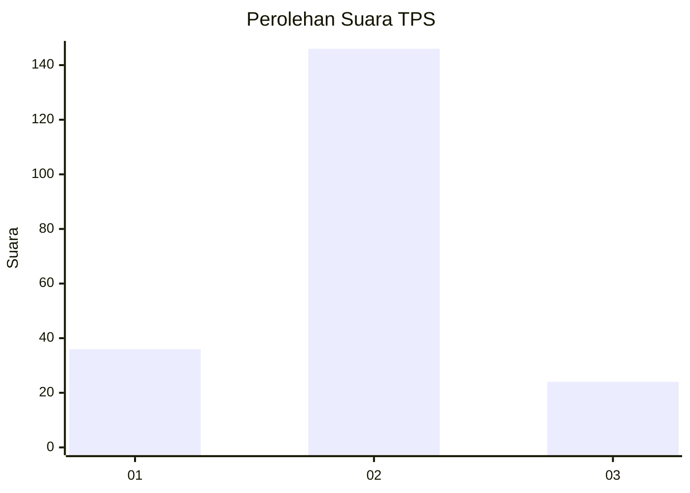
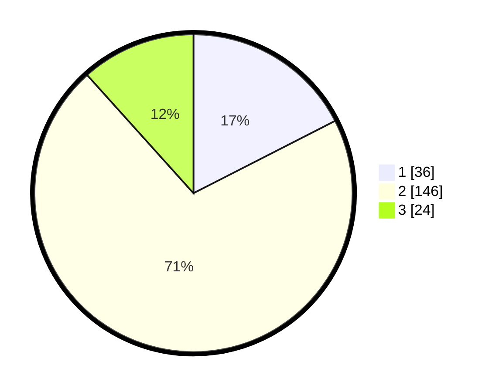

# Hasil

## Grafik

## Tabel

| No. | Nama Paslon    | Suara | Suara (raw) | Persentase |
|:--- |:-------------- | -----:| -----------:| ----------:|
| 1   | ANIES MUHAIMIN | 36    | [36][p-1]   | 17,48      |
| 2   | PRABOWO GIBRAN | 146   | [146][p-2]  | 70,87      |
| 3   | GANJAR MAHFUD  | 24    | [24][p-3]   | 11,65      |

[p-1]: https://github.com/gigit-pemilu/pemilu-2024-35-jawa-timur/blob/main/pilpres/hitung-suara/sub/35-jawa-timur/sub/07-malang/sub/24-singosari/sub/2007-langlang/sub/001-tps/sub/paslon-1.txt
[p-2]: https://github.com/gigit-pemilu/pemilu-2024-35-jawa-timur/blob/main/pilpres/hitung-suara/sub/35-jawa-timur/sub/07-malang/sub/24-singosari/sub/2007-langlang/sub/001-tps/sub/paslon-2.txt
[p-3]: https://github.com/gigit-pemilu/pemilu-2024-35-jawa-timur/blob/main/pilpres/hitung-suara/sub/35-jawa-timur/sub/07-malang/sub/24-singosari/sub/2007-langlang/sub/001-tps/sub/paslon-3.txt

## Foto C Plano

https://sirekap-obj-formc.kpu.go.id/ad5e/pemilu/ppwp/35/07/24/20/07/3507242007001-20240215-005055--228c2563-29e1-4f54-bd5f-658e4de75094.jpg

https://sirekap-obj-formc.kpu.go.id/ad5e/pemilu/ppwp/35/07/24/20/07/3507242007001-20240215-005352--7d8e3736-fd3c-47c9-a0d3-9128a76bf7ee.jpg

https://sirekap-obj-formc.kpu.go.id/ad5e/pemilu/ppwp/35/07/24/20/07/3507242007001-20240215-005643--567917f3-3853-442d-999c-748200563aed.jpg

## Metadata

| Key        | Value               |
| ---------- | ------------------- |
| Time Stamp | 2024-02-15 18:30:25 |

