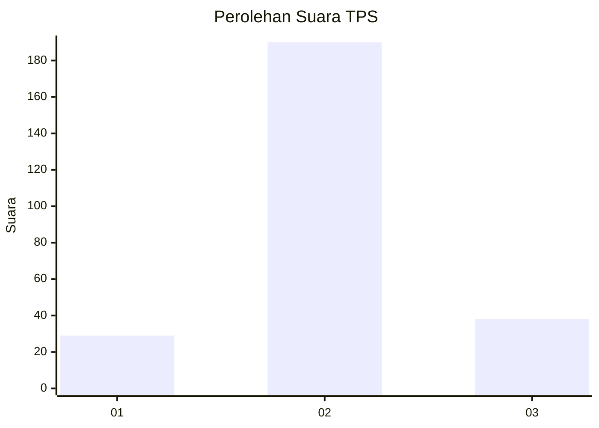
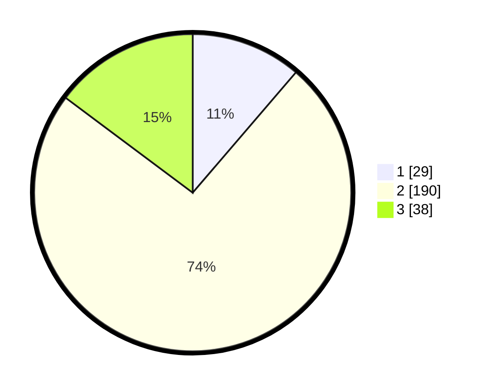

# Hasil

## Grafik

## Tabel

| No. | Nama Paslon    | Suara | Suara (raw) | Persentase |
|:--- |:-------------- | -----:| -----------:| ----------:|
| 1   | ANIES MUHAIMIN | 29    | [29][p-1]   | 11,28      |
| 2   | PRABOWO GIBRAN | 190   | [190][p-2]  | 73,93      |
| 3   | GANJAR MAHFUD  | 38    | [38][p-3]   | 14,79      |

[p-1]: https://github.com/gigit-pemilu/pemilu-2024/blob/main/pilpres/hitung-suara/sub/35-jawa-timur/sub/07-malang/sub/24-singosari/sub/2007-langlang/sub/009-tps/sub/paslon-1.txt
[p-2]: https://github.com/gigit-pemilu/pemilu-2024/blob/main/pilpres/hitung-suara/sub/35-jawa-timur/sub/07-malang/sub/24-singosari/sub/2007-langlang/sub/009-tps/sub/paslon-2.txt
[p-3]: https://github.com/gigit-pemilu/pemilu-2024/blob/main/pilpres/hitung-suara/sub/35-jawa-timur/sub/07-malang/sub/24-singosari/sub/2007-langlang/sub/009-tps/sub/paslon-3.txt

## Foto C Plano

https://sirekap-obj-formc.kpu.go.id/f71d/pemilu/ppwp/35/07/24/20/07/3507242007009-20240215-025934--e2c8e760-c22d-4578-bcc9-9c23af298bca.jpg

https://sirekap-obj-formc.kpu.go.id/f71d/pemilu/ppwp/35/07/24/20/07/3507242007009-20240215-200742--6e960397-7652-4f23-abfc-538e77692d90.jpg

https://sirekap-obj-formc.kpu.go.id/f71d/pemilu/ppwp/35/07/24/20/07/3507242007009-20240215-030144--654d5406-1e2e-4fc9-a32e-e01200574f39.jpg

## Metadata

| Key        | Value               |
| ---------- | ------------------- |
| Time Stamp | 2024-02-24 22:31:28 |

