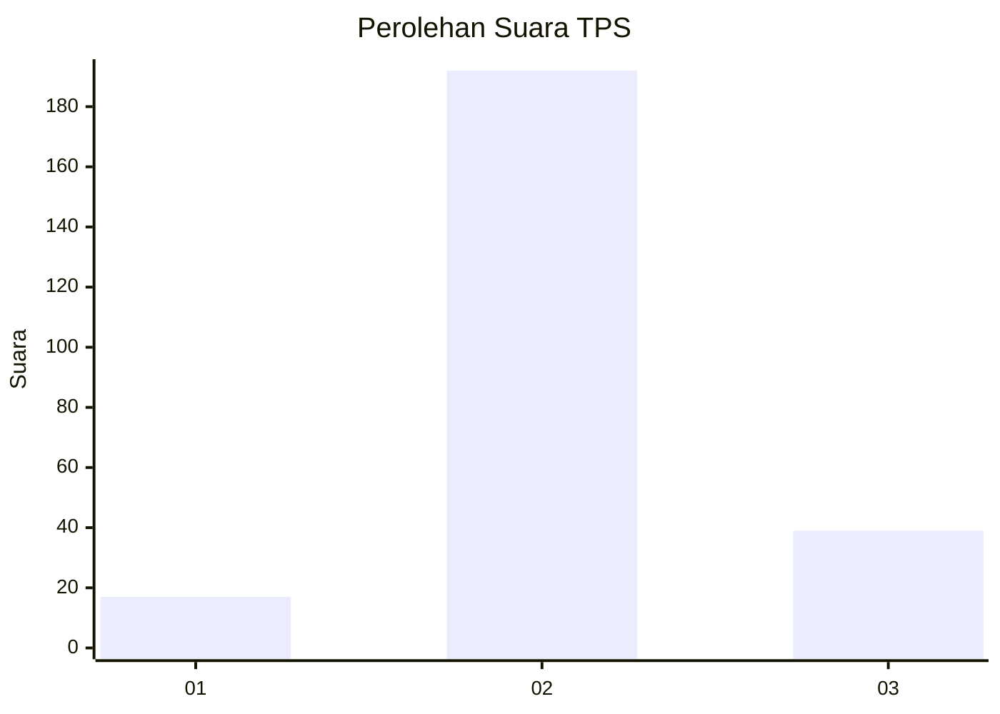
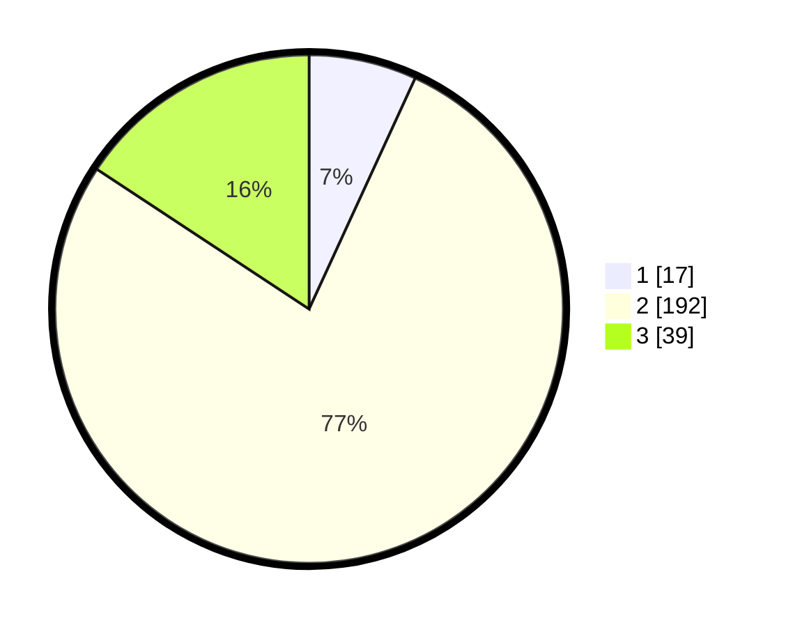

# Hasil

## Grafik

## Tabel

| No. | Nama Paslon    | Suara | Suara (raw) | Persentase |
|:--- |:-------------- | -----:| -----------:| ----------:|
| 1   | ANIES MUHAIMIN | 17    | [17][p-1]   | 6,85       |
| 2   | PRABOWO GIBRAN | 192   | [192][p-2]  | 77,42      |
| 3   | GANJAR MAHFUD  | 39    | [39][p-3]   | 15,73      |

[p-1]: https://github.com/gigit-pemilu/pemilu-2024-35-jawa-timur/blob/main/pilpres/hitung-suara/sub/35-jawa-timur/sub/07-malang/sub/24-singosari/sub/2007-langlang/sub/016-tps/sub/paslon-1.txt
[p-2]: https://github.com/gigit-pemilu/pemilu-2024-35-jawa-timur/blob/main/pilpres/hitung-suara/sub/35-jawa-timur/sub/07-malang/sub/24-singosari/sub/2007-langlang/sub/016-tps/sub/paslon-2.txt
[p-3]: https://github.com/gigit-pemilu/pemilu-2024-35-jawa-timur/blob/main/pilpres/hitung-suara/sub/35-jawa-timur/sub/07-malang/sub/24-singosari/sub/2007-langlang/sub/016-tps/sub/paslon-3.txt

## Foto C Plano

https://sirekap-obj-formc.kpu.go.id/1bf2/pemilu/ppwp/35/07/24/20/07/3507242007016-20240216-212959--356db0d5-1f2b-4519-8983-f750f167c2e8.jpg

https://sirekap-obj-formc.kpu.go.id/1bf2/pemilu/ppwp/35/07/24/20/07/3507242007016-20240216-232240--75a1aa68-ddf9-42fa-a353-c549ed227029.jpg

https://sirekap-obj-formc.kpu.go.id/1bf2/pemilu/ppwp/35/07/24/20/07/3507242007016-20240217-112633--7b0af600-8558-49a0-94e8-7676b424f75d.jpg

## Metadata

| Key        | Value               |
| ---------- | ------------------- |
| Time Stamp | 2024-02-26 17:00:04 |

