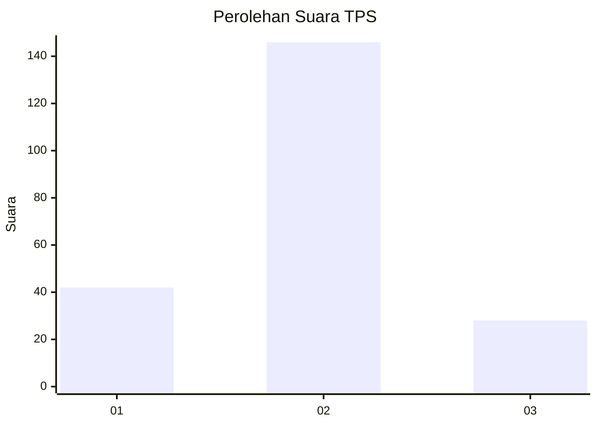
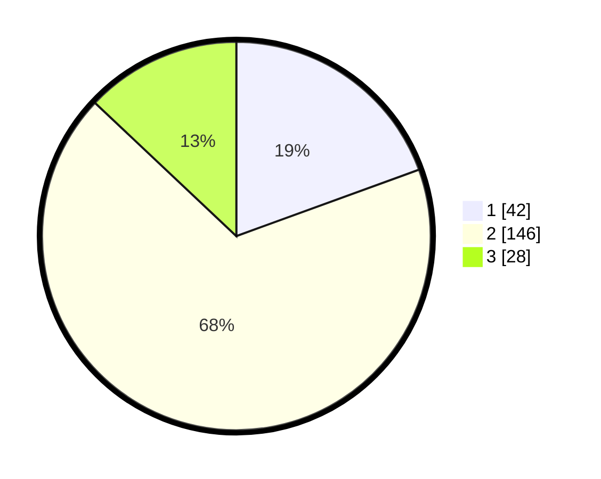

# Hasil

## Grafik

## Tabel

| No. | Nama Paslon    | Suara | Suara (raw) | Persentase |
|:--- |:-------------- | -----:| -----------:| ----------:|
| 1   | ANIES MUHAIMIN | 42    | [42][p-1]   | 19,44      |
| 2   | PRABOWO GIBRAN | 146   | [146][p-2]  | 67,59      |
| 3   | GANJAR MAHFUD  | 28    | [28][p-3]   | 12,96      |

[p-1]: https://github.com/gigit-pemilu/pemilu-2024-35-jawa-timur/blob/main/pilpres/hitung-suara/sub/35-jawa-timur/sub/07-malang/sub/24-singosari/sub/2008-purwoasri/sub/014-tps/sub/paslon-1.txt
[p-2]: https://github.com/gigit-pemilu/pemilu-2024-35-jawa-timur/blob/main/pilpres/hitung-suara/sub/35-jawa-timur/sub/07-malang/sub/24-singosari/sub/2008-purwoasri/sub/014-tps/sub/paslon-2.txt
[p-3]: https://github.com/gigit-pemilu/pemilu-2024-35-jawa-timur/blob/main/pilpres/hitung-suara/sub/35-jawa-timur/sub/07-malang/sub/24-singosari/sub/2008-purwoasri/sub/014-tps/sub/paslon-3.txt

## Foto C Plano

https://sirekap-obj-formc.kpu.go.id/85bb/pemilu/ppwp/35/07/24/20/08/3507242008014-20240214-202315--e0e66200-92fc-4f6f-bb09-cfc5e3075e12.jpg

https://sirekap-obj-formc.kpu.go.id/85bb/pemilu/ppwp/35/07/24/20/08/3507242008014-20240214-203138--a142337b-0632-428d-8f9a-4135fa584fe8.jpg

https://sirekap-obj-formc.kpu.go.id/85bb/pemilu/ppwp/35/07/24/20/08/3507242008014-20240214-203451--99b0ba81-3d04-4eb7-8005-694611ee5f9a.jpg

## Metadata

| Key        | Value               |
| ---------- | ------------------- |
| Time Stamp | 2024-02-15 18:30:25 |

