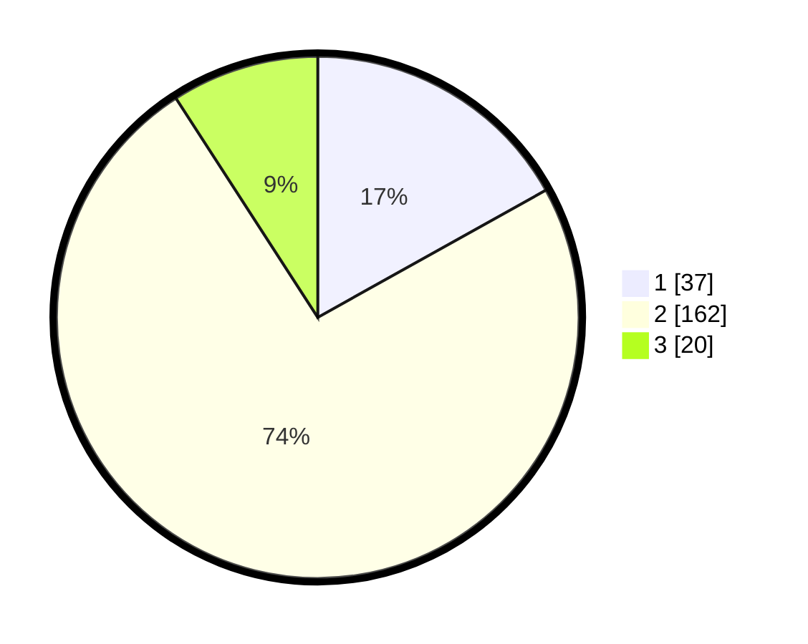

# Hasil

## Grafik

## Tabel

| No. | Nama Paslon    | Suara | Suara (raw) | Persentase |
|:--- |:-------------- | -----:| -----------:| ----------:|
| 1   | ANIES MUHAIMIN | 37    | [37][p-1]   | 16,89      |
| 2   | PRABOWO GIBRAN | 162   | [162][p-2]  | 73,97      |
| 3   | GANJAR MAHFUD  | 20    | [20][p-3]   | 9,13       |

[p-1]: https://github.com/gigit-pemilu/pemilu-2024-35-jawa-timur/blob/main/pilpres/hitung-suara/sub/35-jawa-timur/sub/07-malang/sub/24-singosari/sub/2008-purwoasri/sub/018-tps/sub/paslon-1.txt
[p-2]: https://github.com/gigit-pemilu/pemilu-2024-35-jawa-timur/blob/main/pilpres/hitung-suara/sub/35-jawa-timur/sub/07-malang/sub/24-singosari/sub/2008-purwoasri/sub/018-tps/sub/paslon-2.txt
[p-3]: https://github.com/gigit-pemilu/pemilu-2024-35-jawa-timur/blob/main/pilpres/hitung-suara/sub/35-jawa-timur/sub/07-malang/sub/24-singosari/sub/2008-purwoasri/sub/018-tps/sub/paslon-3.txt

## Foto C Plano

https://sirekap-obj-formc.kpu.go.id/b5cb/pemilu/ppwp/35/07/24/20/08/3507242008018-20240215-170743--fbc97c57-ecfd-410a-9b44-d1a8eca91597.jpg

https://sirekap-obj-formc.kpu.go.id/b5cb/pemilu/ppwp/35/07/24/20/08/3507242008018-20240215-000109--df0aeadf-2c96-49cf-a231-d526adf5d96a.jpg

https://sirekap-obj-formc.kpu.go.id/b5cb/pemilu/ppwp/35/07/24/20/08/3507242008018-20240215-180502--b7bbdc96-58eb-498f-a73a-7c662c33b41c.jpg

## Metadata

| Key        | Value               |
| ---------- | ------------------- |
| Time Stamp | 2024-02-17 18:00:00 |

