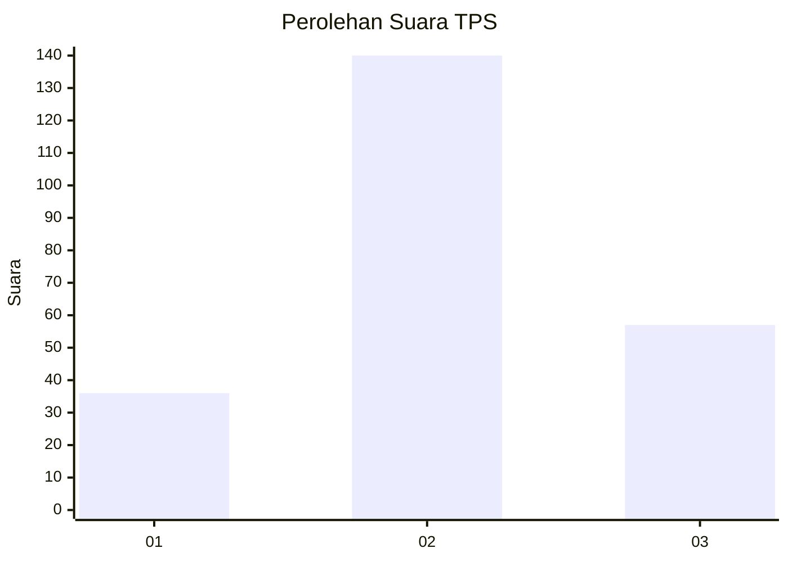
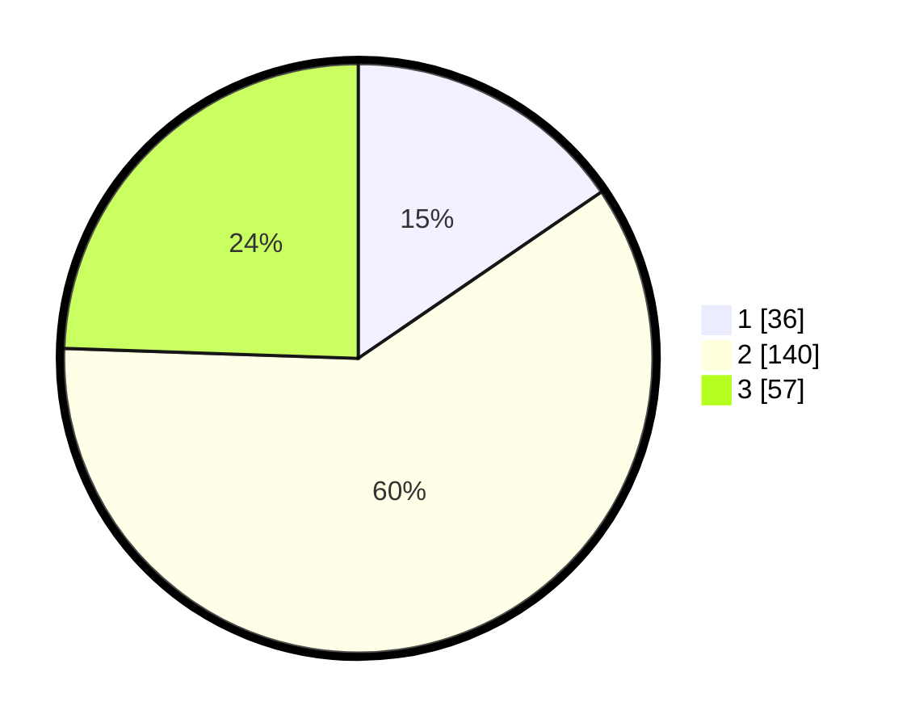

# Hasil

## Grafik

## Tabel

| No. | Nama Paslon    | Suara | Suara (raw) | Persentase |
|:--- |:-------------- | -----:| -----------:| ----------:|
| 1   | ANIES MUHAIMIN | 36    | [36][p-1]   | 15,45      |
| 2   | PRABOWO GIBRAN | 140   | [140][p-2]  | 60,09      |
| 3   | GANJAR MAHFUD  | 57    | [57][p-3]   | 24,46      |

[p-1]: https://github.com/gigit-pemilu/pemilu-2024-35-jawa-timur/blob/main/pilpres/hitung-suara/sub/35-jawa-timur/sub/07-malang/sub/24-singosari/sub/2009-klampok/sub/016-tps/sub/paslon-1.txt
[p-2]: https://github.com/gigit-pemilu/pemilu-2024-35-jawa-timur/blob/main/pilpres/hitung-suara/sub/35-jawa-timur/sub/07-malang/sub/24-singosari/sub/2009-klampok/sub/016-tps/sub/paslon-2.txt
[p-3]: https://github.com/gigit-pemilu/pemilu-2024-35-jawa-timur/blob/main/pilpres/hitung-suara/sub/35-jawa-timur/sub/07-malang/sub/24-singosari/sub/2009-klampok/sub/016-tps/sub/paslon-3.txt

## Foto C Plano

https://sirekap-obj-formc.kpu.go.id/d10f/pemilu/ppwp/35/07/24/20/09/3507242009016-20240215-004907--5ef9990e-2aa0-4e6a-99e4-fe2040081464.jpg

https://sirekap-obj-formc.kpu.go.id/d10f/pemilu/ppwp/35/07/24/20/09/3507242009016-20240215-005039--a0d50a84-e4ac-4597-8bc2-e938b9e8558c.jpg

https://sirekap-obj-formc.kpu.go.id/d10f/pemilu/ppwp/35/07/24/20/09/3507242009016-20240215-005019--31384f25-2c83-492a-b7e2-fc93c5eb0a03.jpg

## Metadata

| Key        | Value               |
| ---------- | ------------------- |
| Time Stamp | 2024-02-15 15:00:29 |

