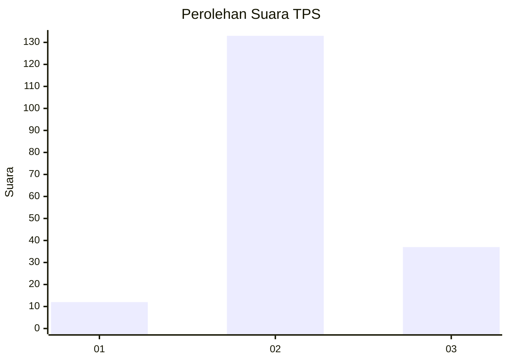

# Hasil

## Grafik

## Tabel

| No. | Nama Paslon    | Suara | Suara (raw) | Persentase |
|:--- |:-------------- | -----:| -----------:| ----------:|
| 1   | ANIES MUHAIMIN | 12    | [12][p-1]   | 6,59       |
| 2   | PRABOWO GIBRAN | 133   | [133][p-2]  | 73,08      |
| 3   | GANJAR MAHFUD  | 37    | [37][p-3]   | 20,33      |

[p-1]: https://github.com/gigit-pemilu/pemilu-2024/blob/main/pilpres/hitung-suara/sub/35-jawa-timur/sub/07-malang/sub/24-singosari/sub/2009-klampok/sub/031-tps/sub/paslon-1.txt
[p-2]: https://github.com/gigit-pemilu/pemilu-2024/blob/main/pilpres/hitung-suara/sub/35-jawa-timur/sub/07-malang/sub/24-singosari/sub/2009-klampok/sub/031-tps/sub/paslon-2.txt
[p-3]: https://github.com/gigit-pemilu/pemilu-2024/blob/main/pilpres/hitung-suara/sub/35-jawa-timur/sub/07-malang/sub/24-singosari/sub/2009-klampok/sub/031-tps/sub/paslon-3.txt

## Foto C Plano

https://sirekap-obj-formc.kpu.go.id/1782/pemilu/ppwp/35/07/24/20/09/3507242009031-20240214-223621--92f7a4b1-bc9a-4f59-9b45-29d72f538dd2.jpg

https://sirekap-obj-formc.kpu.go.id/1782/pemilu/ppwp/35/07/24/20/09/3507242009031-20240214-200816--3039bc4e-92f2-4d48-8af6-373364a73701.jpg

https://sirekap-obj-formc.kpu.go.id/1782/pemilu/ppwp/35/07/24/20/09/3507242009031-20240214-200940--a8f4fbb6-4e85-4560-9854-def3cb7bcf1c.jpg

## Metadata

| Key        | Value               |
| ---------- | ------------------- |
| Time Stamp | 2024-02-17 08:30:03 |

