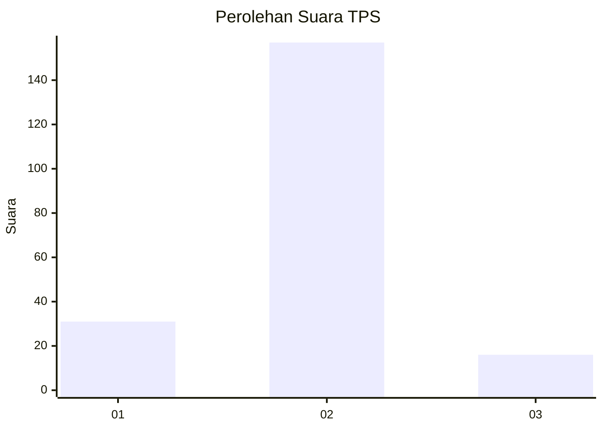
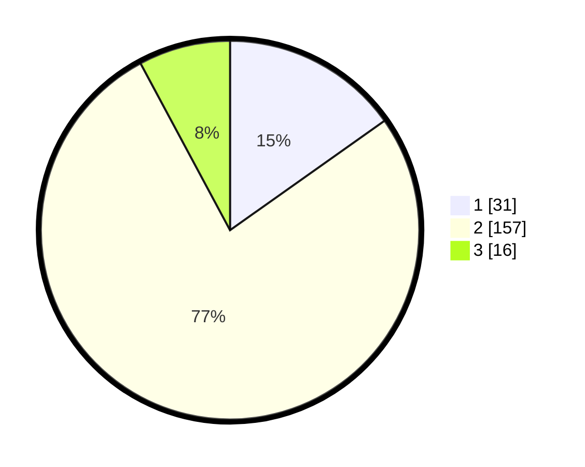

# Hasil

## Grafik

## Tabel

| No. | Nama Paslon    | Suara | Suara (raw) | Persentase |
|:--- |:-------------- | -----:| -----------:| ----------:|
| 1   | ANIES MUHAIMIN | 31    | [31][p-1]   | 15,20      |
| 2   | PRABOWO GIBRAN | 157   | [157][p-2]  | 76,96      |
| 3   | GANJAR MAHFUD  | 16    | [16][p-3]   | 7,84       |

[p-1]: https://github.com/gigit-pemilu/pemilu-2024-35-jawa-timur/blob/main/pilpres/hitung-suara/sub/35-jawa-timur/sub/07-malang/sub/24-singosari/sub/2010-gunungrejo/sub/026-tps/sub/paslon-1.txt
[p-2]: https://github.com/gigit-pemilu/pemilu-2024-35-jawa-timur/blob/main/pilpres/hitung-suara/sub/35-jawa-timur/sub/07-malang/sub/24-singosari/sub/2010-gunungrejo/sub/026-tps/sub/paslon-2.txt
[p-3]: https://github.com/gigit-pemilu/pemilu-2024-35-jawa-timur/blob/main/pilpres/hitung-suara/sub/35-jawa-timur/sub/07-malang/sub/24-singosari/sub/2010-gunungrejo/sub/026-tps/sub/paslon-3.txt

## Foto C Plano

https://sirekap-obj-formc.kpu.go.id/20d1/pemilu/ppwp/35/07/24/20/10/3507242010026-20240215-010740--e40a893f-ca6d-4756-8b77-38981106c423.jpg

https://sirekap-obj-formc.kpu.go.id/20d1/pemilu/ppwp/35/07/24/20/10/3507242010026-20240215-010822--f82f6e42-e4fa-44bd-a923-1bf9d3732a17.jpg

https://sirekap-obj-formc.kpu.go.id/20d1/pemilu/ppwp/35/07/24/20/10/3507242010026-20240215-010939--e37399e9-d75d-432c-bc28-7ef7bb2928f0.jpg

## Metadata

| Key        | Value               |
| ---------- | ------------------- |
| Time Stamp | 2024-02-25 16:00:00 |

