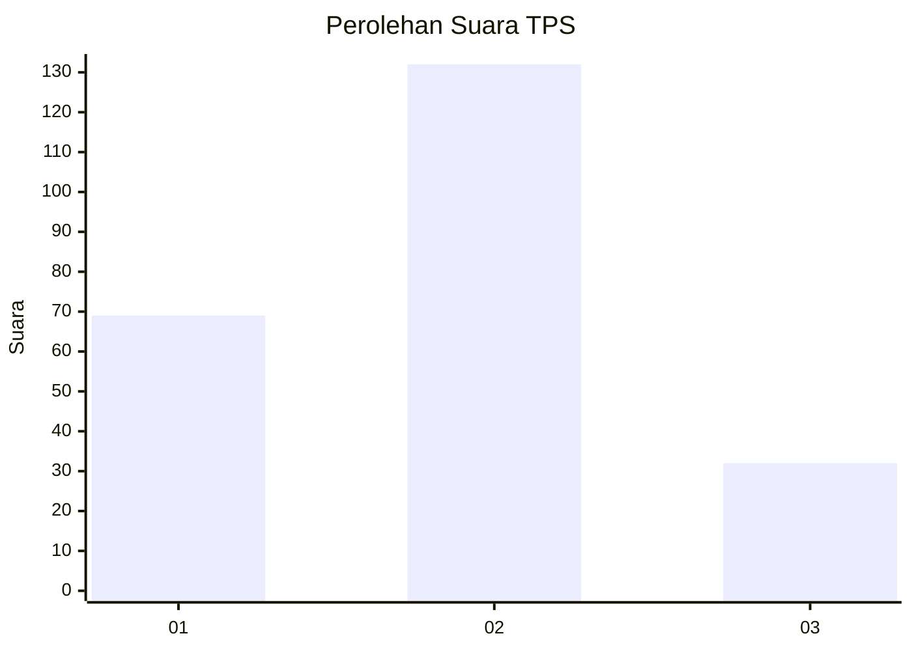
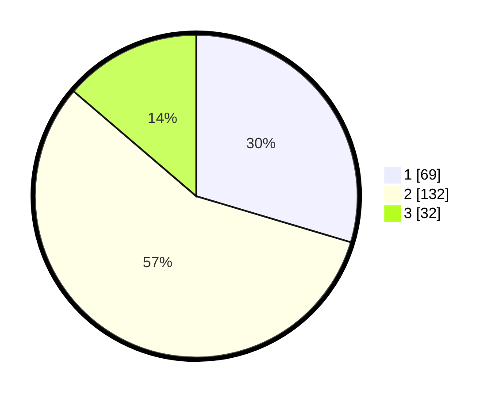

# Hasil

## Grafik

## Tabel

| No. | Nama Paslon    | Suara | Suara (raw) | Persentase |
|:--- |:-------------- | -----:| -----------:| ----------:|
| 1   | ANIES MUHAIMIN | 69    | [69][p-1]   | 29,61      |
| 2   | PRABOWO GIBRAN | 132   | [132][p-2]  | 56,65      |
| 3   | GANJAR MAHFUD  | 32    | [32][p-3]   | 13,73      |

[p-1]: https://github.com/gigit-pemilu/pemilu-2024-35-jawa-timur/blob/main/pilpres/hitung-suara/sub/35-jawa-timur/sub/07-malang/sub/24-singosari/sub/2012-tamanharjo/sub/002-tps/sub/paslon-1.txt
[p-2]: https://github.com/gigit-pemilu/pemilu-2024-35-jawa-timur/blob/main/pilpres/hitung-suara/sub/35-jawa-timur/sub/07-malang/sub/24-singosari/sub/2012-tamanharjo/sub/002-tps/sub/paslon-2.txt
[p-3]: https://github.com/gigit-pemilu/pemilu-2024-35-jawa-timur/blob/main/pilpres/hitung-suara/sub/35-jawa-timur/sub/07-malang/sub/24-singosari/sub/2012-tamanharjo/sub/002-tps/sub/paslon-3.txt

## Foto C Plano

https://sirekap-obj-formc.kpu.go.id/3ad1/pemilu/ppwp/35/07/24/20/12/3507242012002-20240215-070005--28c5548f-40c0-4ab2-89d6-6aa1fdfd035c.jpg

https://sirekap-obj-formc.kpu.go.id/3ad1/pemilu/ppwp/35/07/24/20/12/3507242012002-20240215-070112--0f91cd03-b805-421f-a52d-f4828ccbadee.jpg

https://sirekap-obj-formc.kpu.go.id/3ad1/pemilu/ppwp/35/07/24/20/12/3507242012002-20240215-070435--c27a4201-80f2-46eb-93a8-88fc1c8fc610.jpg

## Metadata

| Key        | Value               |
| ---------- | ------------------- |
| Time Stamp | 2024-02-15 18:30:25 |

