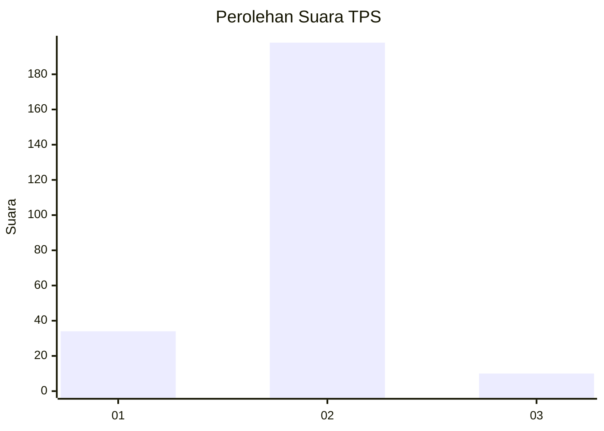
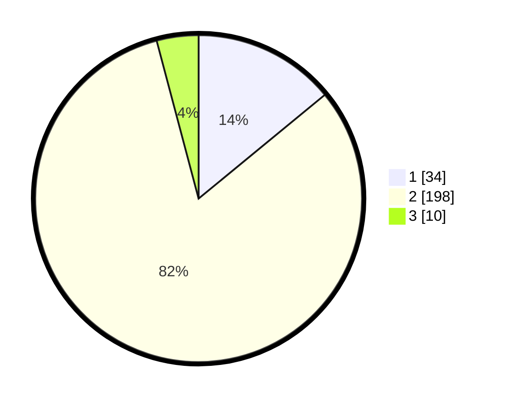

# Hasil

## Grafik

## Tabel

| No. | Nama Paslon    | Suara | Suara (raw) | Persentase |
|:--- |:-------------- | -----:| -----------:| ----------:|
| 1   | ANIES MUHAIMIN | 34    | [34][p-1]   | 14,05      |
| 2   | PRABOWO GIBRAN | 198   | [198][p-2]  | 81,82      |
| 3   | GANJAR MAHFUD  | 10    | [10][p-3]   | 4,13       |

[p-1]: https://github.com/gigit-pemilu/pemilu-2024/blob/main/pilpres/hitung-suara/sub/35-jawa-timur/sub/07-malang/sub/24-singosari/sub/2012-tamanharjo/sub/005-tps/sub/paslon-1.txt
[p-2]: https://github.com/gigit-pemilu/pemilu-2024/blob/main/pilpres/hitung-suara/sub/35-jawa-timur/sub/07-malang/sub/24-singosari/sub/2012-tamanharjo/sub/005-tps/sub/paslon-2.txt
[p-3]: https://github.com/gigit-pemilu/pemilu-2024/blob/main/pilpres/hitung-suara/sub/35-jawa-timur/sub/07-malang/sub/24-singosari/sub/2012-tamanharjo/sub/005-tps/sub/paslon-3.txt

## Foto C Plano

https://sirekap-obj-formc.kpu.go.id/7d74/pemilu/ppwp/35/07/24/20/12/3507242012005-20240214-204723--c2cb14dc-fdb3-4dcf-8797-30bf23ae8db0.jpg

https://sirekap-obj-formc.kpu.go.id/7d74/pemilu/ppwp/35/07/24/20/12/3507242012005-20240218-141011--d17d0764-b36a-4809-b955-f0ba55f9a38e.jpg

https://sirekap-obj-formc.kpu.go.id/7d74/pemilu/ppwp/35/07/24/20/12/3507242012005-20240218-141102--ee37a13b-a776-41eb-b00c-d6de7611b53a.jpg

## Metadata

| Key        | Value               |
| ---------- | ------------------- |
| Time Stamp | 2024-02-19 06:16:00 |

