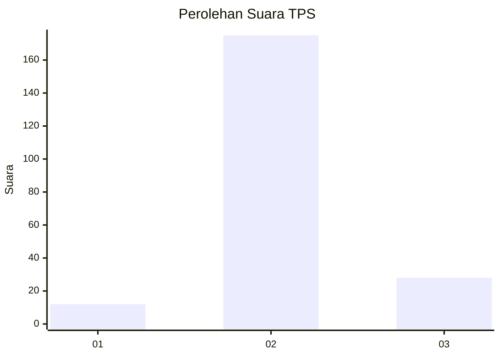
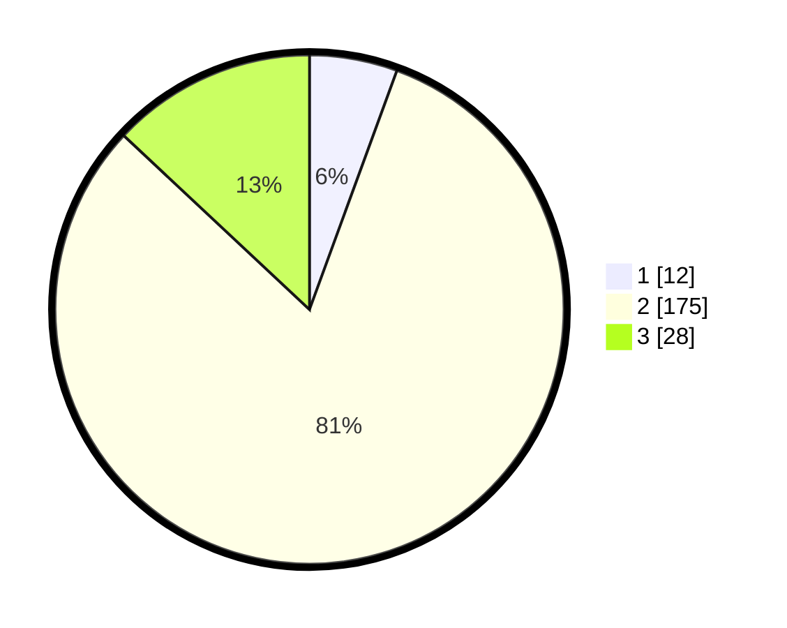

# Hasil

## Grafik

## Tabel

| No. | Nama Paslon    | Suara | Suara (raw) | Persentase |
|:--- |:-------------- | -----:| -----------:| ----------:|
| 1   | ANIES MUHAIMIN | 12    | [12][p-1]   | 5,58       |
| 2   | PRABOWO GIBRAN | 175   | [175][p-2]  | 81,40      |
| 3   | GANJAR MAHFUD  | 28    | [28][p-3]   | 13,02      |

[p-1]: https://github.com/gigit-pemilu/pemilu-2024-35-jawa-timur/blob/main/pilpres/hitung-suara/sub/35-jawa-timur/sub/07-malang/sub/24-singosari/sub/2016-toyomarto/sub/015-tps/sub/paslon-1.txt
[p-2]: https://github.com/gigit-pemilu/pemilu-2024-35-jawa-timur/blob/main/pilpres/hitung-suara/sub/35-jawa-timur/sub/07-malang/sub/24-singosari/sub/2016-toyomarto/sub/015-tps/sub/paslon-2.txt
[p-3]: https://github.com/gigit-pemilu/pemilu-2024-35-jawa-timur/blob/main/pilpres/hitung-suara/sub/35-jawa-timur/sub/07-malang/sub/24-singosari/sub/2016-toyomarto/sub/015-tps/sub/paslon-3.txt

## Foto C Plano

https://sirekap-obj-formc.kpu.go.id/fbf0/pemilu/ppwp/35/07/24/20/16/3507242016015-20240214-140948--04b2e49f-fff4-4c6b-b3b6-eb652e3be61d.jpg

https://sirekap-obj-formc.kpu.go.id/fbf0/pemilu/ppwp/35/07/24/20/16/3507242016015-20240216-002239--c505ded4-9bb4-4397-bded-52c93cf7675c.jpg

https://sirekap-obj-formc.kpu.go.id/fbf0/pemilu/ppwp/35/07/24/20/16/3507242016015-20240214-141130--aff78747-074e-467e-a5b4-505758bef0d3.jpg

## Metadata

| Key        | Value               |
| ---------- | ------------------- |
| Time Stamp | 2024-02-16 00:30:27 |

