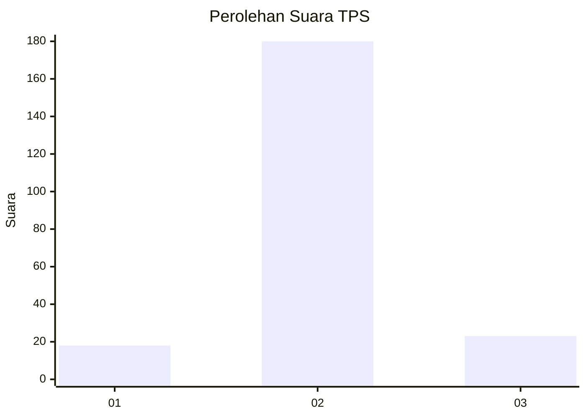
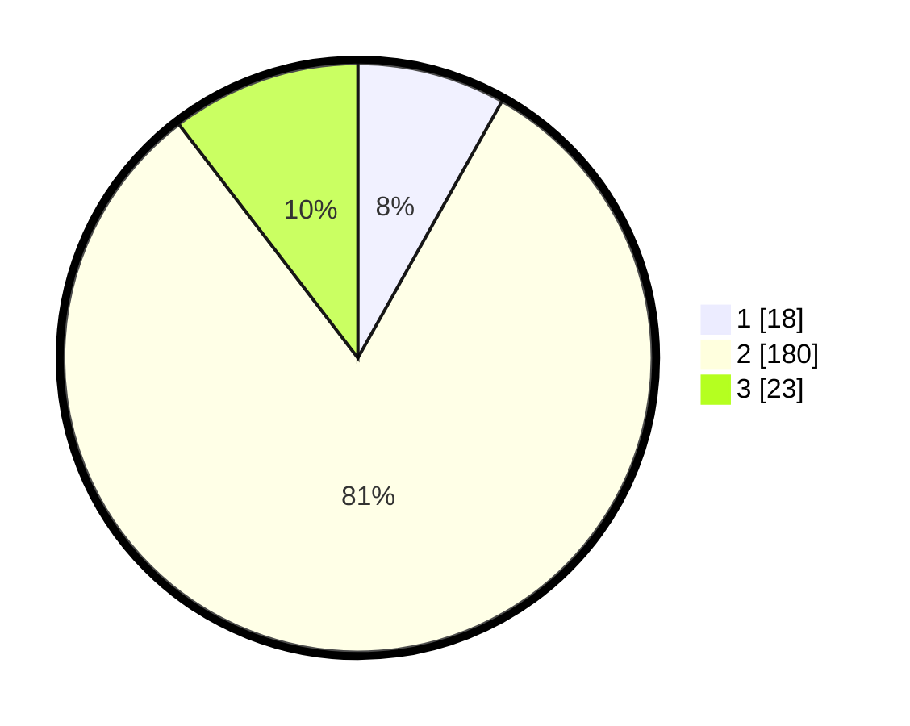

# Hasil

## Grafik

## Tabel

| No. | Nama Paslon    | Suara | Suara (raw) | Persentase |
|:--- |:-------------- | -----:| -----------:| ----------:|
| 1   | ANIES MUHAIMIN | 18    | [18][p-1]   | 8,14       |
| 2   | PRABOWO GIBRAN | 180   | [180][p-2]  | 81,45      |
| 3   | GANJAR MAHFUD  | 23    | [23][p-3]   | 10,41      |

[p-1]: https://github.com/gigit-pemilu/pemilu-2024-35-jawa-timur/blob/main/pilpres/hitung-suara/sub/35-jawa-timur/sub/07-malang/sub/24-singosari/sub/2016-toyomarto/sub/026-tps/sub/paslon-1.txt
[p-2]: https://github.com/gigit-pemilu/pemilu-2024-35-jawa-timur/blob/main/pilpres/hitung-suara/sub/35-jawa-timur/sub/07-malang/sub/24-singosari/sub/2016-toyomarto/sub/026-tps/sub/paslon-2.txt
[p-3]: https://github.com/gigit-pemilu/pemilu-2024-35-jawa-timur/blob/main/pilpres/hitung-suara/sub/35-jawa-timur/sub/07-malang/sub/24-singosari/sub/2016-toyomarto/sub/026-tps/sub/paslon-3.txt

## Foto C Plano

https://sirekap-obj-formc.kpu.go.id/07af/pemilu/ppwp/35/07/24/20/16/3507242016026-20240214-210733--1e144bd6-b1b0-44fc-8833-d831d3258718.jpg

https://sirekap-obj-formc.kpu.go.id/07af/pemilu/ppwp/35/07/24/20/16/3507242016026-20240214-201142--0f5c5e0c-308b-4bb8-9573-b5a777eb07d0.jpg

https://sirekap-obj-formc.kpu.go.id/07af/pemilu/ppwp/35/07/24/20/16/3507242016026-20240214-200221--d670c5ff-2762-4906-b282-40b170145cfa.jpg

## Metadata

| Key        | Value               |
| ---------- | ------------------- |
| Time Stamp | 2024-02-17 18:00:00 |

