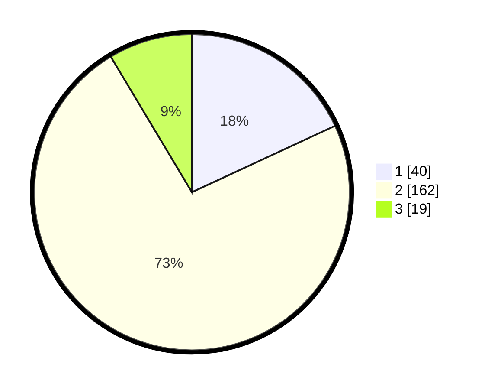

# Hasil

## Grafik

## Tabel

| No. | Nama Paslon    | Suara | Suara (raw) | Persentase |
|:--- |:-------------- | -----:| -----------:| ----------:|
| 1   | ANIES MUHAIMIN | 40    | [40][p-1]   | 18,10      |
| 2   | PRABOWO GIBRAN | 162   | [162][p-2]  | 73,30      |
| 3   | GANJAR MAHFUD  | 19    | [19][p-3]   | 8,60       |

[p-1]: https://github.com/gigit-pemilu/pemilu-2024-35-jawa-timur/blob/main/pilpres/hitung-suara/sub/35-jawa-timur/sub/07-malang/sub/24-singosari/sub/2017-randuagung/sub/001-tps/sub/paslon-1.txt
[p-2]: https://github.com/gigit-pemilu/pemilu-2024-35-jawa-timur/blob/main/pilpres/hitung-suara/sub/35-jawa-timur/sub/07-malang/sub/24-singosari/sub/2017-randuagung/sub/001-tps/sub/paslon-2.txt
[p-3]: https://github.com/gigit-pemilu/pemilu-2024-35-jawa-timur/blob/main/pilpres/hitung-suara/sub/35-jawa-timur/sub/07-malang/sub/24-singosari/sub/2017-randuagung/sub/001-tps/sub/paslon-3.txt

## Foto C Plano

https://sirekap-obj-formc.kpu.go.id/4111/pemilu/ppwp/35/07/24/20/17/3507242017001-20240214-212622--ff445a94-b75b-4815-969d-c566e0971a6c.jpg

https://sirekap-obj-formc.kpu.go.id/4111/pemilu/ppwp/35/07/24/20/17/3507242017001-20240214-213016--d1f14e50-5c43-42ff-8ede-afc68e4a0544.jpg

https://sirekap-obj-formc.kpu.go.id/4111/pemilu/ppwp/35/07/24/20/17/3507242017001-20240214-193641--139b4a8a-52f5-421b-9d5a-5a51e5d27ab9.jpg

## Metadata

| Key        | Value               |
| ---------- | ------------------- |
| Time Stamp | 2024-02-19 06:16:00 |

