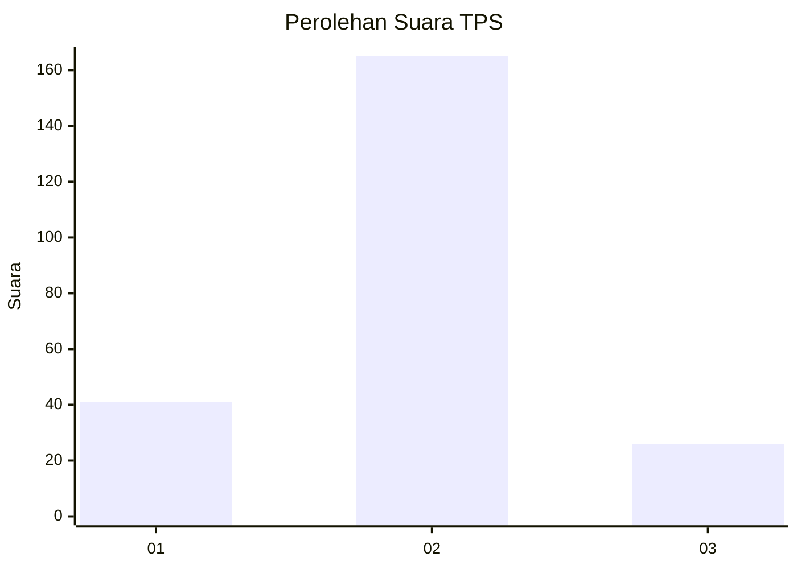
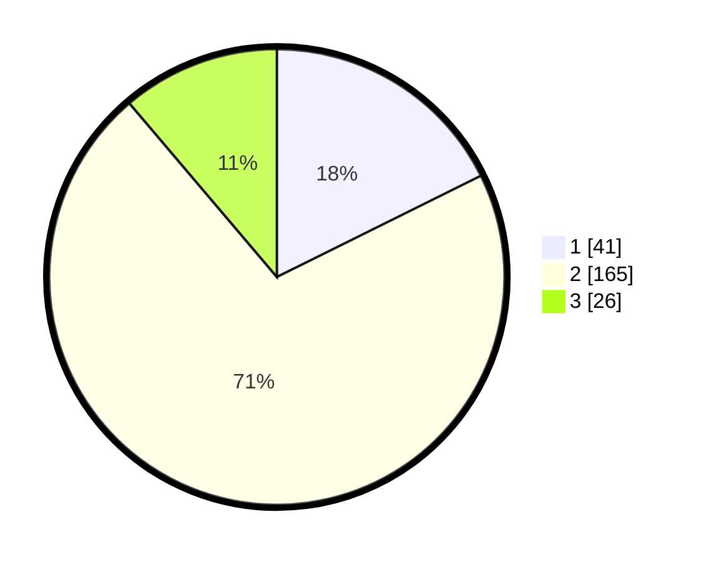

# Hasil

## Grafik

## Tabel

| No. | Nama Paslon    | Suara | Suara (raw) | Persentase |
|:--- |:-------------- | -----:| -----------:| ----------:|
| 1   | ANIES MUHAIMIN | 41    | [41][p-1]   | 17,67      |
| 2   | PRABOWO GIBRAN | 165   | [165][p-2]  | 71,12      |
| 3   | GANJAR MAHFUD  | 26    | [26][p-3]   | 11,21      |

[p-1]: https://github.com/gigit-pemilu/pemilu-2024/blob/main/pilpres/hitung-suara/sub/35-jawa-timur/sub/07-malang/sub/24-singosari/sub/2017-randuagung/sub/003-tps/sub/paslon-1.txt
[p-2]: https://github.com/gigit-pemilu/pemilu-2024/blob/main/pilpres/hitung-suara/sub/35-jawa-timur/sub/07-malang/sub/24-singosari/sub/2017-randuagung/sub/003-tps/sub/paslon-2.txt
[p-3]: https://github.com/gigit-pemilu/pemilu-2024/blob/main/pilpres/hitung-suara/sub/35-jawa-timur/sub/07-malang/sub/24-singosari/sub/2017-randuagung/sub/003-tps/sub/paslon-3.txt

## Foto C Plano

https://sirekap-obj-formc.kpu.go.id/ecfc/pemilu/ppwp/35/07/24/20/17/3507242017003-20240215-004029--f5bbbd59-b8ec-4e8d-9c48-c34d57a76da3.jpg

https://sirekap-obj-formc.kpu.go.id/ecfc/pemilu/ppwp/35/07/24/20/17/3507242017003-20240215-004441--75f9e63b-235b-4adf-bddd-51b277a7c1b0.jpg

https://sirekap-obj-formc.kpu.go.id/ecfc/pemilu/ppwp/35/07/24/20/17/3507242017003-20240215-005021--28beaee3-d1c9-4d91-b110-ca7bd98b1921.jpg

## Metadata

| Key        | Value               |
| ---------- | ------------------- |
| Time Stamp | 2024-02-19 06:16:00 |

