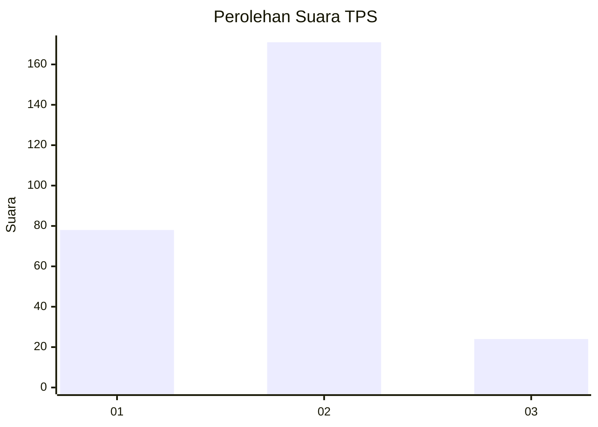
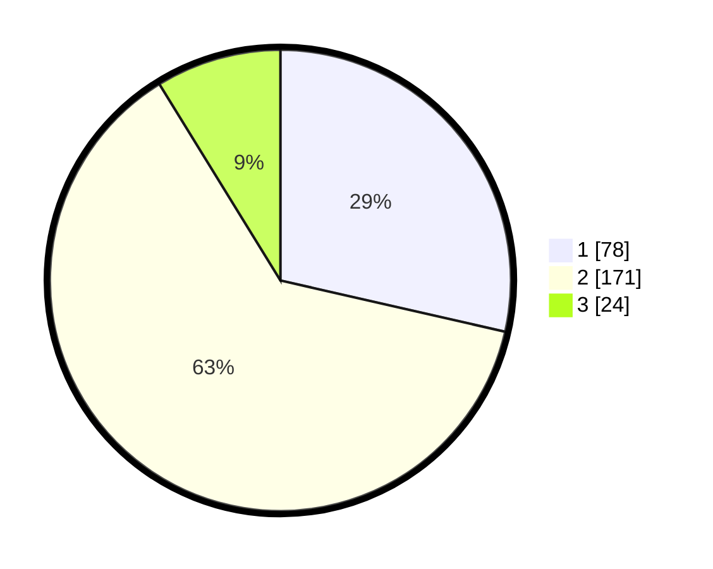

# Hasil

## Grafik

## Tabel

| No. | Nama Paslon    | Suara | Suara (raw) | Persentase |
|:--- |:-------------- | -----:| -----------:| ----------:|
| 1   | ANIES MUHAIMIN | 78    | [78][p-1]   | 28,57      |
| 2   | PRABOWO GIBRAN | 171   | [171][p-2]  | 62,64      |
| 3   | GANJAR MAHFUD  | 24    | [24][p-3]   | 8,79       |

[p-1]: https://github.com/gigit-pemilu/pemilu-2024/blob/main/pilpres/hitung-suara/sub/35-jawa-timur/sub/07-malang/sub/24-singosari/sub/2017-randuagung/sub/004-tps/sub/paslon-1.txt
[p-2]: https://github.com/gigit-pemilu/pemilu-2024/blob/main/pilpres/hitung-suara/sub/35-jawa-timur/sub/07-malang/sub/24-singosari/sub/2017-randuagung/sub/004-tps/sub/paslon-2.txt
[p-3]: https://github.com/gigit-pemilu/pemilu-2024/blob/main/pilpres/hitung-suara/sub/35-jawa-timur/sub/07-malang/sub/24-singosari/sub/2017-randuagung/sub/004-tps/sub/paslon-3.txt

## Foto C Plano

https://sirekap-obj-formc.kpu.go.id/1c3f/pemilu/ppwp/35/07/24/20/17/3507242017004-20240215-183707--4957bf5e-57dc-4d2d-aa68-cf7e79bc2000.jpg

https://sirekap-obj-formc.kpu.go.id/1c3f/pemilu/ppwp/35/07/24/20/17/3507242017004-20240215-185157--a5c58fa1-2add-4069-90ab-f9febad58c24.jpg

https://sirekap-obj-formc.kpu.go.id/1c3f/pemilu/ppwp/35/07/24/20/17/3507242017004-20240215-185223--252d57c2-7a6c-4114-a0b9-c7770fc4a82f.jpg

## Metadata

| Key        | Value               |
| ---------- | ------------------- |
| Time Stamp | 2024-02-22 11:00:00 |

