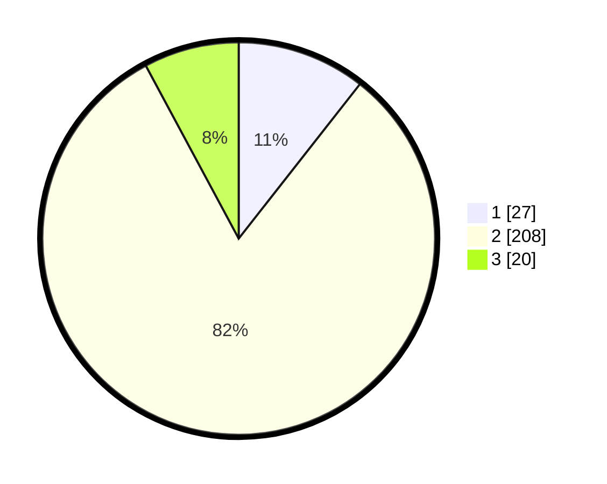

# Hasil

## Grafik

## Tabel

| No. | Nama Paslon    | Suara | Suara (raw) | Persentase |
|:--- |:-------------- | -----:| -----------:| ----------:|
| 1   | ANIES MUHAIMIN | 27    | [27][p-1]   | 10,59      |
| 2   | PRABOWO GIBRAN | 208   | [208][p-2]  | 81,57      |
| 3   | GANJAR MAHFUD  | 20    | [20][p-3]   | 7,84       |

[p-1]: https://github.com/gigit-pemilu/pemilu-2024-35-jawa-timur/blob/main/pilpres/hitung-suara/sub/35-jawa-timur/sub/07-malang/sub/24-singosari/sub/2017-randuagung/sub/005-tps/sub/paslon-1.txt
[p-2]: https://github.com/gigit-pemilu/pemilu-2024-35-jawa-timur/blob/main/pilpres/hitung-suara/sub/35-jawa-timur/sub/07-malang/sub/24-singosari/sub/2017-randuagung/sub/005-tps/sub/paslon-2.txt
[p-3]: https://github.com/gigit-pemilu/pemilu-2024-35-jawa-timur/blob/main/pilpres/hitung-suara/sub/35-jawa-timur/sub/07-malang/sub/24-singosari/sub/2017-randuagung/sub/005-tps/sub/paslon-3.txt

## Foto C Plano

https://sirekap-obj-formc.kpu.go.id/e1d8/pemilu/ppwp/35/07/24/20/17/3507242017005-20240215-041821--16e790c7-dc5b-4a4a-8eb8-51c053b67f3b.jpg

https://sirekap-obj-formc.kpu.go.id/e1d8/pemilu/ppwp/35/07/24/20/17/3507242017005-20240215-041856--9e4def0b-f57b-4e82-9caa-17c687067a31.jpg

https://sirekap-obj-formc.kpu.go.id/e1d8/pemilu/ppwp/35/07/24/20/17/3507242017005-20240215-041936--eec4c7b2-109e-4641-9444-da89489dae4e.jpg

## Metadata

| Key        | Value               |
| ---------- | ------------------- |
| Time Stamp | 2024-02-19 06:16:00 |

