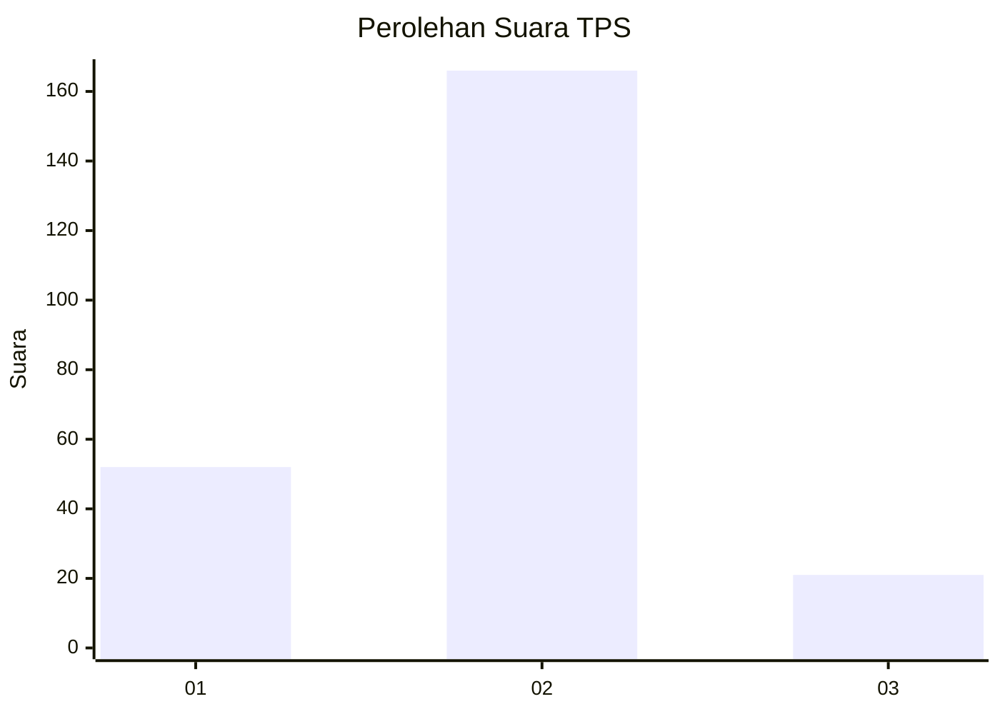
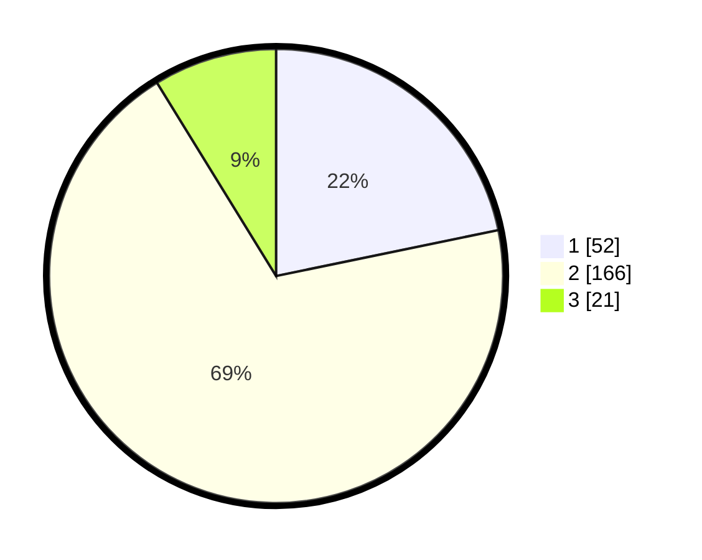

# Hasil

## Grafik

## Tabel

| No. | Nama Paslon    | Suara | Suara (raw) | Persentase |
|:--- |:-------------- | -----:| -----------:| ----------:|
| 1   | ANIES MUHAIMIN | 52    | [52][p-1]   | 21,76      |
| 2   | PRABOWO GIBRAN | 166   | [166][p-2]  | 69,46      |
| 3   | GANJAR MAHFUD  | 21    | [21][p-3]   | 8,79       |

[p-1]: https://github.com/gigit-pemilu/pemilu-2024-35-jawa-timur/blob/main/pilpres/hitung-suara/sub/35-jawa-timur/sub/07-malang/sub/24-singosari/sub/2017-randuagung/sub/008-tps/sub/paslon-1.txt
[p-2]: https://github.com/gigit-pemilu/pemilu-2024-35-jawa-timur/blob/main/pilpres/hitung-suara/sub/35-jawa-timur/sub/07-malang/sub/24-singosari/sub/2017-randuagung/sub/008-tps/sub/paslon-2.txt
[p-3]: https://github.com/gigit-pemilu/pemilu-2024-35-jawa-timur/blob/main/pilpres/hitung-suara/sub/35-jawa-timur/sub/07-malang/sub/24-singosari/sub/2017-randuagung/sub/008-tps/sub/paslon-3.txt

## Foto C Plano

https://sirekap-obj-formc.kpu.go.id/23ae/pemilu/ppwp/35/07/24/20/17/3507242017008-20240214-214452--10ed3581-3c85-4974-a5d4-518eb46fbe2b.jpg

https://sirekap-obj-formc.kpu.go.id/23ae/pemilu/ppwp/35/07/24/20/17/3507242017008-20240214-214456--66f6c2eb-7fda-4b4a-83ef-8902dde26401.jpg

https://sirekap-obj-formc.kpu.go.id/23ae/pemilu/ppwp/35/07/24/20/17/3507242017008-20240214-214500--1f4ae999-e8e6-420d-9fdf-c9db3342b32b.jpg

## Metadata

| Key        | Value               |
| ---------- | ------------------- |
| Time Stamp | 2024-02-15 12:00:28 |

