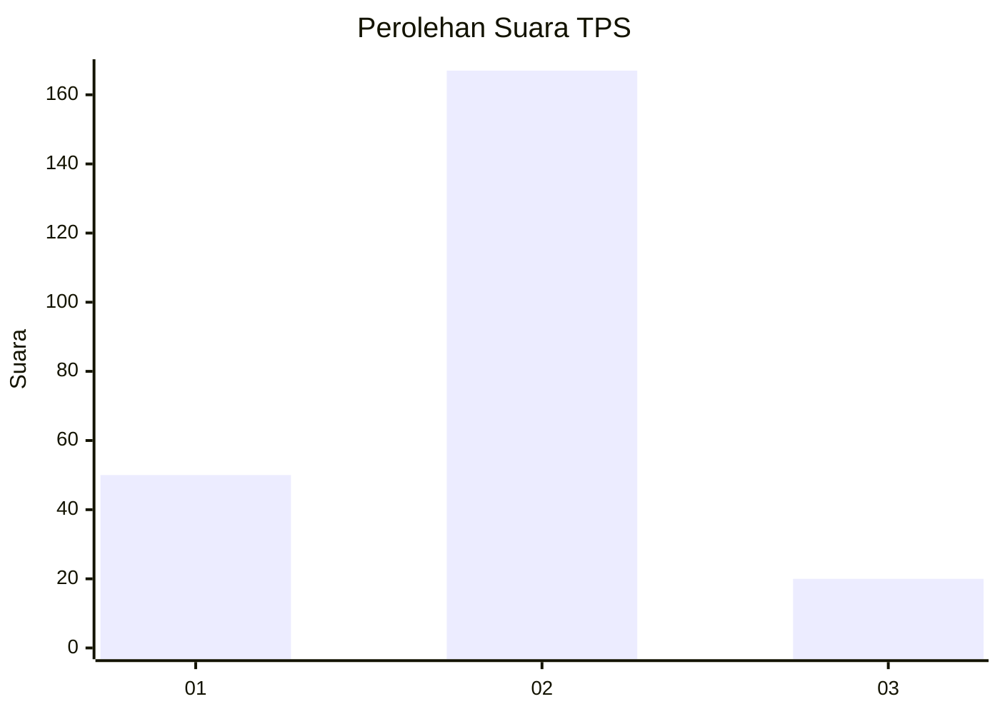
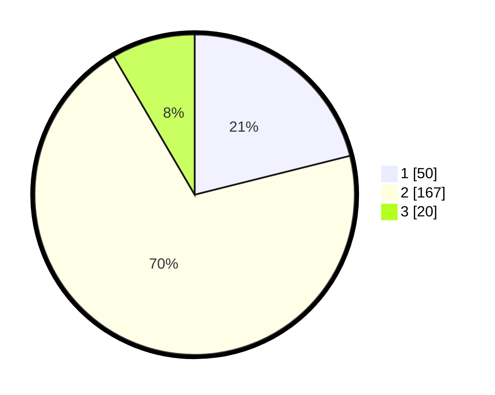

# Hasil

## Grafik

## Tabel

| No. | Nama Paslon    | Suara | Suara (raw) | Persentase |
|:--- |:-------------- | -----:| -----------:| ----------:|
| 1   | ANIES MUHAIMIN | 50    | [50][p-1]   | 21,10      |
| 2   | PRABOWO GIBRAN | 167   | [167][p-2]  | 70,46      |
| 3   | GANJAR MAHFUD  | 20    | [20][p-3]   | 8,44       |

[p-1]: https://github.com/gigit-pemilu/pemilu-2024/blob/main/pilpres/hitung-suara/sub/35-jawa-timur/sub/07-malang/sub/24-singosari/sub/2017-randuagung/sub/022-tps/sub/paslon-1.txt
[p-2]: https://github.com/gigit-pemilu/pemilu-2024/blob/main/pilpres/hitung-suara/sub/35-jawa-timur/sub/07-malang/sub/24-singosari/sub/2017-randuagung/sub/022-tps/sub/paslon-2.txt
[p-3]: https://github.com/gigit-pemilu/pemilu-2024/blob/main/pilpres/hitung-suara/sub/35-jawa-timur/sub/07-malang/sub/24-singosari/sub/2017-randuagung/sub/022-tps/sub/paslon-3.txt

## Foto C Plano

https://sirekap-obj-formc.kpu.go.id/956b/pemilu/ppwp/35/07/24/20/17/3507242017022-20240215-044936--7bf08241-c6c5-4cfc-9cde-0bf34f0881e0.jpg

https://sirekap-obj-formc.kpu.go.id/956b/pemilu/ppwp/35/07/24/20/17/3507242017022-20240215-045045--223bf173-8e58-4ffc-ad69-0361d04db725.jpg

https://sirekap-obj-formc.kpu.go.id/956b/pemilu/ppwp/35/07/24/20/17/3507242017022-20240215-045107--f437142a-5fa5-4dc1-87c3-06c6d7a70680.jpg

## Metadata

| Key        | Value               |
| ---------- | ------------------- |
| Time Stamp | 2024-02-15 18:00:26 |

