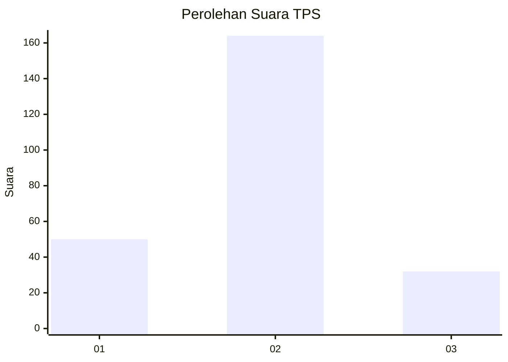
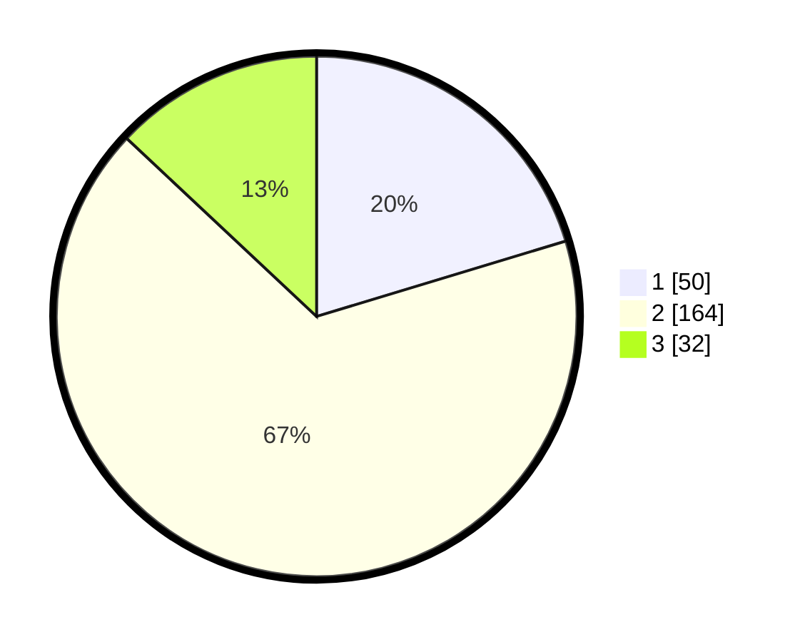

# Hasil

## Grafik

## Tabel

| No. | Nama Paslon    | Suara | Suara (raw) | Persentase |
|:--- |:-------------- | -----:| -----------:| ----------:|
| 1   | ANIES MUHAIMIN | 50    | [50][p-1]   | 20,33      |
| 2   | PRABOWO GIBRAN | 164   | [164][p-2]  | 66,67      |
| 3   | GANJAR MAHFUD  | 32    | [32][p-3]   | 13,01      |

[p-1]: https://github.com/gigit-pemilu/pemilu-2024/blob/main/pilpres/hitung-suara/sub/35-jawa-timur/sub/07-malang/sub/24-singosari/sub/2017-randuagung/sub/029-tps/sub/paslon-1.txt
[p-2]: https://github.com/gigit-pemilu/pemilu-2024/blob/main/pilpres/hitung-suara/sub/35-jawa-timur/sub/07-malang/sub/24-singosari/sub/2017-randuagung/sub/029-tps/sub/paslon-2.txt
[p-3]: https://github.com/gigit-pemilu/pemilu-2024/blob/main/pilpres/hitung-suara/sub/35-jawa-timur/sub/07-malang/sub/24-singosari/sub/2017-randuagung/sub/029-tps/sub/paslon-3.txt

## Foto C Plano

https://sirekap-obj-formc.kpu.go.id/dd7a/pemilu/ppwp/35/07/24/20/17/3507242017029-20240215-011807--4468ab9b-1a4f-47f4-bca4-9a1ad147ea17.jpg

https://sirekap-obj-formc.kpu.go.id/dd7a/pemilu/ppwp/35/07/24/20/17/3507242017029-20240215-011836--d49bf935-b861-468d-ad20-b8d48f846d7b.jpg

https://sirekap-obj-formc.kpu.go.id/dd7a/pemilu/ppwp/35/07/24/20/17/3507242017029-20240215-011900--16e1aee2-761d-4d26-9e34-65738ff504e2.jpg

## Metadata

| Key        | Value               |
| ---------- | ------------------- |
| Time Stamp | 2024-02-19 06:16:00 |

