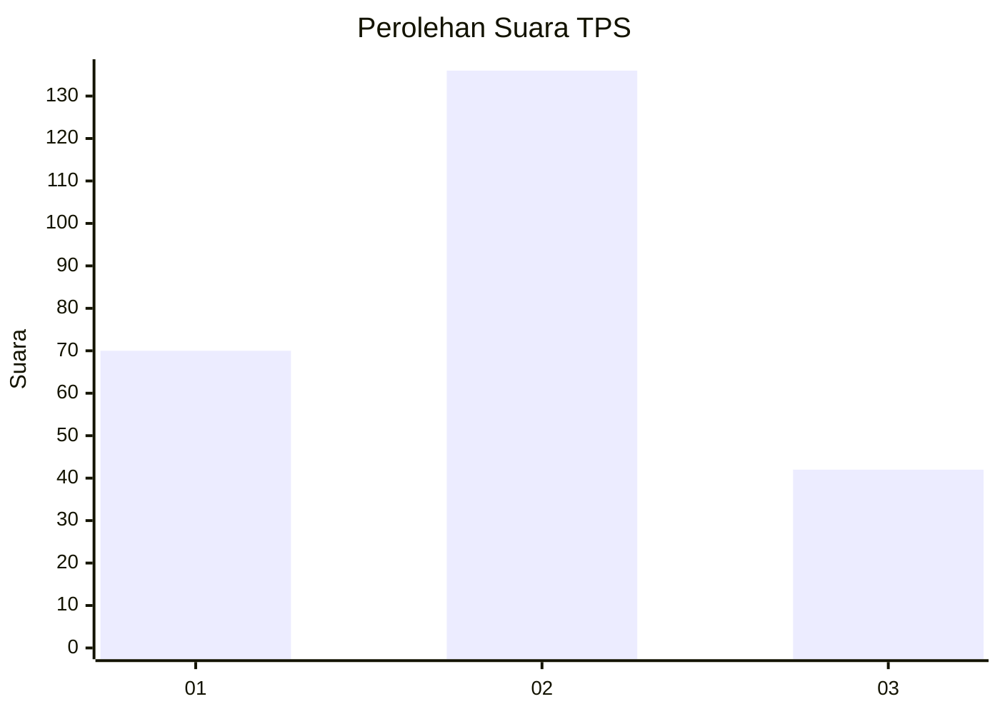
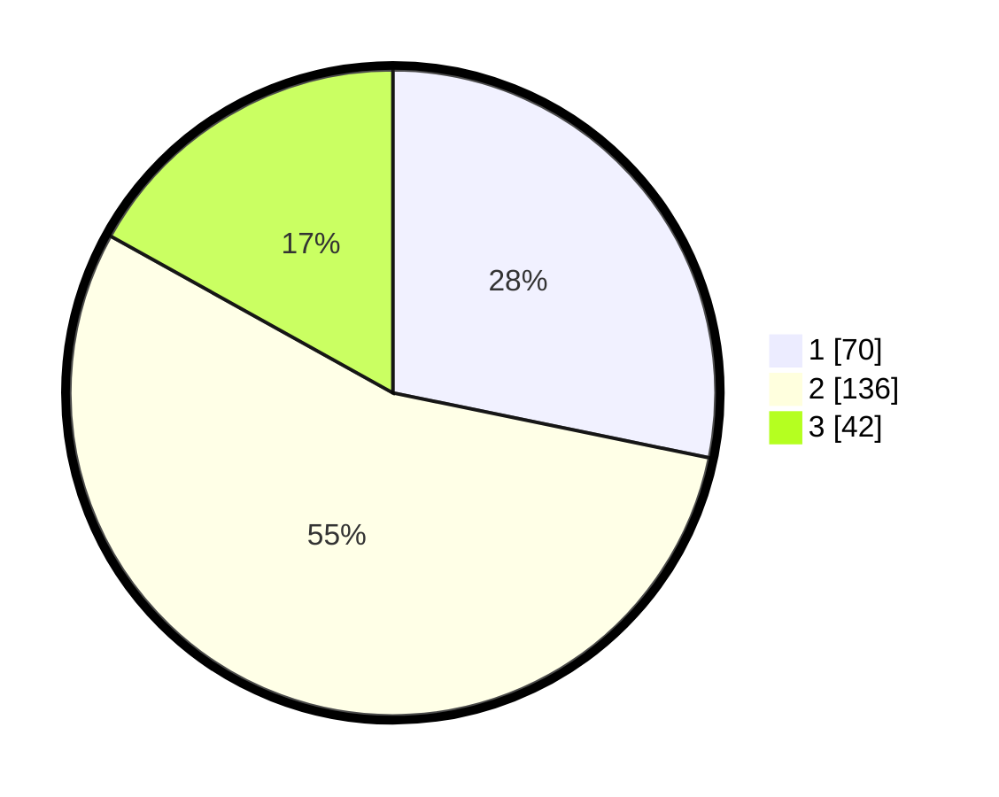

# Hasil

## Grafik

## Tabel

| No. | Nama Paslon    | Suara | Suara (raw) | Persentase |
|:--- |:-------------- | -----:| -----------:| ----------:|
| 1   | ANIES MUHAIMIN | 70    | [70][p-1]   | 28,23      |
| 2   | PRABOWO GIBRAN | 136   | [136][p-2]  | 54,84      |
| 3   | GANJAR MAHFUD  | 42    | [42][p-3]   | 16,94      |

[p-1]: https://github.com/gigit-pemilu/pemilu-2024/blob/main/pilpres/hitung-suara/sub/35-jawa-timur/sub/07-malang/sub/24-singosari/sub/2017-randuagung/sub/030-tps/sub/paslon-1.txt
[p-2]: https://github.com/gigit-pemilu/pemilu-2024/blob/main/pilpres/hitung-suara/sub/35-jawa-timur/sub/07-malang/sub/24-singosari/sub/2017-randuagung/sub/030-tps/sub/paslon-2.txt
[p-3]: https://github.com/gigit-pemilu/pemilu-2024/blob/main/pilpres/hitung-suara/sub/35-jawa-timur/sub/07-malang/sub/24-singosari/sub/2017-randuagung/sub/030-tps/sub/paslon-3.txt

## Foto C Plano

https://sirekap-obj-formc.kpu.go.id/9289/pemilu/ppwp/35/07/24/20/17/3507242017030-20240214-201143--44d68505-440e-4081-ab16-77b2f8dce8c4.jpg

https://sirekap-obj-formc.kpu.go.id/9289/pemilu/ppwp/35/07/24/20/17/3507242017030-20240215-030651--4f88f209-21f8-402a-95a2-34239368c9af.jpg

https://sirekap-obj-formc.kpu.go.id/9289/pemilu/ppwp/35/07/24/20/17/3507242017030-20240215-030809--8f51800a-cc40-4cb1-9758-2e3d995c350b.jpg

## Metadata

| Key        | Value               |
| ---------- | ------------------- |
| Time Stamp | 2024-02-24 22:31:28 |

