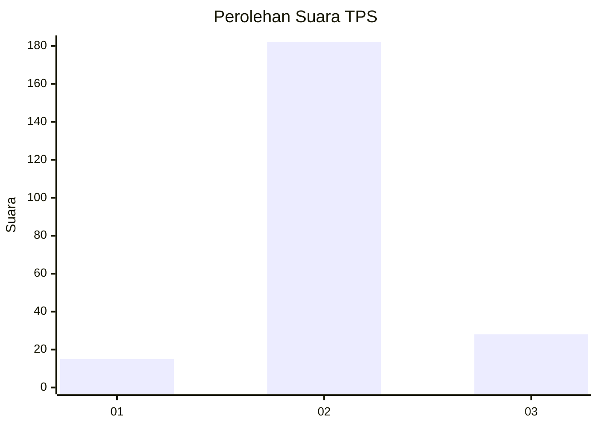
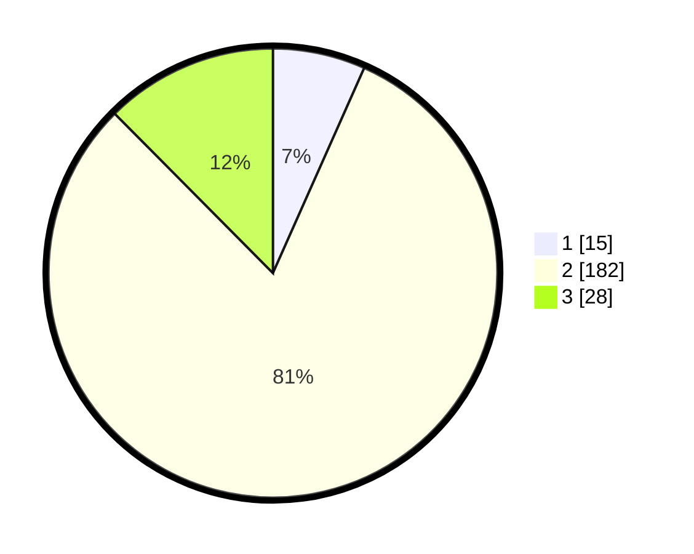

# Hasil

## Grafik

## Tabel

| No. | Nama Paslon    | Suara | Suara (raw) | Persentase |
|:--- |:-------------- | -----:| -----------:| ----------:|
| 1   | ANIES MUHAIMIN | 15    | [15][p-1]   | 6,67       |
| 2   | PRABOWO GIBRAN | 182   | [182][p-2]  | 80,89      |
| 3   | GANJAR MAHFUD  | 28    | [28][p-3]   | 12,44      |

[p-1]: https://github.com/gigit-pemilu/pemilu-2024/blob/main/pilpres/hitung-suara/sub/35-jawa-timur/sub/07-malang/sub/24-singosari/sub/2017-randuagung/sub/033-tps/sub/paslon-1.txt
[p-2]: https://github.com/gigit-pemilu/pemilu-2024/blob/main/pilpres/hitung-suara/sub/35-jawa-timur/sub/07-malang/sub/24-singosari/sub/2017-randuagung/sub/033-tps/sub/paslon-2.txt
[p-3]: https://github.com/gigit-pemilu/pemilu-2024/blob/main/pilpres/hitung-suara/sub/35-jawa-timur/sub/07-malang/sub/24-singosari/sub/2017-randuagung/sub/033-tps/sub/paslon-3.txt

## Foto C Plano

https://sirekap-obj-formc.kpu.go.id/8dd8/pemilu/ppwp/35/07/24/20/17/3507242017033-20240215-053833--d5f1a7ee-585b-4549-81a0-7fbe08046b0b.jpg

https://sirekap-obj-formc.kpu.go.id/8dd8/pemilu/ppwp/35/07/24/20/17/3507242017033-20240215-053838--77021944-b03d-485d-be5d-ffaa4471ace3.jpg

https://sirekap-obj-formc.kpu.go.id/8dd8/pemilu/ppwp/35/07/24/20/17/3507242017033-20240215-053844--fc804db3-bbda-4699-8634-6cbbe0adab2a.jpg

## Metadata

| Key        | Value               |
| ---------- | ------------------- |
| Time Stamp | 2024-02-19 06:16:00 |

