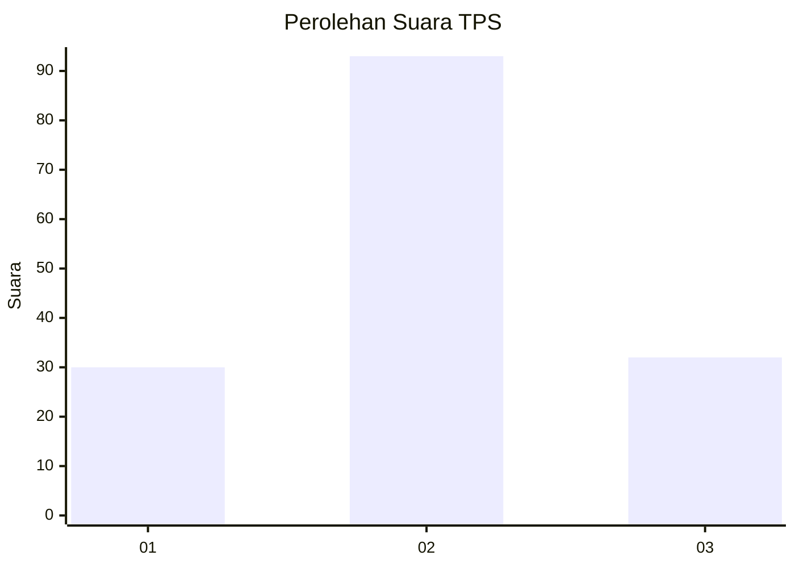
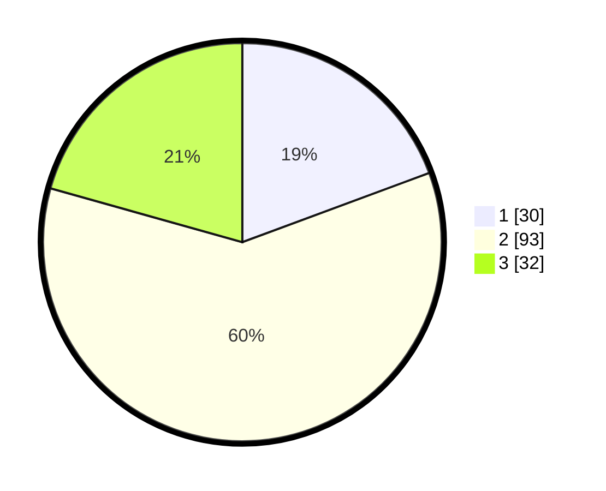

# Hasil

## Grafik

## Tabel

| No. | Nama Paslon    | Suara | Suara (raw) | Persentase |
|:--- |:-------------- | -----:| -----------:| ----------:|
| 1   | ANIES MUHAIMIN | 30    | [30][p-1]   | 19,35      |
| 2   | PRABOWO GIBRAN | 93    | [93][p-2]   | 60,00      |
| 3   | GANJAR MAHFUD  | 32    | [32][p-3]   | 20,65      |

[p-1]: https://github.com/gigit-pemilu/pemilu-2024/blob/main/pilpres/hitung-suara/sub/35-jawa-timur/sub/07-malang/sub/25-lawang/sub/1005-kalirejo/sub/015-tps/sub/paslon-1.txt
[p-2]: https://github.com/gigit-pemilu/pemilu-2024/blob/main/pilpres/hitung-suara/sub/35-jawa-timur/sub/07-malang/sub/25-lawang/sub/1005-kalirejo/sub/015-tps/sub/paslon-2.txt
[p-3]: https://github.com/gigit-pemilu/pemilu-2024/blob/main/pilpres/hitung-suara/sub/35-jawa-timur/sub/07-malang/sub/25-lawang/sub/1005-kalirejo/sub/015-tps/sub/paslon-3.txt

## Foto C Plano

https://sirekap-obj-formc.kpu.go.id/a98e/pemilu/ppwp/35/07/25/10/05/3507251005015-20240214-201704--0a836fce-384a-461a-8cb8-9d973a3b295f.jpg

https://sirekap-obj-formc.kpu.go.id/a98e/pemilu/ppwp/35/07/25/10/05/3507251005015-20240214-201711--d049fd4a-6461-42e5-8d06-52cff8e42cdb.jpg

https://sirekap-obj-formc.kpu.go.id/a98e/pemilu/ppwp/35/07/25/10/05/3507251005015-20240214-201718--7bab79cd-5491-4cfa-b566-6df8e5d42fe4.jpg

## Metadata

| Key        | Value               |
| ---------- | ------------------- |
| Time Stamp | 2024-02-24 22:31:28 |

