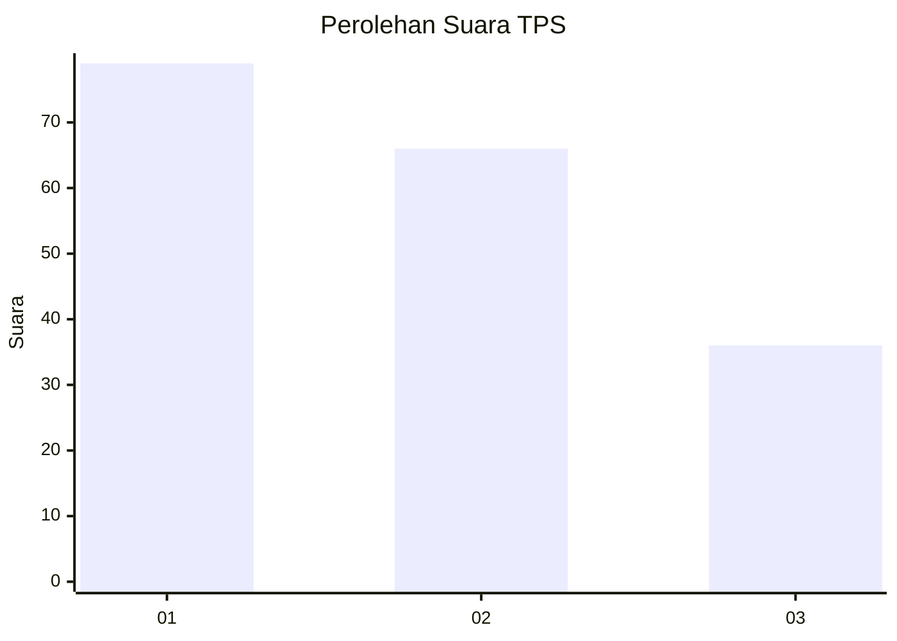
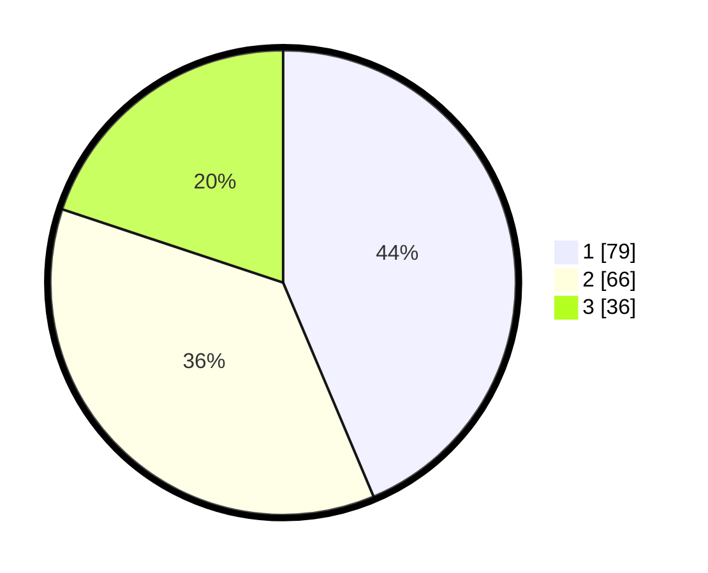

# Hasil

## Grafik

## Tabel

| No. | Nama Paslon    | Suara | Suara (raw) | Persentase |
|:--- |:-------------- | -----:| -----------:| ----------:|
| 1   | ANIES MUHAIMIN | 79    | [79][p-1]   | 43,65      |
| 2   | PRABOWO GIBRAN | 66    | [66][p-2]   | 36,46      |
| 3   | GANJAR MAHFUD  | 36    | [36][p-3]   | 19,89      |

[p-1]: https://github.com/gigit-pemilu/pemilu-2024-35-jawa-timur/blob/main/pilpres/hitung-suara/sub/35-jawa-timur/sub/07-malang/sub/25-lawang/sub/1010-lawang/sub/007-tps/sub/paslon-1.txt
[p-2]: https://github.com/gigit-pemilu/pemilu-2024-35-jawa-timur/blob/main/pilpres/hitung-suara/sub/35-jawa-timur/sub/07-malang/sub/25-lawang/sub/1010-lawang/sub/007-tps/sub/paslon-2.txt
[p-3]: https://github.com/gigit-pemilu/pemilu-2024-35-jawa-timur/blob/main/pilpres/hitung-suara/sub/35-jawa-timur/sub/07-malang/sub/25-lawang/sub/1010-lawang/sub/007-tps/sub/paslon-3.txt

## Foto C Plano

https://sirekap-obj-formc.kpu.go.id/21f3/pemilu/ppwp/35/07/25/10/10/3507251010007-20240214-195659--aa8a919f-99d9-4e21-ae3d-6161a70a7702.jpg

https://sirekap-obj-formc.kpu.go.id/21f3/pemilu/ppwp/35/07/25/10/10/3507251010007-20240214-200009--f56a18d4-7b4c-47b9-a75e-2f9b6a50e679.jpg

https://sirekap-obj-formc.kpu.go.id/21f3/pemilu/ppwp/35/07/25/10/10/3507251010007-20240214-200459--231412fe-4210-4500-99e2-390cd1e6faa7.jpg

## Metadata

| Key        | Value               |
| ---------- | ------------------- |
| Time Stamp | 2024-02-25 18:00:00 |

