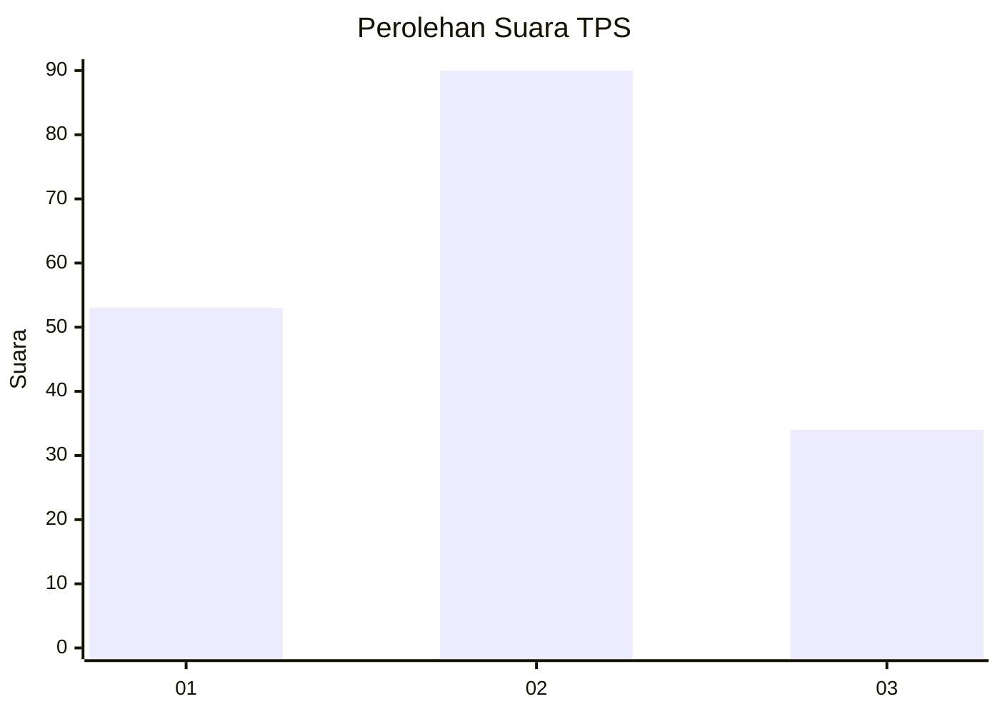
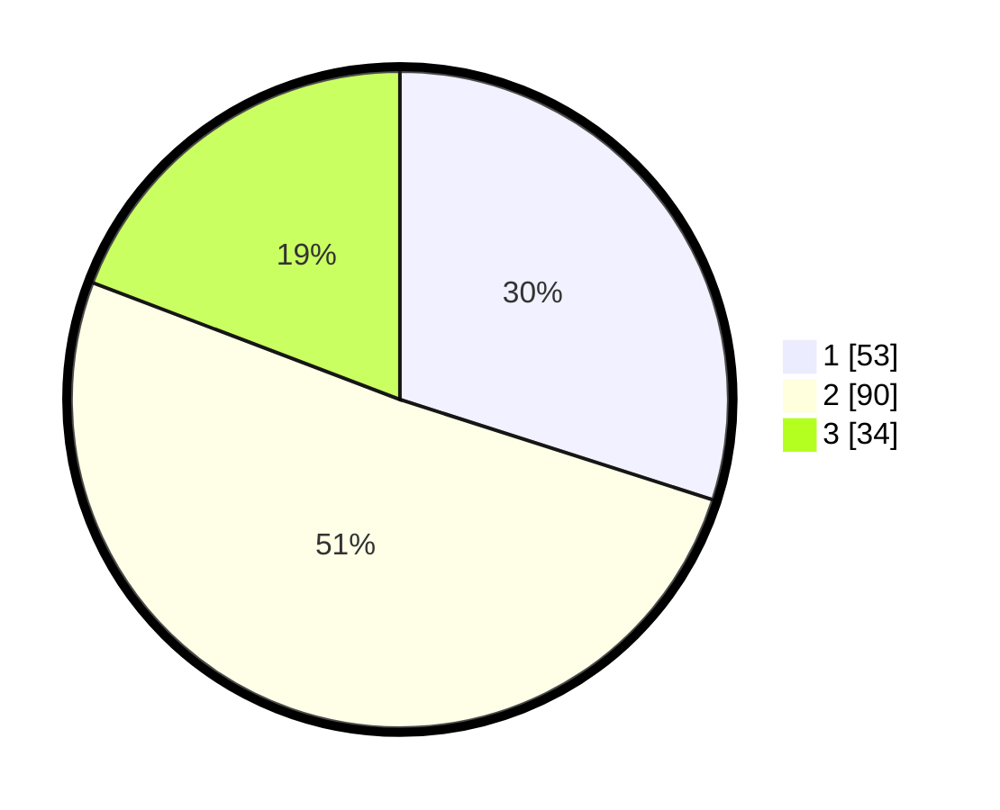

# Hasil

## Grafik

## Tabel

| No. | Nama Paslon    | Suara | Suara (raw) | Persentase |
|:--- |:-------------- | -----:| -----------:| ----------:|
| 1   | ANIES MUHAIMIN | 53    | [53][p-1]   | 29,94      |
| 2   | PRABOWO GIBRAN | 90    | [90][p-2]   | 50,85      |
| 3   | GANJAR MAHFUD  | 34    | [34][p-3]   | 19,21      |

[p-1]: https://github.com/gigit-pemilu/pemilu-2024-35-jawa-timur/blob/main/pilpres/hitung-suara/sub/35-jawa-timur/sub/07-malang/sub/25-lawang/sub/1010-lawang/sub/013-tps/sub/paslon-1.txt
[p-2]: https://github.com/gigit-pemilu/pemilu-2024-35-jawa-timur/blob/main/pilpres/hitung-suara/sub/35-jawa-timur/sub/07-malang/sub/25-lawang/sub/1010-lawang/sub/013-tps/sub/paslon-2.txt
[p-3]: https://github.com/gigit-pemilu/pemilu-2024-35-jawa-timur/blob/main/pilpres/hitung-suara/sub/35-jawa-timur/sub/07-malang/sub/25-lawang/sub/1010-lawang/sub/013-tps/sub/paslon-3.txt

## Foto C Plano

https://sirekap-obj-formc.kpu.go.id/549f/pemilu/ppwp/35/07/25/10/10/3507251010013-20240217-204407--d2b8fe35-425f-40d6-8659-563f91ccd31b.jpg

https://sirekap-obj-formc.kpu.go.id/549f/pemilu/ppwp/35/07/25/10/10/3507251010013-20240215-174522--9975315a-34c2-4ca5-84b5-5d463413cae2.jpg

https://sirekap-obj-formc.kpu.go.id/549f/pemilu/ppwp/35/07/25/10/10/3507251010013-20240214-233232--3438a187-3b8e-44ad-a74a-f4b99e2f42e4.jpg

## Metadata

| Key        | Value               |
| ---------- | ------------------- |
| Time Stamp | 2024-02-25 17:00:00 |

