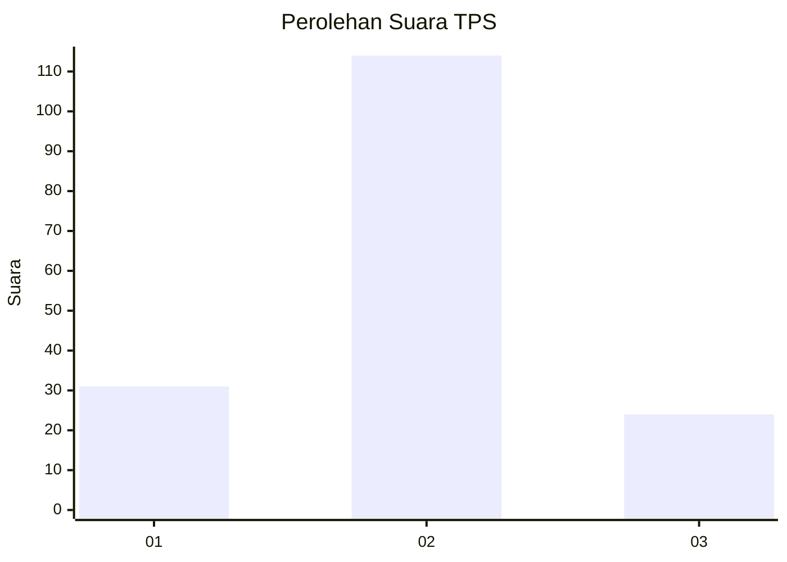
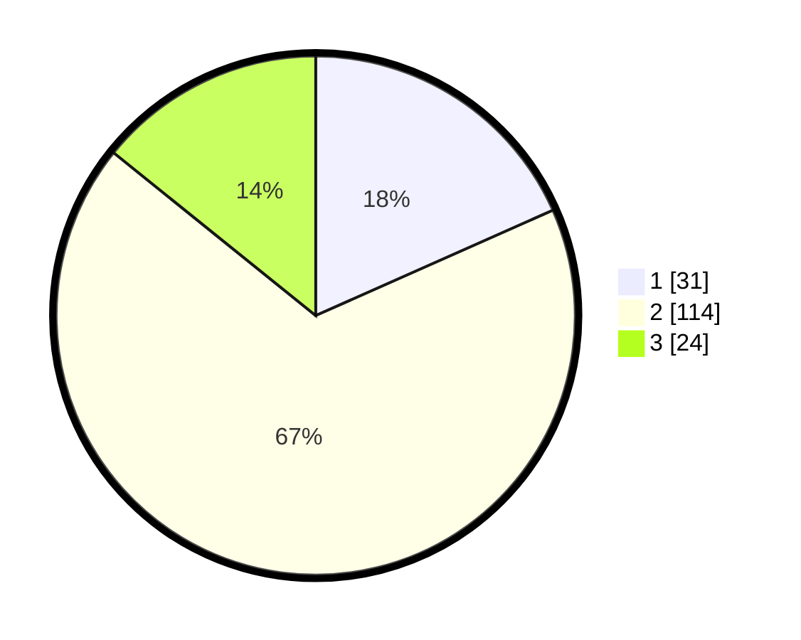

# Hasil

## Grafik

## Tabel

| No. | Nama Paslon    | Suara | Suara (raw) | Persentase |
|:--- |:-------------- | -----:| -----------:| ----------:|
| 1   | ANIES MUHAIMIN | 31    | [31][p-1]   | 18,34      |
| 2   | PRABOWO GIBRAN | 114   | [114][p-2]  | 67,46      |
| 3   | GANJAR MAHFUD  | 24    | [24][p-3]   | 14,20      |

[p-1]: https://github.com/gigit-pemilu/pemilu-2024/blob/main/pilpres/hitung-suara/sub/35-jawa-timur/sub/07-malang/sub/25-lawang/sub/1010-lawang/sub/015-tps/sub/paslon-1.txt
[p-2]: https://github.com/gigit-pemilu/pemilu-2024/blob/main/pilpres/hitung-suara/sub/35-jawa-timur/sub/07-malang/sub/25-lawang/sub/1010-lawang/sub/015-tps/sub/paslon-2.txt
[p-3]: https://github.com/gigit-pemilu/pemilu-2024/blob/main/pilpres/hitung-suara/sub/35-jawa-timur/sub/07-malang/sub/25-lawang/sub/1010-lawang/sub/015-tps/sub/paslon-3.txt

## Foto C Plano

https://sirekap-obj-formc.kpu.go.id/c98a/pemilu/ppwp/35/07/25/10/10/3507251010015-20240214-141750--803a44b1-42ca-4d98-860c-b5afce356359.jpg

https://sirekap-obj-formc.kpu.go.id/c98a/pemilu/ppwp/35/07/25/10/10/3507251010015-20240214-141856--979b96bb-b44d-4bfd-9e92-1e4389d4e9f9.jpg

https://sirekap-obj-formc.kpu.go.id/c98a/pemilu/ppwp/35/07/25/10/10/3507251010015-20240217-181247--0fc9b43d-90d7-4e67-a142-4472de56cb96.jpg

## Metadata

| Key        | Value               |
| ---------- | ------------------- |
| Time Stamp | 2024-02-24 22:31:28 |

