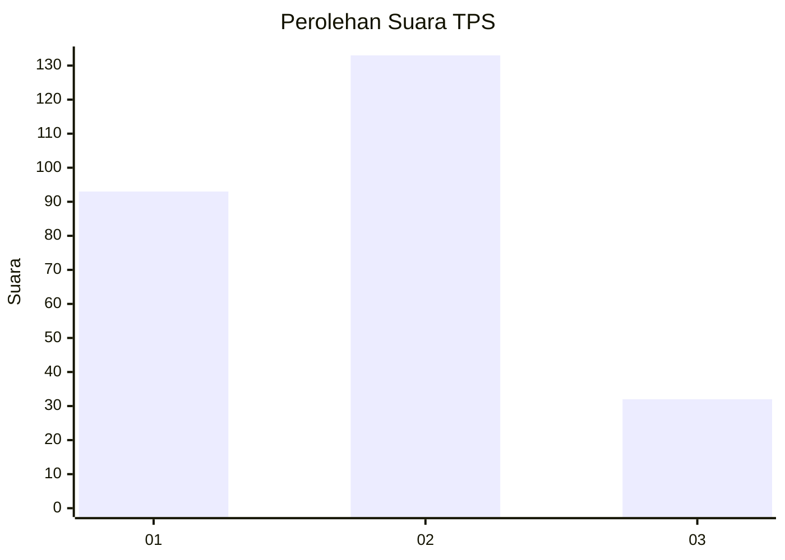
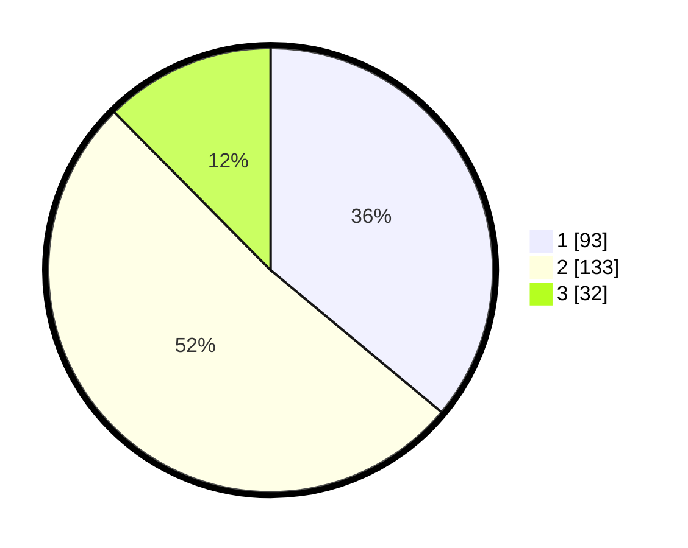

# Hasil

## Grafik

## Tabel

| No. | Nama Paslon    | Suara | Suara (raw) | Persentase |
|:--- |:-------------- | -----:| -----------:| ----------:|
| 1   | ANIES MUHAIMIN | 93    | [93][p-1]   | 36,05      |
| 2   | PRABOWO GIBRAN | 133   | [133][p-2]  | 51,55      |
| 3   | GANJAR MAHFUD  | 32    | [32][p-3]   | 12,40      |

[p-1]: https://github.com/gigit-pemilu/pemilu-2024/blob/main/pilpres/hitung-suara/sub/35-jawa-timur/sub/07-malang/sub/25-lawang/sub/1010-lawang/sub/025-tps/sub/paslon-1.txt
[p-2]: https://github.com/gigit-pemilu/pemilu-2024/blob/main/pilpres/hitung-suara/sub/35-jawa-timur/sub/07-malang/sub/25-lawang/sub/1010-lawang/sub/025-tps/sub/paslon-2.txt
[p-3]: https://github.com/gigit-pemilu/pemilu-2024/blob/main/pilpres/hitung-suara/sub/35-jawa-timur/sub/07-malang/sub/25-lawang/sub/1010-lawang/sub/025-tps/sub/paslon-3.txt

## Foto C Plano

https://sirekap-obj-formc.kpu.go.id/433c/pemilu/ppwp/35/07/25/10/10/3507251010025-20240218-191827--599e0993-fb33-4666-920f-bab1f768489c.jpg

https://sirekap-obj-formc.kpu.go.id/433c/pemilu/ppwp/35/07/25/10/10/3507251010025-20240215-000533--2975ec04-4819-46ef-a245-78297d93568c.jpg

https://sirekap-obj-formc.kpu.go.id/433c/pemilu/ppwp/35/07/25/10/10/3507251010025-20240215-000635--e691297c-62ff-418d-a64f-2d663b8128af.jpg

## Metadata

| Key        | Value               |
| ---------- | ------------------- |
| Time Stamp | 2024-02-24 22:31:28 |

