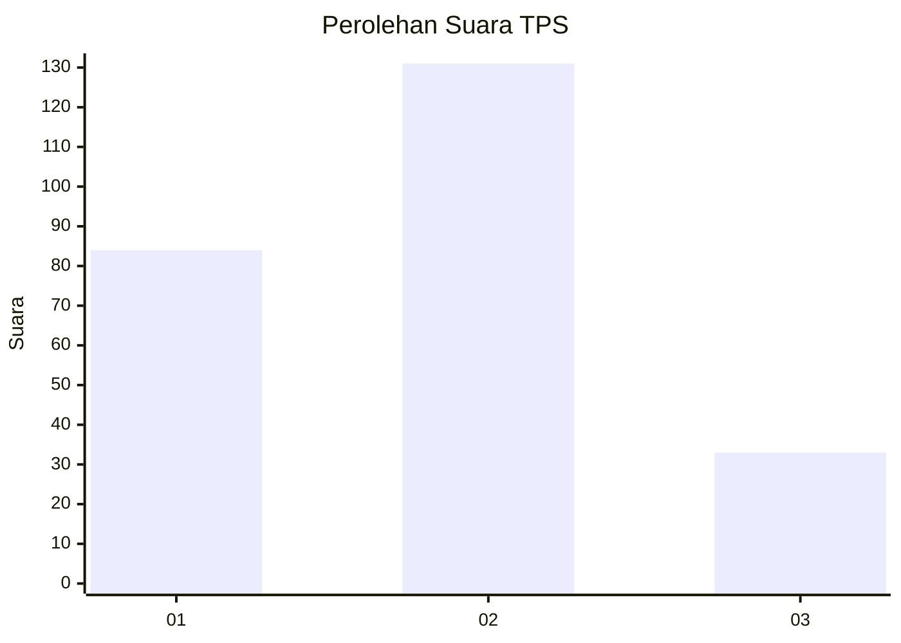
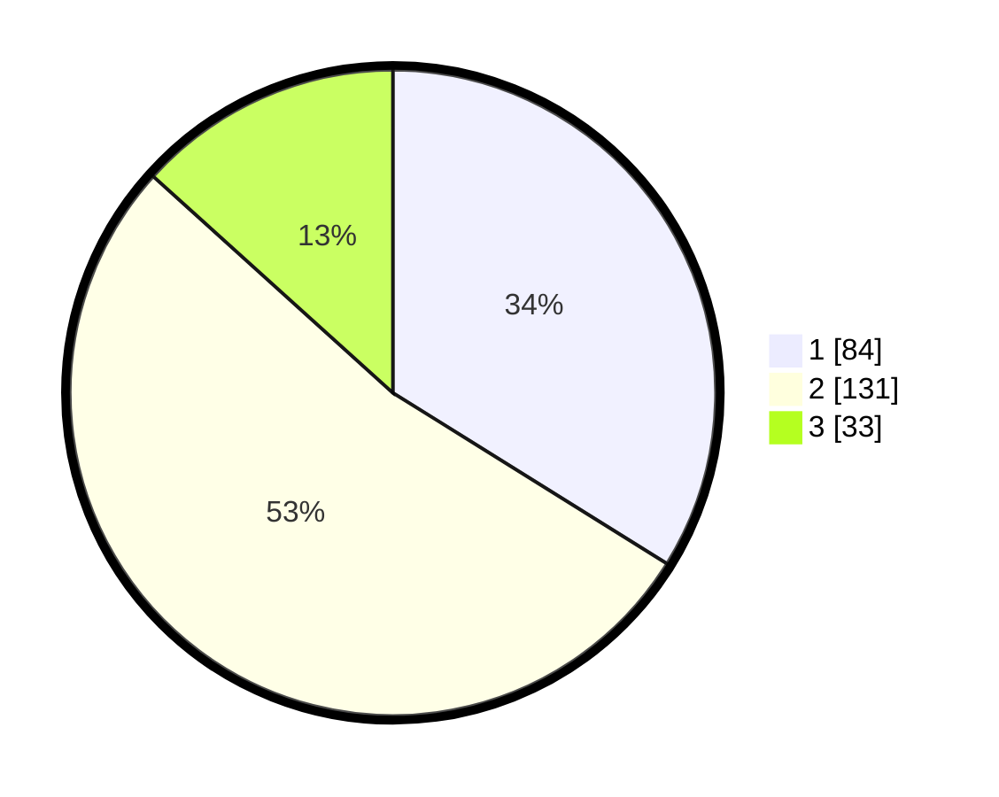

# Hasil

## Grafik

## Tabel

| No. | Nama Paslon    | Suara | Suara (raw) | Persentase |
|:--- |:-------------- | -----:| -----------:| ----------:|
| 1   | ANIES MUHAIMIN | 84    | [84][p-1]   | 33,87      |
| 2   | PRABOWO GIBRAN | 131   | [131][p-2]  | 52,82      |
| 3   | GANJAR MAHFUD  | 33    | [33][p-3]   | 13,31      |

[p-1]: https://github.com/gigit-pemilu/pemilu-2024-35-jawa-timur/blob/main/pilpres/hitung-suara/sub/35-jawa-timur/sub/07-malang/sub/25-lawang/sub/1010-lawang/sub/026-tps/sub/paslon-1.txt
[p-2]: https://github.com/gigit-pemilu/pemilu-2024-35-jawa-timur/blob/main/pilpres/hitung-suara/sub/35-jawa-timur/sub/07-malang/sub/25-lawang/sub/1010-lawang/sub/026-tps/sub/paslon-2.txt
[p-3]: https://github.com/gigit-pemilu/pemilu-2024-35-jawa-timur/blob/main/pilpres/hitung-suara/sub/35-jawa-timur/sub/07-malang/sub/25-lawang/sub/1010-lawang/sub/026-tps/sub/paslon-3.txt

## Foto C Plano

https://sirekap-obj-formc.kpu.go.id/bc1f/pemilu/ppwp/35/07/25/10/10/3507251010026-20240217-183342--05813ffb-fae1-41c6-8e50-1f2d989acca0.jpg

https://sirekap-obj-formc.kpu.go.id/bc1f/pemilu/ppwp/35/07/25/10/10/3507251010026-20240214-214241--9ef7da18-3ac0-495f-8b40-06283a27b15e.jpg

https://sirekap-obj-formc.kpu.go.id/bc1f/pemilu/ppwp/35/07/25/10/10/3507251010026-20240214-214348--f460b89d-41ab-41bf-98af-1f00a7498c1b.jpg

## Metadata

| Key        | Value               |
| ---------- | ------------------- |
| Time Stamp | 2024-02-25 12:00:00 |

