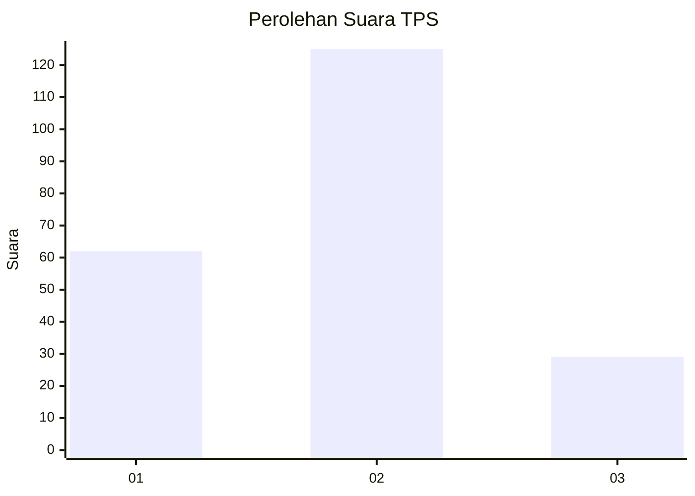
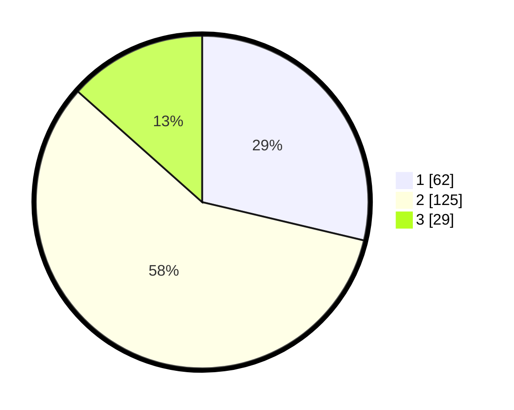

# Hasil

## Grafik

## Tabel

| No. | Nama Paslon    | Suara | Suara (raw) | Persentase |
|:--- |:-------------- | -----:| -----------:| ----------:|
| 1   | ANIES MUHAIMIN | 62    | [62][p-1]   | 28,70      |
| 2   | PRABOWO GIBRAN | 125   | [125][p-2]  | 57,87      |
| 3   | GANJAR MAHFUD  | 29    | [29][p-3]   | 13,43      |

[p-1]: https://github.com/gigit-pemilu/pemilu-2024-35-jawa-timur/blob/main/pilpres/hitung-suara/sub/35-jawa-timur/sub/07-malang/sub/25-lawang/sub/1010-lawang/sub/033-tps/sub/paslon-1.txt
[p-2]: https://github.com/gigit-pemilu/pemilu-2024-35-jawa-timur/blob/main/pilpres/hitung-suara/sub/35-jawa-timur/sub/07-malang/sub/25-lawang/sub/1010-lawang/sub/033-tps/sub/paslon-2.txt
[p-3]: https://github.com/gigit-pemilu/pemilu-2024-35-jawa-timur/blob/main/pilpres/hitung-suara/sub/35-jawa-timur/sub/07-malang/sub/25-lawang/sub/1010-lawang/sub/033-tps/sub/paslon-3.txt

## Foto C Plano

https://sirekap-obj-formc.kpu.go.id/b8e8/pemilu/ppwp/35/07/25/10/10/3507251010033-20240217-221923--6aabc69c-6926-498d-8817-6c9072865c04.jpg

https://sirekap-obj-formc.kpu.go.id/b8e8/pemilu/ppwp/35/07/25/10/10/3507251010033-20240220-105838--2edcb9a2-5148-438b-a608-4ba25200a9c9.jpg

https://sirekap-obj-formc.kpu.go.id/b8e8/pemilu/ppwp/35/07/25/10/10/3507251010033-20240218-050843--1afee603-8d7a-436d-b713-74ef3d0fe8a1.jpg

## Metadata

| Key        | Value               |
| ---------- | ------------------- |
| Time Stamp | 2024-02-20 11:00:00 |

