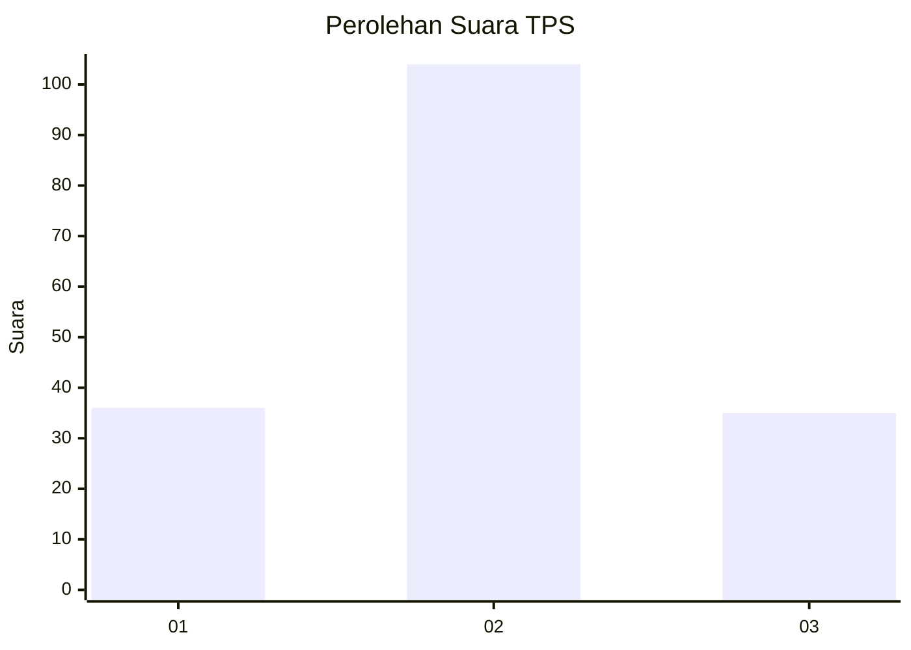
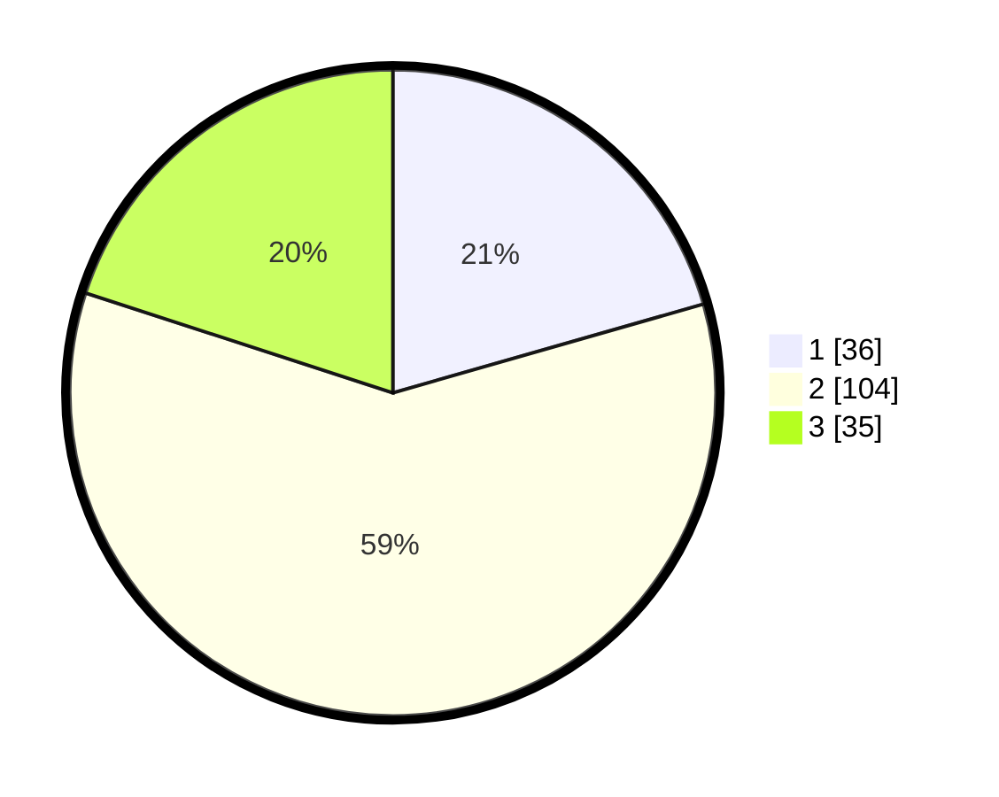

# Hasil

## Grafik

## Tabel

| No. | Nama Paslon    | Suara | Suara (raw) | Persentase |
|:--- |:-------------- | -----:| -----------:| ----------:|
| 1   | ANIES MUHAIMIN | 36    | [36][p-1]   | 20,57      |
| 2   | PRABOWO GIBRAN | 104   | [104][p-2]  | 59,43      |
| 3   | GANJAR MAHFUD  | 35    | [35][p-3]   | 20,00      |

[p-1]: https://github.com/gigit-pemilu/pemilu-2024/blob/main/pilpres/hitung-suara/sub/35-jawa-timur/sub/07-malang/sub/25-lawang/sub/2001-sidoluhur/sub/014-tps/sub/paslon-1.txt
[p-2]: https://github.com/gigit-pemilu/pemilu-2024/blob/main/pilpres/hitung-suara/sub/35-jawa-timur/sub/07-malang/sub/25-lawang/sub/2001-sidoluhur/sub/014-tps/sub/paslon-2.txt
[p-3]: https://github.com/gigit-pemilu/pemilu-2024/blob/main/pilpres/hitung-suara/sub/35-jawa-timur/sub/07-malang/sub/25-lawang/sub/2001-sidoluhur/sub/014-tps/sub/paslon-3.txt

## Foto C Plano

https://sirekap-obj-formc.kpu.go.id/09a5/pemilu/ppwp/35/07/25/20/01/3507252001014-20240225-211342--93a12050-ef4e-4219-aa31-ac0729b5e3a0.jpg

https://sirekap-obj-formc.kpu.go.id/09a5/pemilu/ppwp/35/07/25/20/01/3507252001014-20240220-215526--620dafa3-9056-4b81-b50c-6d52bfa44007.jpg

https://sirekap-obj-formc.kpu.go.id/09a5/pemilu/ppwp/35/07/25/20/01/3507252001014-20240225-211402--d65e9585-30e9-481f-ad5d-8261552769fb.jpg

## Metadata

| Key        | Value               |
| ---------- | ------------------- |
| Time Stamp | 2024-02-25 22:00:00 |

