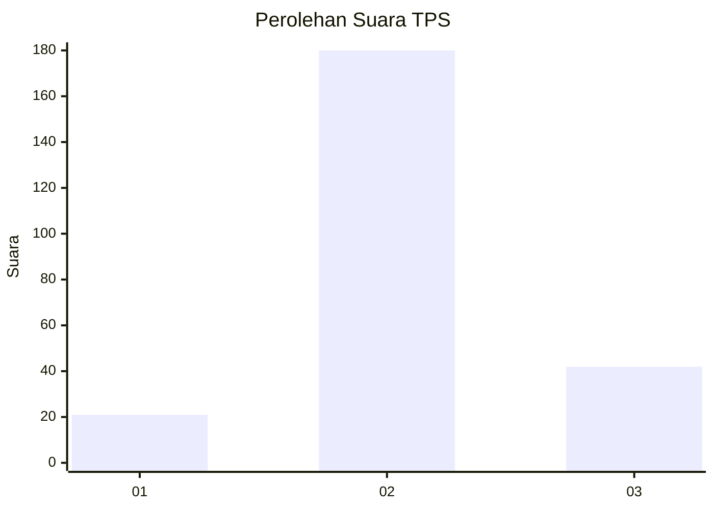
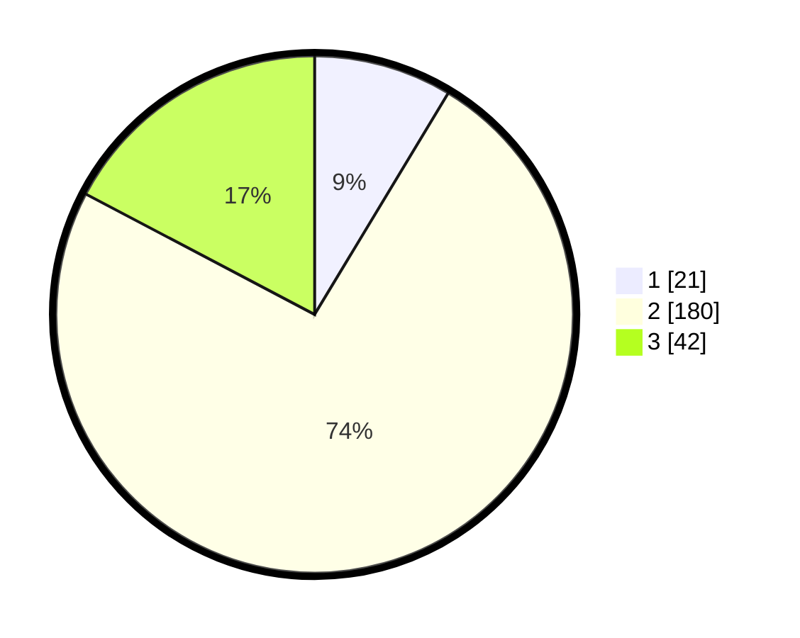

# Hasil

## Grafik

## Tabel

| No. | Nama Paslon    | Suara | Suara (raw) | Persentase |
|:--- |:-------------- | -----:| -----------:| ----------:|
| 1   | ANIES MUHAIMIN | 21    | [21][p-1]   | 8,64       |
| 2   | PRABOWO GIBRAN | 180   | [180][p-2]  | 74,07      |
| 3   | GANJAR MAHFUD  | 42    | [42][p-3]   | 17,28      |

[p-1]: https://github.com/gigit-pemilu/pemilu-2024/blob/main/pilpres/hitung-suara/sub/35-jawa-timur/sub/07-malang/sub/25-lawang/sub/2007-sumberngepoh/sub/004-tps/sub/paslon-1.txt
[p-2]: https://github.com/gigit-pemilu/pemilu-2024/blob/main/pilpres/hitung-suara/sub/35-jawa-timur/sub/07-malang/sub/25-lawang/sub/2007-sumberngepoh/sub/004-tps/sub/paslon-2.txt
[p-3]: https://github.com/gigit-pemilu/pemilu-2024/blob/main/pilpres/hitung-suara/sub/35-jawa-timur/sub/07-malang/sub/25-lawang/sub/2007-sumberngepoh/sub/004-tps/sub/paslon-3.txt

## Foto C Plano

https://sirekap-obj-formc.kpu.go.id/f054/pemilu/ppwp/35/07/25/20/07/3507252007004-20240216-125753--7afcd96c-1638-47c0-bbac-ef5f11bbcb27.jpg

https://sirekap-obj-formc.kpu.go.id/f054/pemilu/ppwp/35/07/25/20/07/3507252007004-20240216-125859--0041a4d1-5c4a-4e5d-b238-41816f7c9715.jpg

https://sirekap-obj-formc.kpu.go.id/f054/pemilu/ppwp/35/07/25/20/07/3507252007004-20240216-125433--0dd282a4-18f2-494e-ab1f-c917aaf2697b.jpg

## Metadata

| Key        | Value               |
| ---------- | ------------------- |
| Time Stamp | 2024-02-25 07:00:00 |

