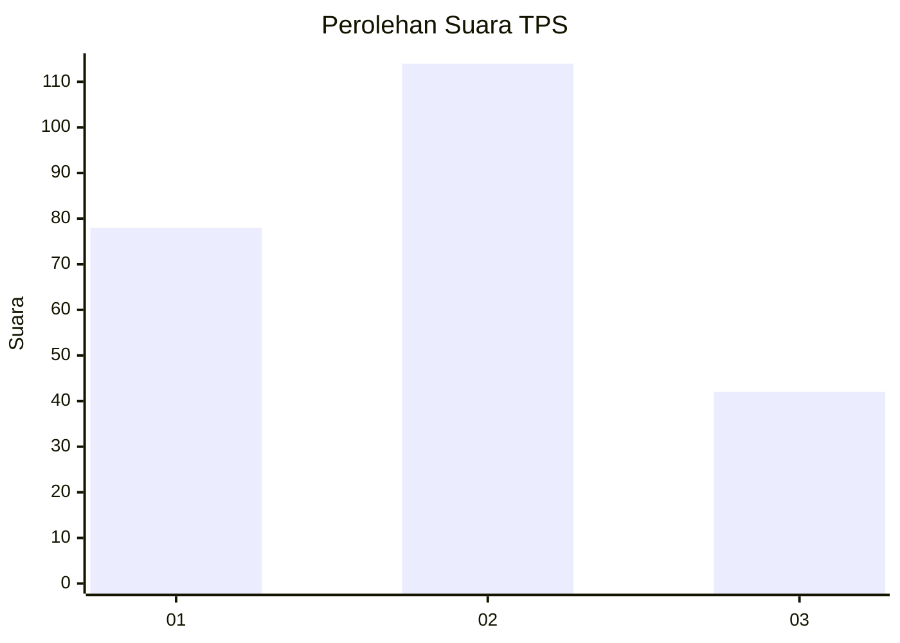
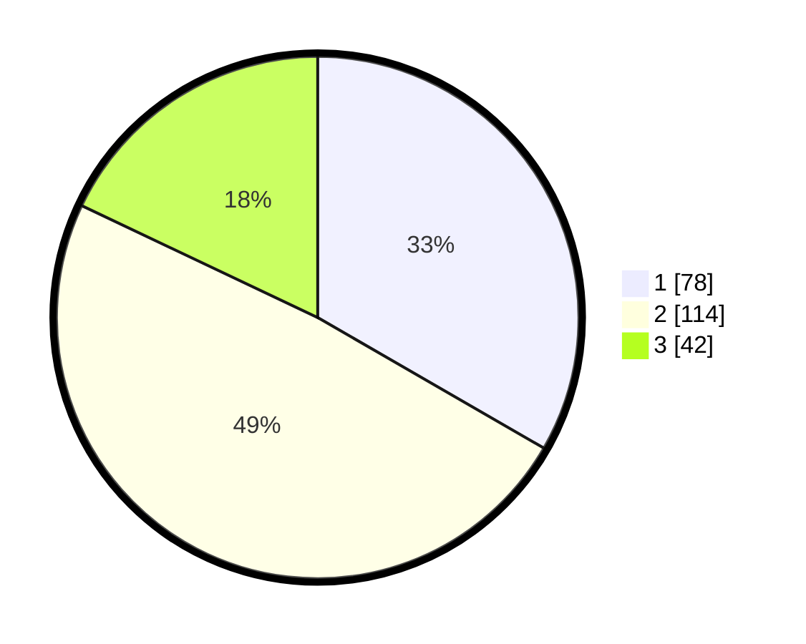

# Hasil

## Grafik

## Tabel

| No. | Nama Paslon    | Suara | Suara (raw) | Persentase |
|:--- |:-------------- | -----:| -----------:| ----------:|
| 1   | ANIES MUHAIMIN | 78    | [78][p-1]   | 33,33      |
| 2   | PRABOWO GIBRAN | 114   | [114][p-2]  | 48,72      |
| 3   | GANJAR MAHFUD  | 42    | [42][p-3]   | 17,95      |

[p-1]: https://github.com/gigit-pemilu/pemilu-2024-35-jawa-timur/blob/main/pilpres/hitung-suara/sub/35-jawa-timur/sub/07-malang/sub/25-lawang/sub/2008-sumberporong/sub/013-tps/sub/paslon-1.txt
[p-2]: https://github.com/gigit-pemilu/pemilu-2024-35-jawa-timur/blob/main/pilpres/hitung-suara/sub/35-jawa-timur/sub/07-malang/sub/25-lawang/sub/2008-sumberporong/sub/013-tps/sub/paslon-2.txt
[p-3]: https://github.com/gigit-pemilu/pemilu-2024-35-jawa-timur/blob/main/pilpres/hitung-suara/sub/35-jawa-timur/sub/07-malang/sub/25-lawang/sub/2008-sumberporong/sub/013-tps/sub/paslon-3.txt

## Foto C Plano

https://sirekap-obj-formc.kpu.go.id/e4b8/pemilu/ppwp/35/07/25/20/08/3507252008013-20240225-110903--7b58c919-7c29-4b1f-b2f8-38675cb5aef0.jpg

https://sirekap-obj-formc.kpu.go.id/e4b8/pemilu/ppwp/35/07/25/20/08/3507252008013-20240225-110954--86f5da1b-12f6-4d9f-9f1f-ecb78cb9a2d7.jpg

https://sirekap-obj-formc.kpu.go.id/e4b8/pemilu/ppwp/35/07/25/20/08/3507252008013-20240225-111017--a107480d-6d42-47dd-8245-99f1293a7f91.jpg

## Metadata

| Key        | Value               |
| ---------- | ------------------- |
| Time Stamp | 2024-02-25 21:00:00 |

