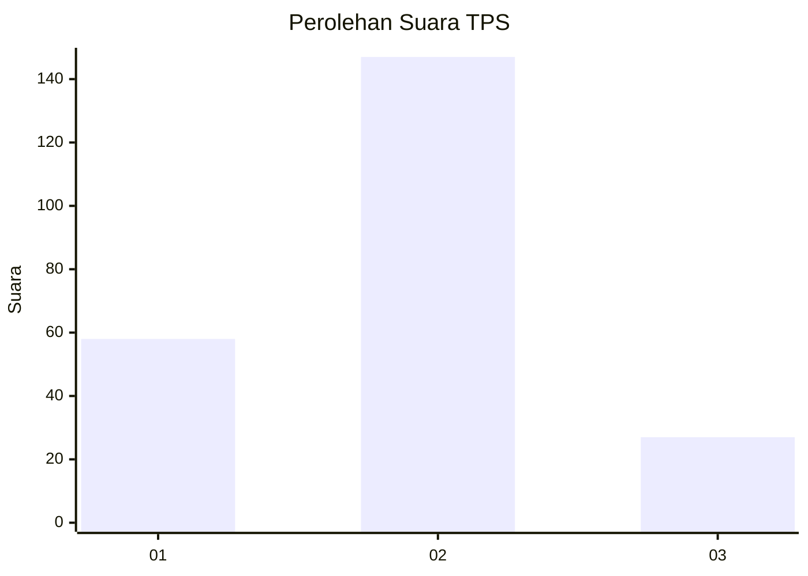
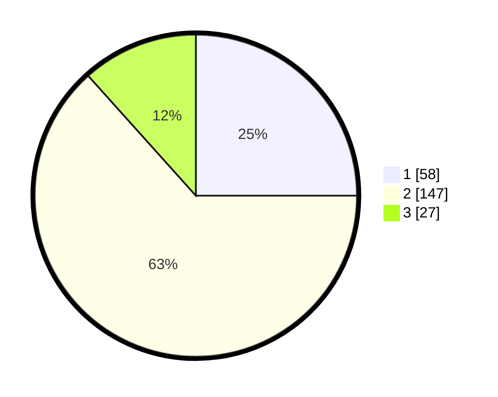

# Hasil

## Grafik

## Tabel

| No. | Nama Paslon    | Suara | Suara (raw) | Persentase |
|:--- |:-------------- | -----:| -----------:| ----------:|
| 1   | ANIES MUHAIMIN | 58    | [58][p-1]   | 25,00      |
| 2   | PRABOWO GIBRAN | 147   | [147][p-2]  | 63,36      |
| 3   | GANJAR MAHFUD  | 27    | [27][p-3]   | 11,64      |

[p-1]: https://github.com/gigit-pemilu/pemilu-2024/blob/main/pilpres/hitung-suara/sub/35-jawa-timur/sub/07-malang/sub/25-lawang/sub/2011-ketindan/sub/001-tps/sub/paslon-1.txt
[p-2]: https://github.com/gigit-pemilu/pemilu-2024/blob/main/pilpres/hitung-suara/sub/35-jawa-timur/sub/07-malang/sub/25-lawang/sub/2011-ketindan/sub/001-tps/sub/paslon-2.txt
[p-3]: https://github.com/gigit-pemilu/pemilu-2024/blob/main/pilpres/hitung-suara/sub/35-jawa-timur/sub/07-malang/sub/25-lawang/sub/2011-ketindan/sub/001-tps/sub/paslon-3.txt

## Foto C Plano

https://sirekap-obj-formc.kpu.go.id/09f3/pemilu/ppwp/35/07/25/20/11/3507252011001-20240217-180830--c1732abd-cbfd-4f1b-a517-1a56f4f4319b.jpg

https://sirekap-obj-formc.kpu.go.id/09f3/pemilu/ppwp/35/07/25/20/11/3507252011001-20240218-054836--cc38c8ff-72b5-4886-9205-214d87b59179.jpg

https://sirekap-obj-formc.kpu.go.id/09f3/pemilu/ppwp/35/07/25/20/11/3507252011001-20240218-055725--86e63b6f-bd88-4006-8d96-21b13cb99e45.jpg

## Metadata

| Key        | Value               |
| ---------- | ------------------- |
| Time Stamp | 2024-02-19 06:16:00 |

