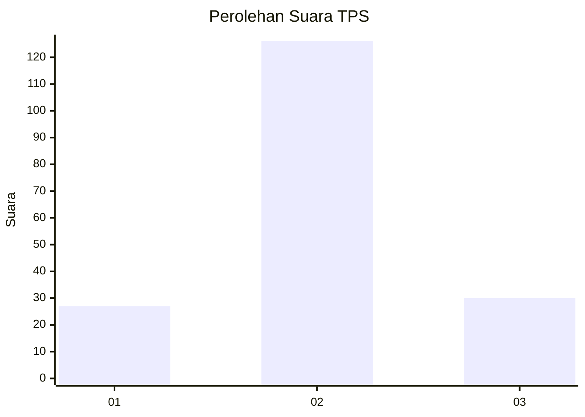
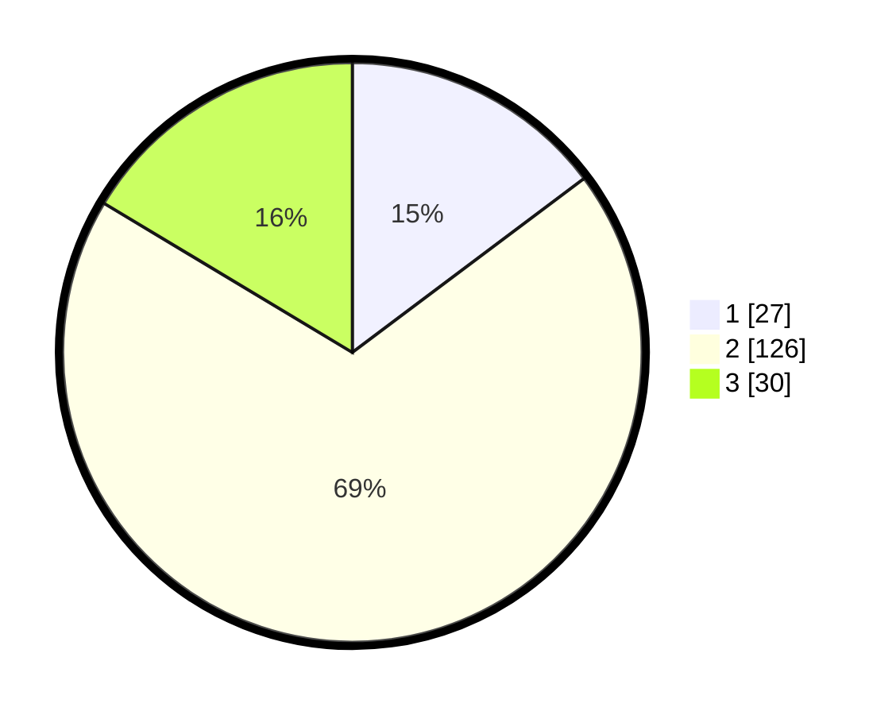

# Hasil

## Grafik

## Tabel

| No. | Nama Paslon    | Suara | Suara (raw) | Persentase |
|:--- |:-------------- | -----:| -----------:| ----------:|
| 1   | ANIES MUHAIMIN | 27    | [27][p-1]   | 14,75      |
| 2   | PRABOWO GIBRAN | 126   | [126][p-2]  | 68,85      |
| 3   | GANJAR MAHFUD  | 30    | [30][p-3]   | 16,39      |

[p-1]: https://github.com/gigit-pemilu/pemilu-2024/blob/main/pilpres/hitung-suara/sub/35-jawa-timur/sub/07-malang/sub/25-lawang/sub/2011-ketindan/sub/015-tps/sub/paslon-1.txt
[p-2]: https://github.com/gigit-pemilu/pemilu-2024/blob/main/pilpres/hitung-suara/sub/35-jawa-timur/sub/07-malang/sub/25-lawang/sub/2011-ketindan/sub/015-tps/sub/paslon-2.txt
[p-3]: https://github.com/gigit-pemilu/pemilu-2024/blob/main/pilpres/hitung-suara/sub/35-jawa-timur/sub/07-malang/sub/25-lawang/sub/2011-ketindan/sub/015-tps/sub/paslon-3.txt

## Foto C Plano

https://sirekap-obj-formc.kpu.go.id/bfff/pemilu/ppwp/35/07/25/20/11/3507252011015-20240218-005412--76ec9ba7-9d18-4f14-8d9c-4bc7e16a70c0.jpg

https://sirekap-obj-formc.kpu.go.id/bfff/pemilu/ppwp/35/07/25/20/11/3507252011015-20240214-141129--256c6a38-3665-4afa-bf00-e336e7323c71.jpg

https://sirekap-obj-formc.kpu.go.id/bfff/pemilu/ppwp/35/07/25/20/11/3507252011015-20240217-203709--586c1c46-0a15-4786-9e25-aba70d857cdf.jpg

## Metadata

| Key        | Value               |
| ---------- | ------------------- |
| Time Stamp | 2024-02-19 06:16:00 |

