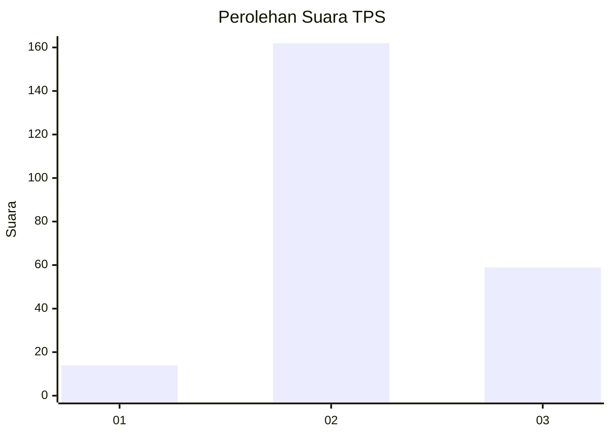
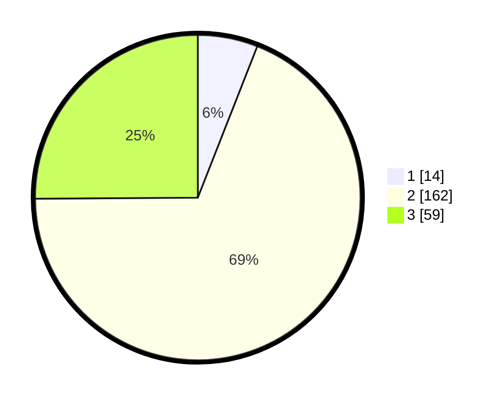

# Hasil

## Grafik

## Tabel

| No. | Nama Paslon    | Suara | Suara (raw) | Persentase |
|:--- |:-------------- | -----:| -----------:| ----------:|
| 1   | ANIES MUHAIMIN | 14    | [14][p-1]   | 5,96       |
| 2   | PRABOWO GIBRAN | 162   | [162][p-2]  | 68,94      |
| 3   | GANJAR MAHFUD  | 59    | [59][p-3]   | 25,11      |

[p-1]: https://github.com/gigit-pemilu/pemilu-2024-35-jawa-timur/blob/main/pilpres/hitung-suara/sub/35-jawa-timur/sub/07-malang/sub/26-pujon/sub/2001-bendosari/sub/002-tps/sub/paslon-1.txt
[p-2]: https://github.com/gigit-pemilu/pemilu-2024-35-jawa-timur/blob/main/pilpres/hitung-suara/sub/35-jawa-timur/sub/07-malang/sub/26-pujon/sub/2001-bendosari/sub/002-tps/sub/paslon-2.txt
[p-3]: https://github.com/gigit-pemilu/pemilu-2024-35-jawa-timur/blob/main/pilpres/hitung-suara/sub/35-jawa-timur/sub/07-malang/sub/26-pujon/sub/2001-bendosari/sub/002-tps/sub/paslon-3.txt

## Foto C Plano

https://sirekap-obj-formc.kpu.go.id/3bea/pemilu/ppwp/35/07/26/20/01/3507262001002-20240215-005455--fccdcaf7-ba9f-41d1-adf0-03e9134ccac7.jpg

https://sirekap-obj-formc.kpu.go.id/3bea/pemilu/ppwp/35/07/26/20/01/3507262001002-20240215-005610--6b0f934b-eaaf-49fe-b6bd-426ba3e67ec3.jpg

https://sirekap-obj-formc.kpu.go.id/3bea/pemilu/ppwp/35/07/26/20/01/3507262001002-20240215-005700--23048b27-0041-4f48-817e-cf05ceb1d187.jpg

## Metadata

| Key        | Value               |
| ---------- | ------------------- |
| Time Stamp | 2024-02-17 10:30:03 |

