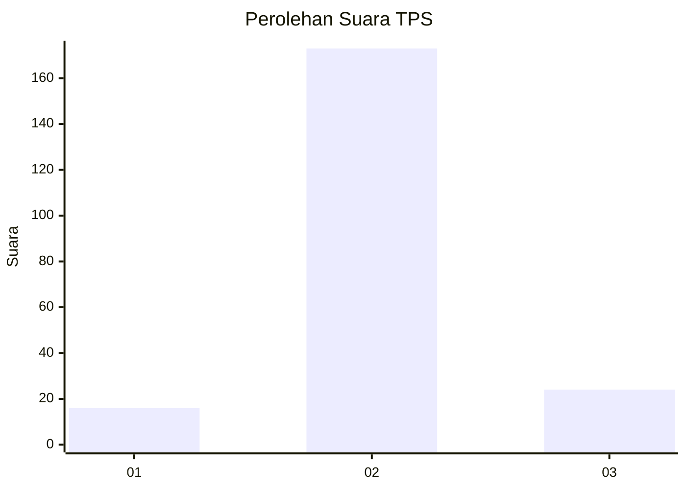
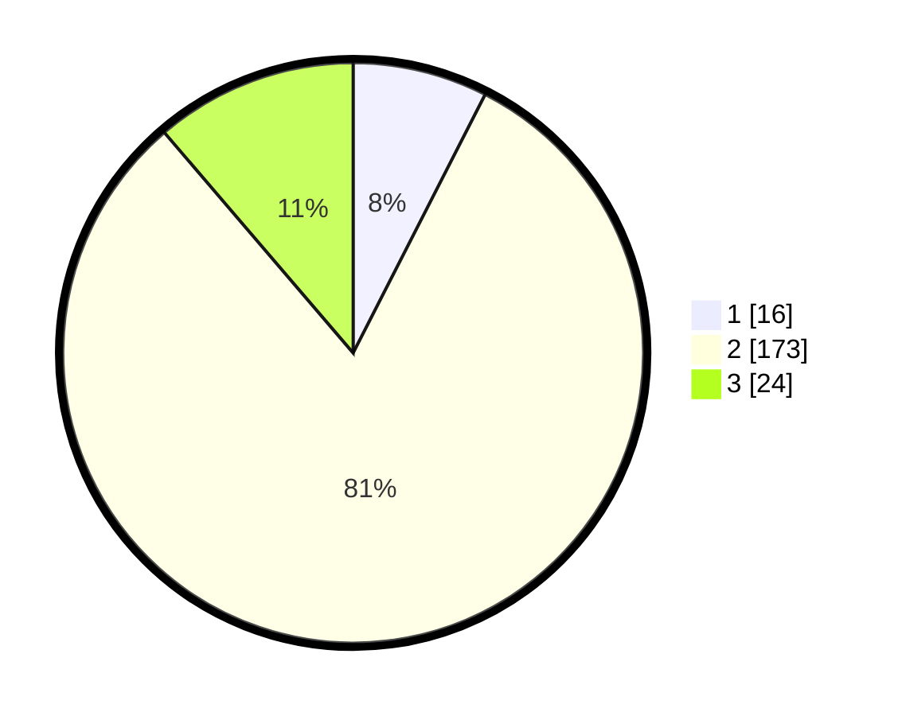

# Hasil

## Grafik

## Tabel

| No. | Nama Paslon    | Suara | Suara (raw) | Persentase |
|:--- |:-------------- | -----:| -----------:| ----------:|
| 1   | ANIES MUHAIMIN | 16    | [16][p-1]   | 7,51       |
| 2   | PRABOWO GIBRAN | 173   | [173][p-2]  | 81,22      |
| 3   | GANJAR MAHFUD  | 24    | [24][p-3]   | 11,27      |

[p-1]: https://github.com/gigit-pemilu/pemilu-2024-35-jawa-timur/blob/main/pilpres/hitung-suara/sub/35-jawa-timur/sub/07-malang/sub/26-pujon/sub/2002-sukomulyo/sub/002-tps/sub/paslon-1.txt
[p-2]: https://github.com/gigit-pemilu/pemilu-2024-35-jawa-timur/blob/main/pilpres/hitung-suara/sub/35-jawa-timur/sub/07-malang/sub/26-pujon/sub/2002-sukomulyo/sub/002-tps/sub/paslon-2.txt
[p-3]: https://github.com/gigit-pemilu/pemilu-2024-35-jawa-timur/blob/main/pilpres/hitung-suara/sub/35-jawa-timur/sub/07-malang/sub/26-pujon/sub/2002-sukomulyo/sub/002-tps/sub/paslon-3.txt

## Foto C Plano

https://sirekap-obj-formc.kpu.go.id/a823/pemilu/ppwp/35/07/26/20/02/3507262002002-20240215-030148--c76c191f-7532-4b94-bb37-4879b453ec05.jpg

https://sirekap-obj-formc.kpu.go.id/a823/pemilu/ppwp/35/07/26/20/02/3507262002002-20240215-034831--d1e0e3fc-d4b6-4ae0-b7c8-f58a07d70eca.jpg

https://sirekap-obj-formc.kpu.go.id/a823/pemilu/ppwp/35/07/26/20/02/3507262002002-20240215-030644--5f4be15c-d852-4a25-bd05-85c4286b0b0e.jpg

## Metadata

| Key        | Value               |
| ---------- | ------------------- |
| Time Stamp | 2024-02-17 10:00:02 |

