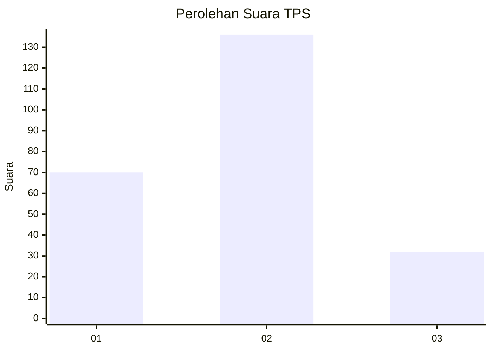
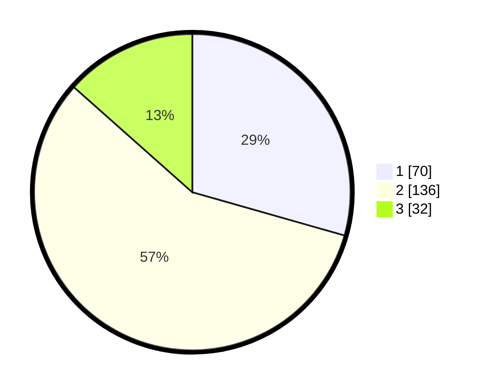

# Hasil

## Grafik

## Tabel

| No. | Nama Paslon    | Suara | Suara (raw) | Persentase |
|:--- |:-------------- | -----:| -----------:| ----------:|
| 1   | ANIES MUHAIMIN | 70    | [70][p-1]   | 29,41      |
| 2   | PRABOWO GIBRAN | 136   | [136][p-2]  | 57,14      |
| 3   | GANJAR MAHFUD  | 32    | [32][p-3]   | 13,45      |

[p-1]: https://github.com/gigit-pemilu/pemilu-2024-35-jawa-timur/blob/main/pilpres/hitung-suara/sub/35-jawa-timur/sub/07-malang/sub/26-pujon/sub/2003-pujonkidul/sub/009-tps/sub/paslon-1.txt
[p-2]: https://github.com/gigit-pemilu/pemilu-2024-35-jawa-timur/blob/main/pilpres/hitung-suara/sub/35-jawa-timur/sub/07-malang/sub/26-pujon/sub/2003-pujonkidul/sub/009-tps/sub/paslon-2.txt
[p-3]: https://github.com/gigit-pemilu/pemilu-2024-35-jawa-timur/blob/main/pilpres/hitung-suara/sub/35-jawa-timur/sub/07-malang/sub/26-pujon/sub/2003-pujonkidul/sub/009-tps/sub/paslon-3.txt

## Foto C Plano

https://sirekap-obj-formc.kpu.go.id/1573/pemilu/ppwp/35/07/26/20/03/3507262003009-20240217-185957--230f3719-55d5-407b-b584-6bed44ede587.jpg

https://sirekap-obj-formc.kpu.go.id/1573/pemilu/ppwp/35/07/26/20/03/3507262003009-20240217-190059--8430e760-d5b7-4aa2-a6b1-05998e780376.jpg

https://sirekap-obj-formc.kpu.go.id/1573/pemilu/ppwp/35/07/26/20/03/3507262003009-20240217-190147--c2e27c3e-f037-49f4-a796-96dc7eb6b4ef.jpg

## Metadata

| Key        | Value               |
| ---------- | ------------------- |
| Time Stamp | 2024-02-17 19:30:00 |

