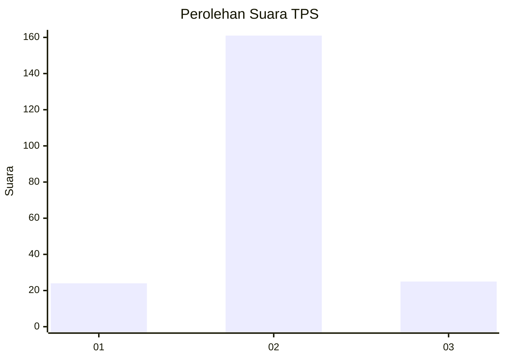
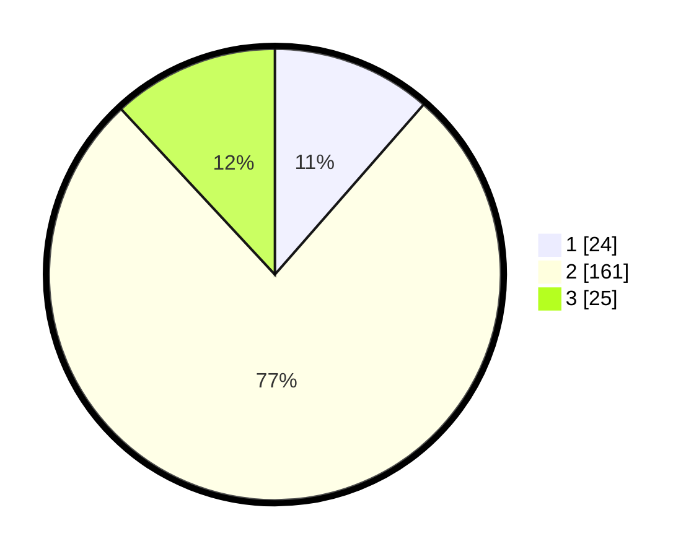

# Hasil

## Grafik

## Tabel

| No. | Nama Paslon    | Suara | Suara (raw) | Persentase |
|:--- |:-------------- | -----:| -----------:| ----------:|
| 1   | ANIES MUHAIMIN | 24    | [24][p-1]   | 11,43      |
| 2   | PRABOWO GIBRAN | 161   | [161][p-2]  | 76,67      |
| 3   | GANJAR MAHFUD  | 25    | [25][p-3]   | 11,90      |

[p-1]: https://github.com/gigit-pemilu/pemilu-2024/blob/main/pilpres/hitung-suara/sub/35-jawa-timur/sub/07-malang/sub/26-pujon/sub/2005-pujon-lor/sub/005-tps/sub/paslon-1.txt
[p-2]: https://github.com/gigit-pemilu/pemilu-2024/blob/main/pilpres/hitung-suara/sub/35-jawa-timur/sub/07-malang/sub/26-pujon/sub/2005-pujon-lor/sub/005-tps/sub/paslon-2.txt
[p-3]: https://github.com/gigit-pemilu/pemilu-2024/blob/main/pilpres/hitung-suara/sub/35-jawa-timur/sub/07-malang/sub/26-pujon/sub/2005-pujon-lor/sub/005-tps/sub/paslon-3.txt

## Foto C Plano

https://sirekap-obj-formc.kpu.go.id/ee89/pemilu/ppwp/35/07/26/20/05/3507262005005-20240218-204638--ce3bd7f5-a714-499f-a12c-5259144c39b3.jpg

https://sirekap-obj-formc.kpu.go.id/ee89/pemilu/ppwp/35/07/26/20/05/3507262005005-20240218-204426--bbe58a21-3092-4e42-8f8e-43fae8d3ade8.jpg

https://sirekap-obj-formc.kpu.go.id/ee89/pemilu/ppwp/35/07/26/20/05/3507262005005-20240218-204658--14fc8785-9586-4798-b1c3-5882f342d15d.jpg

## Metadata

| Key        | Value               |
| ---------- | ------------------- |
| Time Stamp | 2024-02-19 09:00:00 |

