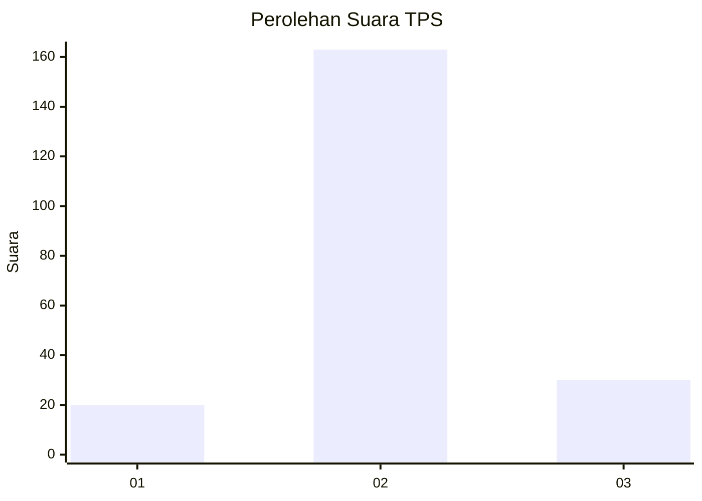
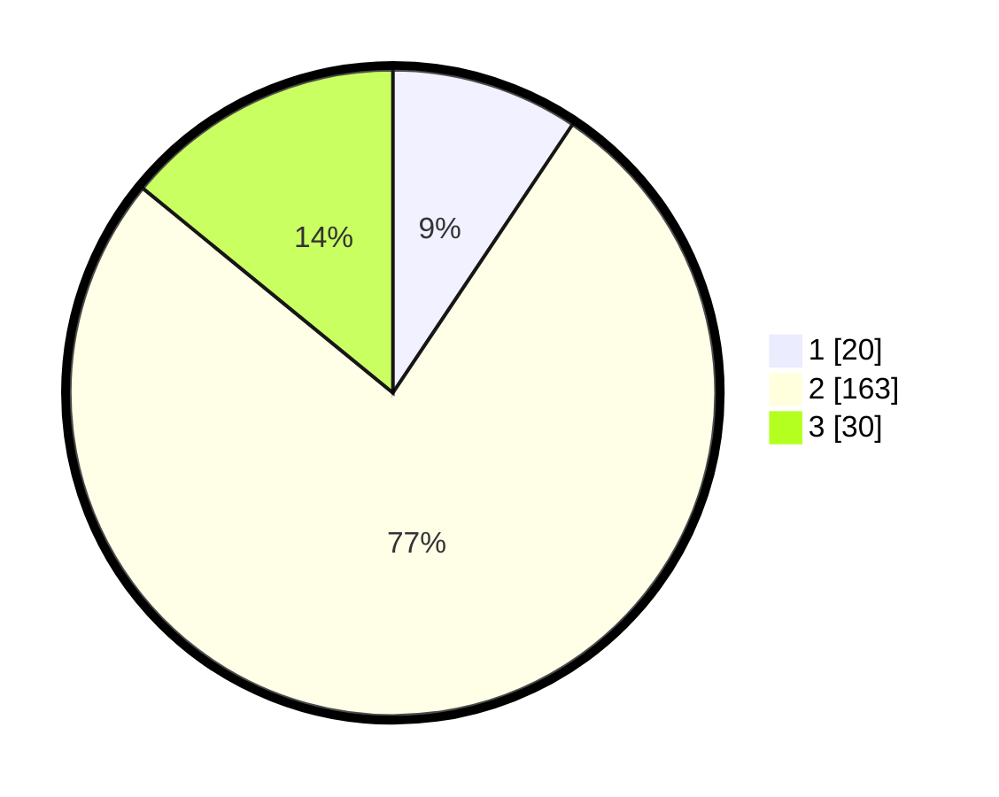

# Hasil

## Grafik

## Tabel

| No. | Nama Paslon    | Suara | Suara (raw) | Persentase |
|:--- |:-------------- | -----:| -----------:| ----------:|
| 1   | ANIES MUHAIMIN | 20    | [20][p-1]   | 9,39       |
| 2   | PRABOWO GIBRAN | 163   | [163][p-2]  | 76,53      |
| 3   | GANJAR MAHFUD  | 30    | [30][p-3]   | 14,08      |

[p-1]: https://github.com/gigit-pemilu/pemilu-2024/blob/main/pilpres/hitung-suara/sub/35-jawa-timur/sub/07-malang/sub/26-pujon/sub/2005-pujon-lor/sub/006-tps/sub/paslon-1.txt
[p-2]: https://github.com/gigit-pemilu/pemilu-2024/blob/main/pilpres/hitung-suara/sub/35-jawa-timur/sub/07-malang/sub/26-pujon/sub/2005-pujon-lor/sub/006-tps/sub/paslon-2.txt
[p-3]: https://github.com/gigit-pemilu/pemilu-2024/blob/main/pilpres/hitung-suara/sub/35-jawa-timur/sub/07-malang/sub/26-pujon/sub/2005-pujon-lor/sub/006-tps/sub/paslon-3.txt

## Foto C Plano

https://sirekap-obj-formc.kpu.go.id/3170/pemilu/ppwp/35/07/26/20/05/3507262005006-20240216-114639--9ce2bcc0-4bcc-4b6c-a704-4e282e0a2a69.jpg

https://sirekap-obj-formc.kpu.go.id/3170/pemilu/ppwp/35/07/26/20/05/3507262005006-20240218-190829--640a33ba-50d8-4e14-b004-13fa9b4d946f.jpg

https://sirekap-obj-formc.kpu.go.id/3170/pemilu/ppwp/35/07/26/20/05/3507262005006-20240218-103616--ce5bb54e-0298-4008-9c48-cc342346d77a.jpg

## Metadata

| Key        | Value               |
| ---------- | ------------------- |
| Time Stamp | 2024-02-19 06:16:00 |

