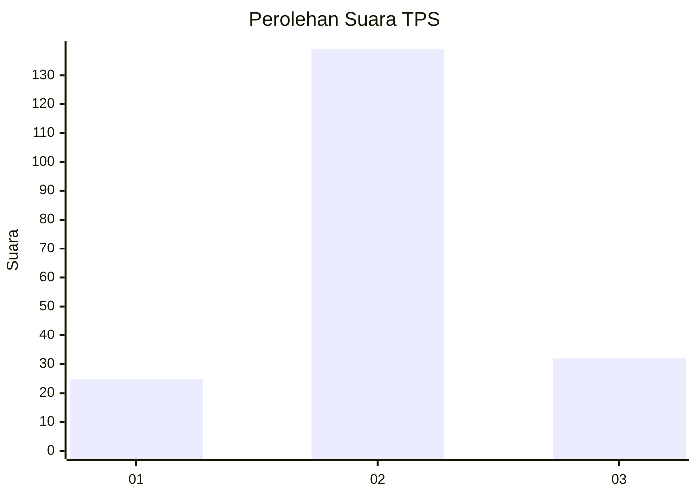
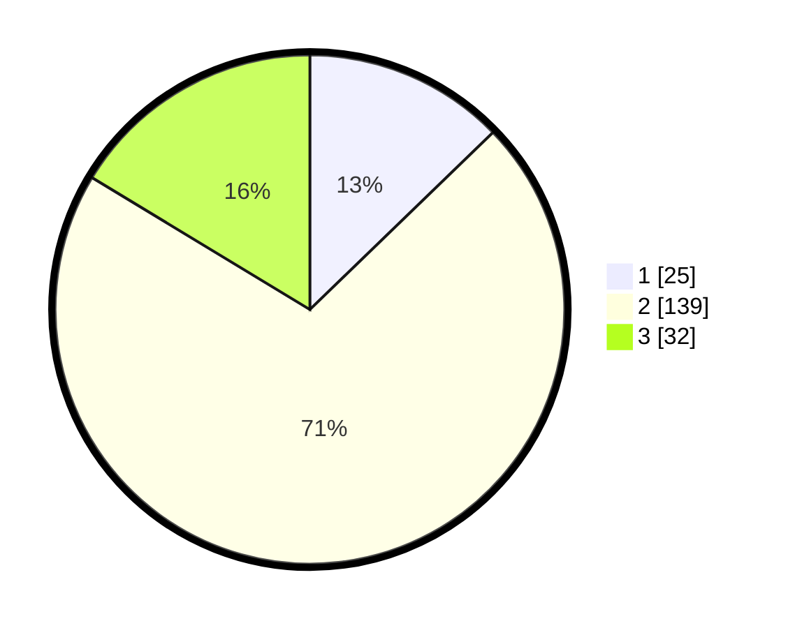

# Hasil

## Grafik

## Tabel

| No. | Nama Paslon    | Suara | Suara (raw) | Persentase |
|:--- |:-------------- | -----:| -----------:| ----------:|
| 1   | ANIES MUHAIMIN | 25    | [25][p-1]   | 12,76      |
| 2   | PRABOWO GIBRAN | 139   | [139][p-2]  | 70,92      |
| 3   | GANJAR MAHFUD  | 32    | [32][p-3]   | 16,33      |

[p-1]: https://github.com/gigit-pemilu/pemilu-2024/blob/main/pilpres/hitung-suara/sub/35-jawa-timur/sub/07-malang/sub/26-pujon/sub/2007-ngabab/sub/004-tps/sub/paslon-1.txt
[p-2]: https://github.com/gigit-pemilu/pemilu-2024/blob/main/pilpres/hitung-suara/sub/35-jawa-timur/sub/07-malang/sub/26-pujon/sub/2007-ngabab/sub/004-tps/sub/paslon-2.txt
[p-3]: https://github.com/gigit-pemilu/pemilu-2024/blob/main/pilpres/hitung-suara/sub/35-jawa-timur/sub/07-malang/sub/26-pujon/sub/2007-ngabab/sub/004-tps/sub/paslon-3.txt

## Foto C Plano

https://sirekap-obj-formc.kpu.go.id/c14c/pemilu/ppwp/35/07/26/20/07/3507262007004-20240214-191107--4da18fea-b78b-4a45-8b1f-e4d184c6bad4.jpg

https://sirekap-obj-formc.kpu.go.id/c14c/pemilu/ppwp/35/07/26/20/07/3507262007004-20240214-191122--cc41fa84-ed5e-4b11-ad87-ee8d0d8bb261.jpg

https://sirekap-obj-formc.kpu.go.id/c14c/pemilu/ppwp/35/07/26/20/07/3507262007004-20240214-191131--a7dd8ac3-fb56-40ab-ba0c-c9ed3d187ced.jpg

## Metadata

| Key        | Value               |
| ---------- | ------------------- |
| Time Stamp | 2024-02-17 11:00:02 |

