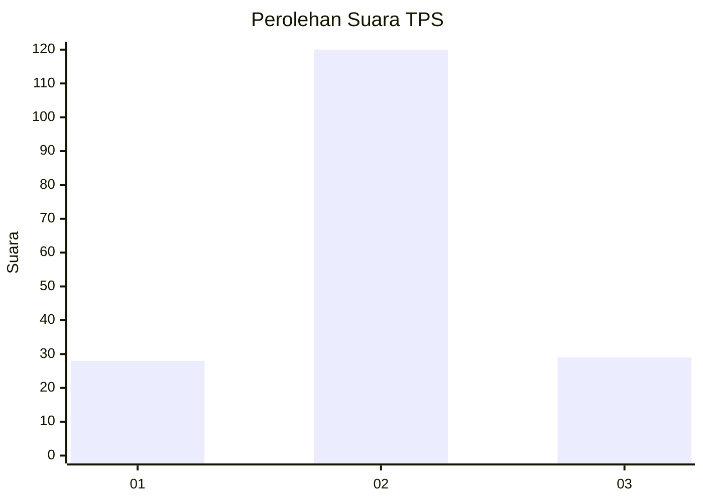
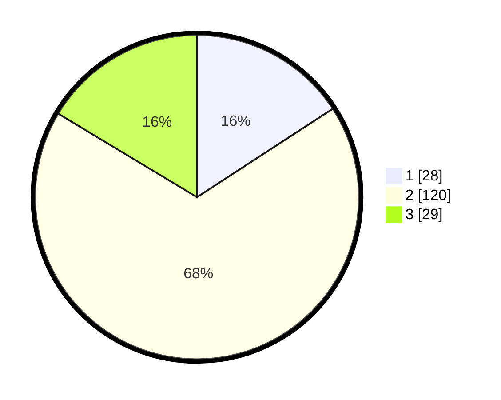

# Hasil

## Grafik

## Tabel

| No. | Nama Paslon    | Suara | Suara (raw) | Persentase |
|:--- |:-------------- | -----:| -----------:| ----------:|
| 1   | ANIES MUHAIMIN | 28    | [28][p-1]   | 15,82      |
| 2   | PRABOWO GIBRAN | 120   | [120][p-2]  | 67,80      |
| 3   | GANJAR MAHFUD  | 29    | [29][p-3]   | 16,38      |

[p-1]: https://github.com/gigit-pemilu/pemilu-2024/blob/main/pilpres/hitung-suara/sub/35-jawa-timur/sub/07-malang/sub/26-pujon/sub/2007-ngabab/sub/008-tps/sub/paslon-1.txt
[p-2]: https://github.com/gigit-pemilu/pemilu-2024/blob/main/pilpres/hitung-suara/sub/35-jawa-timur/sub/07-malang/sub/26-pujon/sub/2007-ngabab/sub/008-tps/sub/paslon-2.txt
[p-3]: https://github.com/gigit-pemilu/pemilu-2024/blob/main/pilpres/hitung-suara/sub/35-jawa-timur/sub/07-malang/sub/26-pujon/sub/2007-ngabab/sub/008-tps/sub/paslon-3.txt

## Foto C Plano

https://sirekap-obj-formc.kpu.go.id/62d1/pemilu/ppwp/35/07/26/20/07/3507262007008-20240214-215435--8ea433a4-bf4a-4fa4-a3c2-62252488efa6.jpg

https://sirekap-obj-formc.kpu.go.id/62d1/pemilu/ppwp/35/07/26/20/07/3507262007008-20240214-205934--d7829f55-8c8b-494f-862b-49eab91f07d1.jpg

https://sirekap-obj-formc.kpu.go.id/62d1/pemilu/ppwp/35/07/26/20/07/3507262007008-20240214-215537--a74b0d48-6136-4ffe-b7da-043e13dc9ea9.jpg

## Metadata

| Key        | Value               |
| ---------- | ------------------- |
| Time Stamp | 2024-02-17 10:00:02 |

