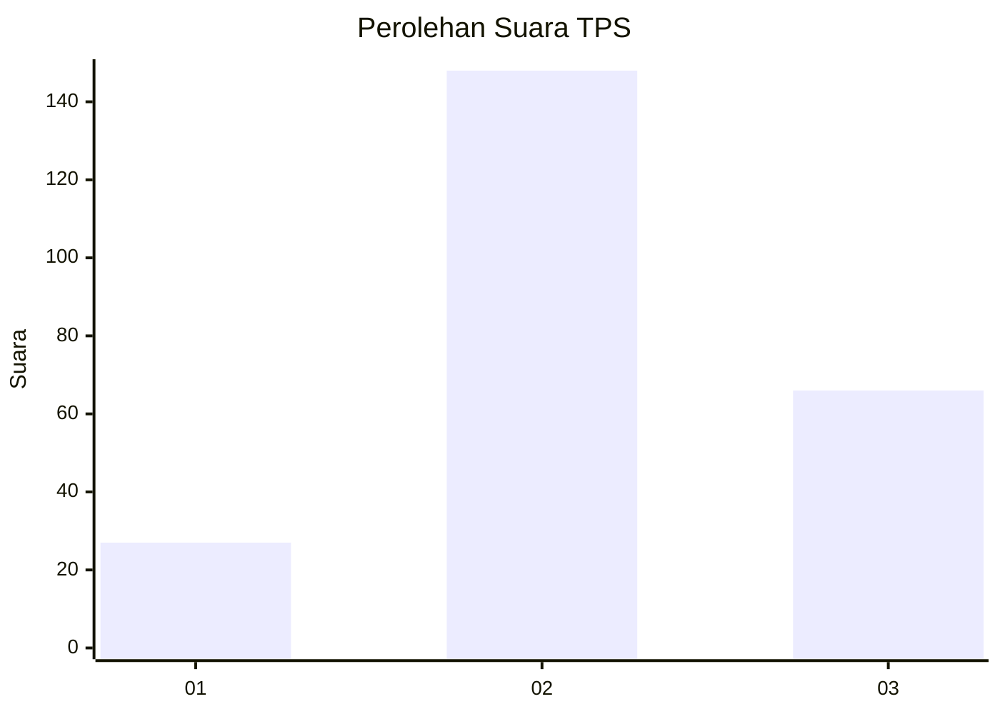
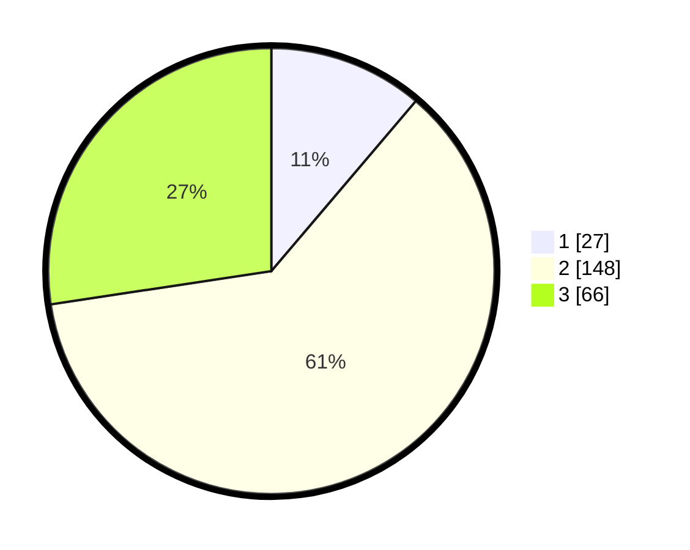

# Hasil

## Grafik

## Tabel

| No. | Nama Paslon    | Suara | Suara (raw) | Persentase |
|:--- |:-------------- | -----:| -----------:| ----------:|
| 1   | ANIES MUHAIMIN | 27    | [27][p-1]   | 11,20      |
| 2   | PRABOWO GIBRAN | 148   | [148][p-2]  | 61,41      |
| 3   | GANJAR MAHFUD  | 66    | [66][p-3]   | 27,39      |

[p-1]: https://github.com/gigit-pemilu/pemilu-2024/blob/main/pilpres/hitung-suara/sub/35-jawa-timur/sub/07-malang/sub/26-pujon/sub/2008-tawangsari/sub/011-tps/sub/paslon-1.txt
[p-2]: https://github.com/gigit-pemilu/pemilu-2024/blob/main/pilpres/hitung-suara/sub/35-jawa-timur/sub/07-malang/sub/26-pujon/sub/2008-tawangsari/sub/011-tps/sub/paslon-2.txt
[p-3]: https://github.com/gigit-pemilu/pemilu-2024/blob/main/pilpres/hitung-suara/sub/35-jawa-timur/sub/07-malang/sub/26-pujon/sub/2008-tawangsari/sub/011-tps/sub/paslon-3.txt

## Foto C Plano

https://sirekap-obj-formc.kpu.go.id/90f7/pemilu/ppwp/35/07/26/20/08/3507262008011-20240218-153350--4765629a-d064-45c5-b633-3519386f08a2.jpg

https://sirekap-obj-formc.kpu.go.id/90f7/pemilu/ppwp/35/07/26/20/08/3507262008011-20240218-154046--dd7b6368-0e7b-4f19-b810-89fa75e98908.jpg

https://sirekap-obj-formc.kpu.go.id/90f7/pemilu/ppwp/35/07/26/20/08/3507262008011-20240218-154139--fa22bf29-e7c6-48c6-aab7-c3965ec1fe33.jpg

## Metadata

| Key        | Value               |
| ---------- | ------------------- |
| Time Stamp | 2024-02-19 06:16:00 |

