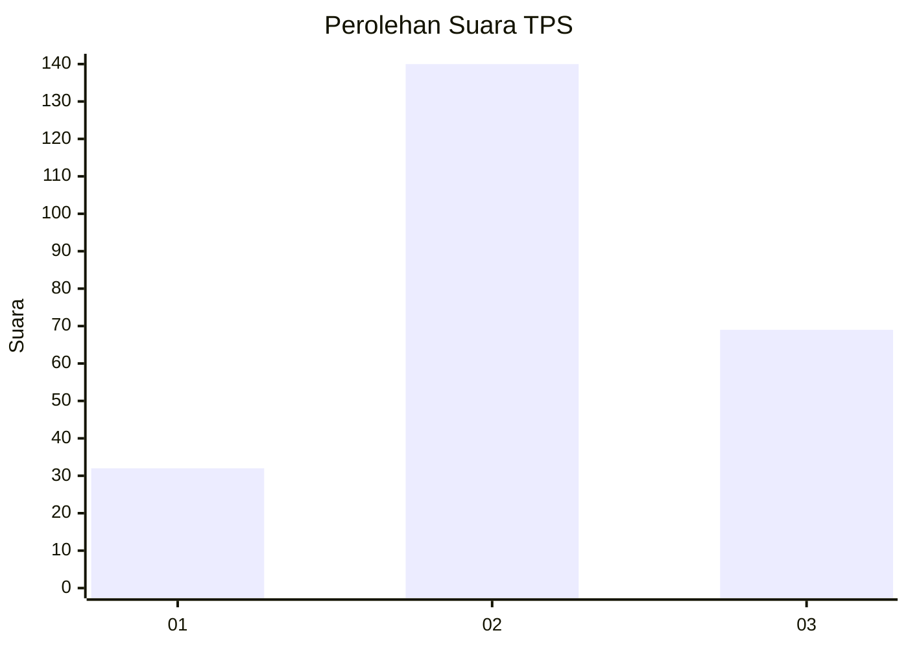
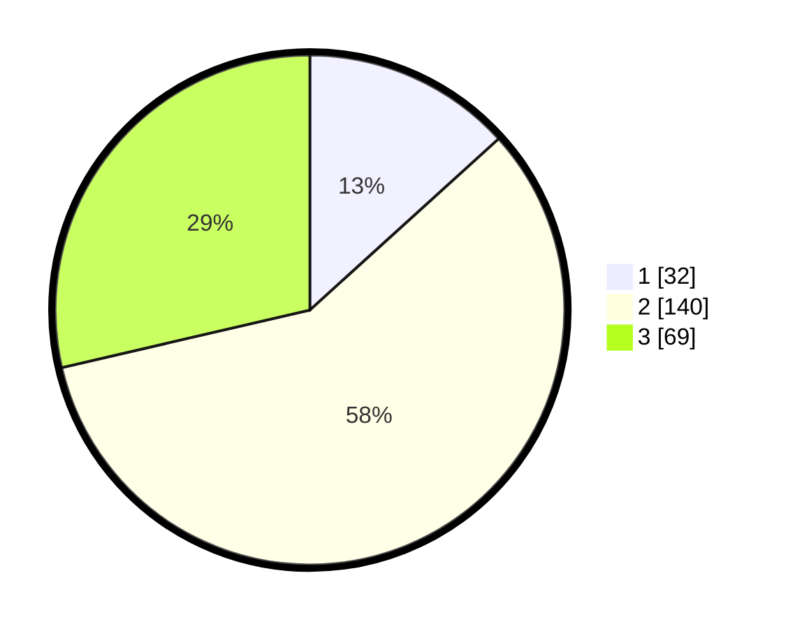

# Hasil

## Grafik

## Tabel

| No. | Nama Paslon    | Suara | Suara (raw) | Persentase |
|:--- |:-------------- | -----:| -----------:| ----------:|
| 1   | ANIES MUHAIMIN | 32    | [32][p-1]   | 13,28      |
| 2   | PRABOWO GIBRAN | 140   | [140][p-2]  | 58,09      |
| 3   | GANJAR MAHFUD  | 69    | [69][p-3]   | 28,63      |

[p-1]: https://github.com/gigit-pemilu/pemilu-2024-35-jawa-timur/blob/main/pilpres/hitung-suara/sub/35-jawa-timur/sub/07-malang/sub/26-pujon/sub/2008-tawangsari/sub/012-tps/sub/paslon-1.txt
[p-2]: https://github.com/gigit-pemilu/pemilu-2024-35-jawa-timur/blob/main/pilpres/hitung-suara/sub/35-jawa-timur/sub/07-malang/sub/26-pujon/sub/2008-tawangsari/sub/012-tps/sub/paslon-2.txt
[p-3]: https://github.com/gigit-pemilu/pemilu-2024-35-jawa-timur/blob/main/pilpres/hitung-suara/sub/35-jawa-timur/sub/07-malang/sub/26-pujon/sub/2008-tawangsari/sub/012-tps/sub/paslon-3.txt

## Foto C Plano

https://sirekap-obj-formc.kpu.go.id/cad4/pemilu/ppwp/35/07/26/20/08/3507262008012-20240218-084304--79fdcb44-4de6-43be-8008-69b3d76f6c81.jpg

https://sirekap-obj-formc.kpu.go.id/cad4/pemilu/ppwp/35/07/26/20/08/3507262008012-20240215-021248--4891d707-bb89-440c-9957-d25e32c5019a.jpg

https://sirekap-obj-formc.kpu.go.id/cad4/pemilu/ppwp/35/07/26/20/08/3507262008012-20240215-021257--fb96125e-924a-49ce-90d9-41bfb8d47919.jpg

## Metadata

| Key        | Value               |
| ---------- | ------------------- |
| Time Stamp | 2024-02-19 06:16:00 |

