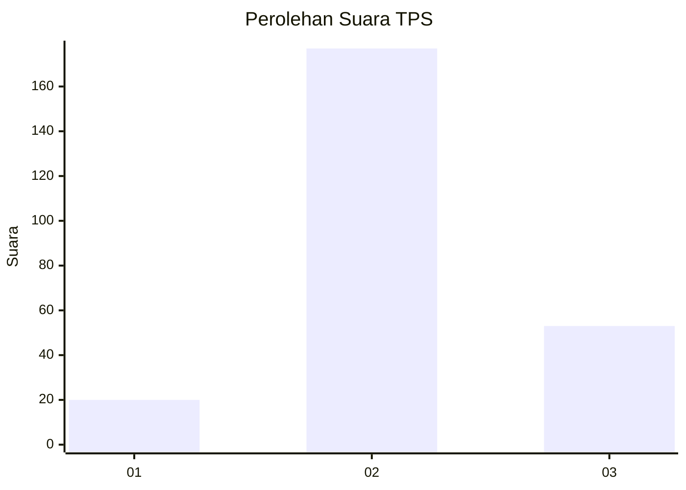
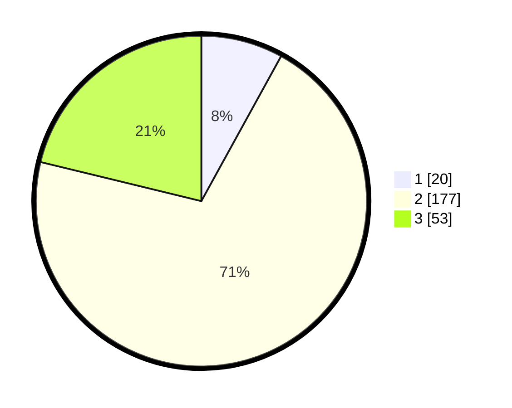

# Hasil

## Grafik

## Tabel

| No. | Nama Paslon    | Suara | Suara (raw) | Persentase |
|:--- |:-------------- | -----:| -----------:| ----------:|
| 1   | ANIES MUHAIMIN | 20    | [20][p-1]   | 8,00       |
| 2   | PRABOWO GIBRAN | 177   | [177][p-2]  | 70,80      |
| 3   | GANJAR MAHFUD  | 53    | [53][p-3]   | 21,20      |

[p-1]: https://github.com/gigit-pemilu/pemilu-2024/blob/main/pilpres/hitung-suara/sub/35-jawa-timur/sub/07-malang/sub/26-pujon/sub/2009-madiredo/sub/001-tps/sub/paslon-1.txt
[p-2]: https://github.com/gigit-pemilu/pemilu-2024/blob/main/pilpres/hitung-suara/sub/35-jawa-timur/sub/07-malang/sub/26-pujon/sub/2009-madiredo/sub/001-tps/sub/paslon-2.txt
[p-3]: https://github.com/gigit-pemilu/pemilu-2024/blob/main/pilpres/hitung-suara/sub/35-jawa-timur/sub/07-malang/sub/26-pujon/sub/2009-madiredo/sub/001-tps/sub/paslon-3.txt

## Foto C Plano

https://sirekap-obj-formc.kpu.go.id/bb3c/pemilu/ppwp/35/07/26/20/09/3507262009001-20240217-174529--774922dc-c6f3-4393-b252-fd676741d18c.jpg

https://sirekap-obj-formc.kpu.go.id/bb3c/pemilu/ppwp/35/07/26/20/09/3507262009001-20240217-174833--cf56d5c3-52c2-4097-9a1d-42cdc93ca0d3.jpg

## Metadata

| Key        | Value               |
| ---------- | ------------------- |
| Time Stamp | 2024-02-17 18:00:00 |

