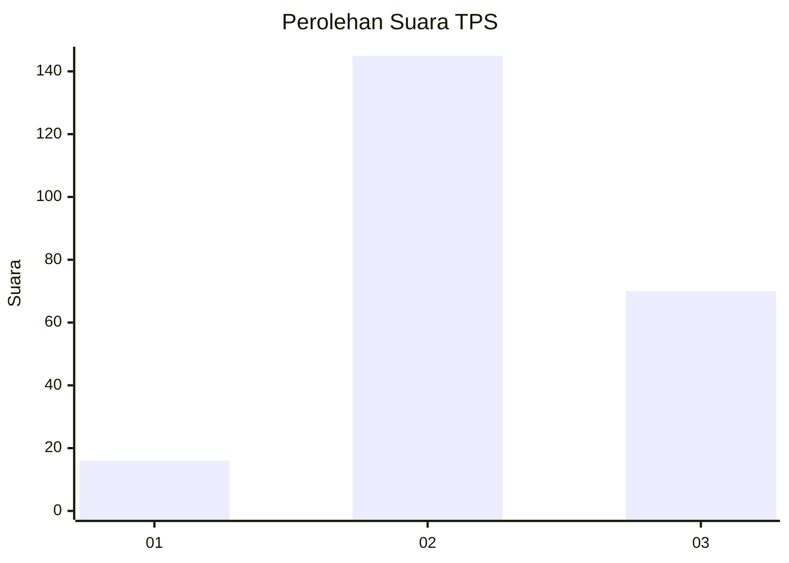
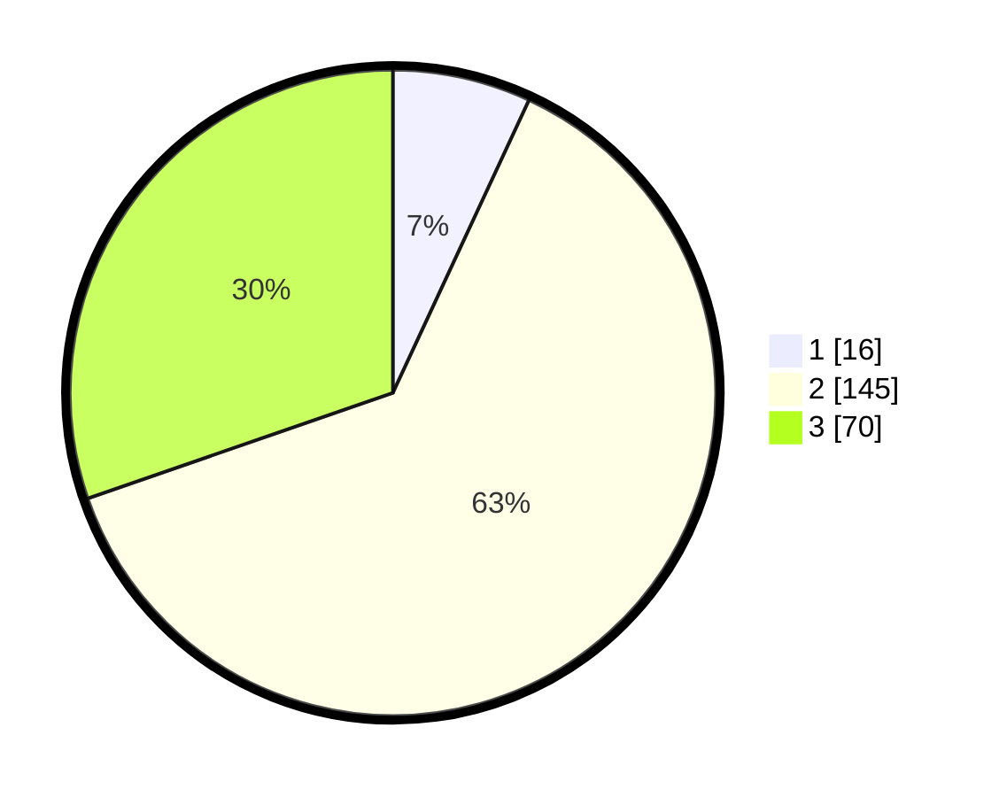

# Hasil

## Grafik

## Tabel

| No. | Nama Paslon    | Suara | Suara (raw) | Persentase |
|:--- |:-------------- | -----:| -----------:| ----------:|
| 1   | ANIES MUHAIMIN | 16    | [16][p-1]   | 6,93       |
| 2   | PRABOWO GIBRAN | 145   | [145][p-2]  | 62,77      |
| 3   | GANJAR MAHFUD  | 70    | [70][p-3]   | 30,30      |

[p-1]: https://github.com/gigit-pemilu/pemilu-2024/blob/main/pilpres/hitung-suara/sub/35-jawa-timur/sub/07-malang/sub/26-pujon/sub/2009-madiredo/sub/002-tps/sub/paslon-1.txt
[p-2]: https://github.com/gigit-pemilu/pemilu-2024/blob/main/pilpres/hitung-suara/sub/35-jawa-timur/sub/07-malang/sub/26-pujon/sub/2009-madiredo/sub/002-tps/sub/paslon-2.txt
[p-3]: https://github.com/gigit-pemilu/pemilu-2024/blob/main/pilpres/hitung-suara/sub/35-jawa-timur/sub/07-malang/sub/26-pujon/sub/2009-madiredo/sub/002-tps/sub/paslon-3.txt

## Foto C Plano

https://sirekap-obj-formc.kpu.go.id/0a27/pemilu/ppwp/35/07/26/20/09/3507262009002-20240214-235951--c3418092-e529-4c04-813b-0c8c8baa1d7b.jpg

https://sirekap-obj-formc.kpu.go.id/0a27/pemilu/ppwp/35/07/26/20/09/3507262009002-20240215-000115--50f8b7f0-6b77-410a-bbdb-6b5112cf9e9d.jpg

https://sirekap-obj-formc.kpu.go.id/0a27/pemilu/ppwp/35/07/26/20/09/3507262009002-20240215-000220--7d50fb91-2fcd-4e67-bbcb-9236da296ab9.jpg

## Metadata

| Key        | Value               |
| ---------- | ------------------- |
| Time Stamp | 2024-02-17 10:30:03 |

