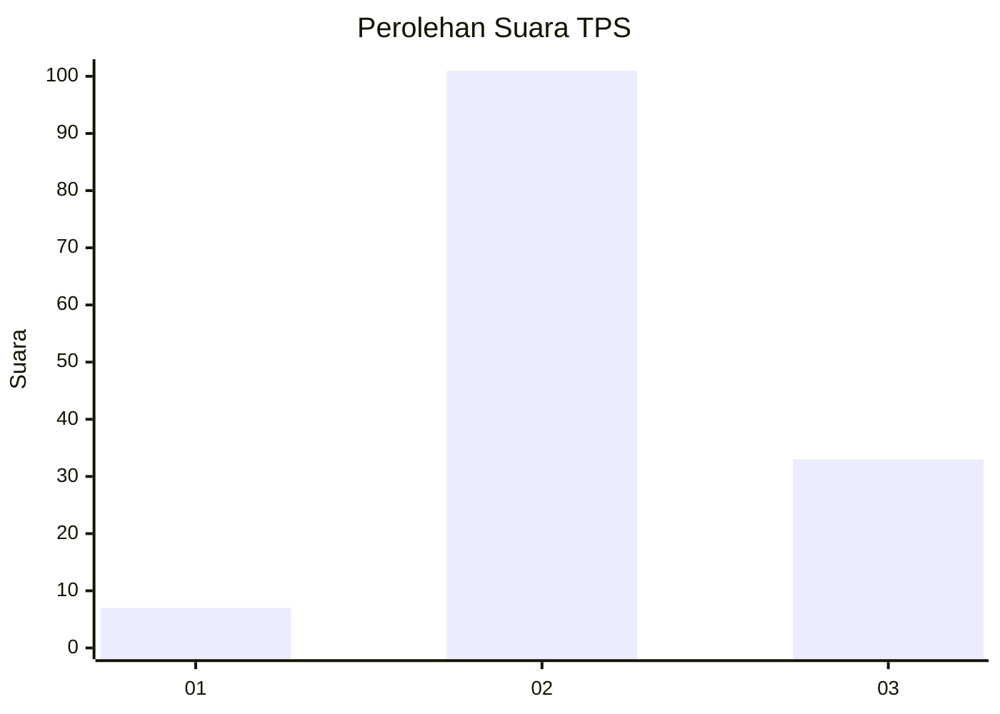
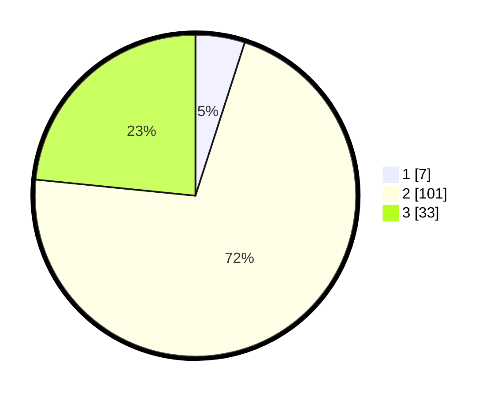

# Hasil

## Grafik

## Tabel

| No. | Nama Paslon    | Suara | Suara (raw) | Persentase |
|:--- |:-------------- | -----:| -----------:| ----------:|
| 1   | ANIES MUHAIMIN | 7     | [7][p-1]    | 4,96       |
| 2   | PRABOWO GIBRAN | 101   | [101][p-2]  | 71,63      |
| 3   | GANJAR MAHFUD  | 33    | [33][p-3]   | 23,40      |

[p-1]: https://github.com/gigit-pemilu/pemilu-2024-35-jawa-timur/blob/main/pilpres/hitung-suara/sub/35-jawa-timur/sub/07-malang/sub/27-ngantang/sub/2007-pandansari/sub/014-tps/sub/paslon-1.txt
[p-2]: https://github.com/gigit-pemilu/pemilu-2024-35-jawa-timur/blob/main/pilpres/hitung-suara/sub/35-jawa-timur/sub/07-malang/sub/27-ngantang/sub/2007-pandansari/sub/014-tps/sub/paslon-2.txt
[p-3]: https://github.com/gigit-pemilu/pemilu-2024-35-jawa-timur/blob/main/pilpres/hitung-suara/sub/35-jawa-timur/sub/07-malang/sub/27-ngantang/sub/2007-pandansari/sub/014-tps/sub/paslon-3.txt

## Foto C Plano

https://sirekap-obj-formc.kpu.go.id/1127/pemilu/ppwp/35/07/27/20/07/3507272007014-20240301-222735--8dd84a53-2102-4c22-a54b-6c7c4e9dcb3e.jpg

https://sirekap-obj-formc.kpu.go.id/1127/pemilu/ppwp/35/07/27/20/07/3507272007014-20240214-194134--70b58236-5abf-4854-995c-3ae25941deb4.jpg

https://sirekap-obj-formc.kpu.go.id/1127/pemilu/ppwp/35/07/27/20/07/3507272007014-20240214-194103--412440df-cf7a-416e-a0fc-f0ad9d50677e.jpg

## Metadata

| Key        | Value               |
| ---------- | ------------------- |
| Time Stamp | 2024-03-01 23:00:00 |

