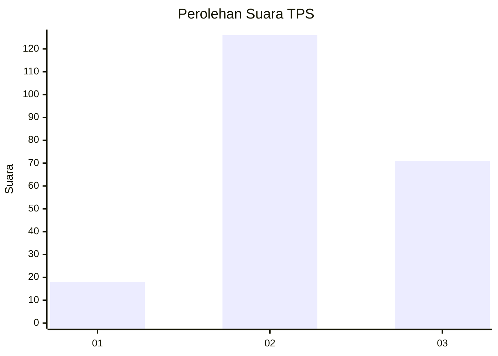
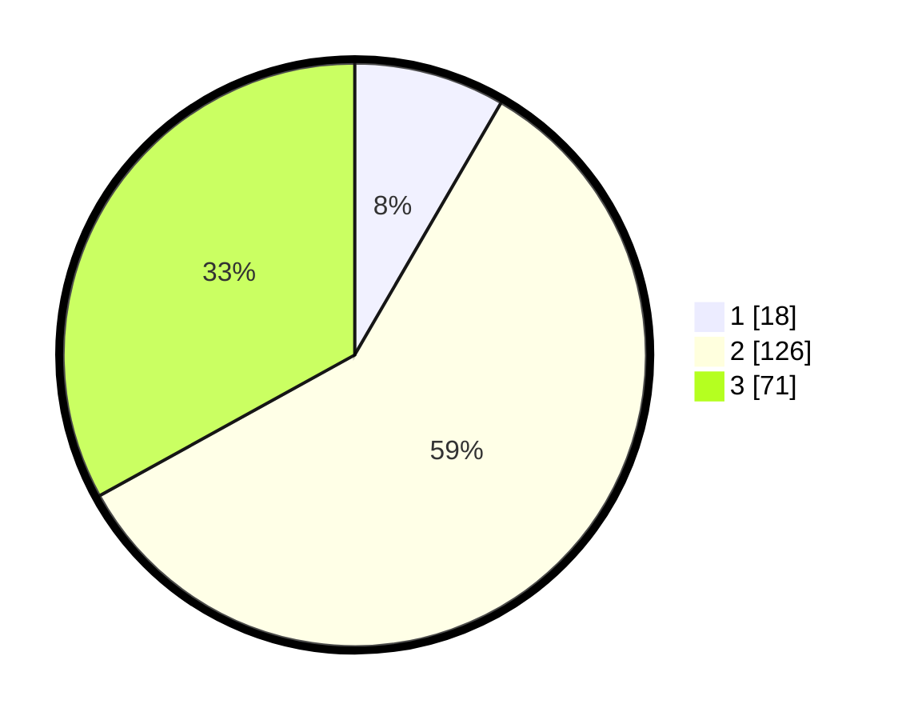

# Hasil

## Grafik

## Tabel

| No. | Nama Paslon    | Suara | Suara (raw) | Persentase |
|:--- |:-------------- | -----:| -----------:| ----------:|
| 1   | ANIES MUHAIMIN | 18    | [18][p-1]   | 8,37       |
| 2   | PRABOWO GIBRAN | 126   | [126][p-2]  | 58,60      |
| 3   | GANJAR MAHFUD  | 71    | [71][p-3]   | 33,02      |

[p-1]: https://github.com/gigit-pemilu/pemilu-2024/blob/main/pilpres/hitung-suara/sub/35-jawa-timur/sub/07-malang/sub/29-gedangan/sub/2001-sidodadi/sub/002-tps/sub/paslon-1.txt
[p-2]: https://github.com/gigit-pemilu/pemilu-2024/blob/main/pilpres/hitung-suara/sub/35-jawa-timur/sub/07-malang/sub/29-gedangan/sub/2001-sidodadi/sub/002-tps/sub/paslon-2.txt
[p-3]: https://github.com/gigit-pemilu/pemilu-2024/blob/main/pilpres/hitung-suara/sub/35-jawa-timur/sub/07-malang/sub/29-gedangan/sub/2001-sidodadi/sub/002-tps/sub/paslon-3.txt

## Foto C Plano

https://sirekap-obj-formc.kpu.go.id/eef7/pemilu/ppwp/35/07/29/20/01/3507292001002-20240221-095526--738015b0-bc76-46e3-8dd3-71e3ad85a54c.jpg

https://sirekap-obj-formc.kpu.go.id/eef7/pemilu/ppwp/35/07/29/20/01/3507292001002-20240221-095720--013dad37-f967-46ea-9291-09367bb0bb85.jpg

https://sirekap-obj-formc.kpu.go.id/eef7/pemilu/ppwp/35/07/29/20/01/3507292001002-20240221-095800--70c2a8ae-28a0-41a4-bde4-9e2101c7e5d3.jpg

## Metadata

| Key        | Value               |
| ---------- | ------------------- |
| Time Stamp | 2024-02-24 22:31:28 |

