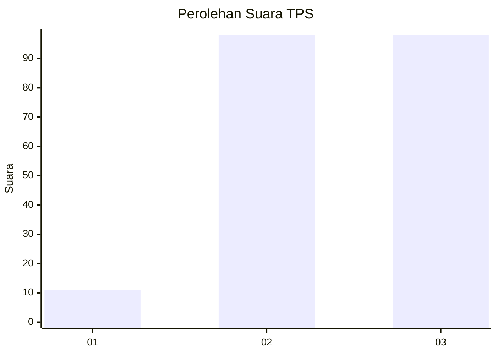
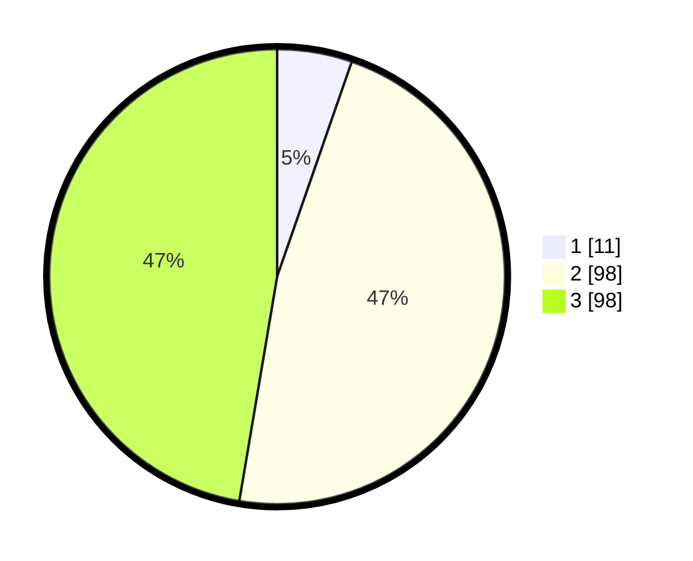

# Hasil

## Grafik

## Tabel

| No. | Nama Paslon    | Suara | Suara (raw) | Persentase |
|:--- |:-------------- | -----:| -----------:| ----------:|
| 1   | ANIES MUHAIMIN | 11    | [11][p-1]   | 5,31       |
| 2   | PRABOWO GIBRAN | 98    | [98][p-2]   | 47,34      |
| 3   | GANJAR MAHFUD  | 98    | [98][p-3]   | 47,34      |

[p-1]: https://github.com/gigit-pemilu/pemilu-2024/blob/main/pilpres/hitung-suara/sub/35-jawa-timur/sub/07-malang/sub/29-gedangan/sub/2001-sidodadi/sub/003-tps/sub/paslon-1.txt
[p-2]: https://github.com/gigit-pemilu/pemilu-2024/blob/main/pilpres/hitung-suara/sub/35-jawa-timur/sub/07-malang/sub/29-gedangan/sub/2001-sidodadi/sub/003-tps/sub/paslon-2.txt
[p-3]: https://github.com/gigit-pemilu/pemilu-2024/blob/main/pilpres/hitung-suara/sub/35-jawa-timur/sub/07-malang/sub/29-gedangan/sub/2001-sidodadi/sub/003-tps/sub/paslon-3.txt

## Foto C Plano

https://sirekap-obj-formc.kpu.go.id/9e98/pemilu/ppwp/35/07/29/20/01/3507292001003-20240221-104741--e270d128-40f3-4960-9d2e-82b37b5580e6.jpg

https://sirekap-obj-formc.kpu.go.id/9e98/pemilu/ppwp/35/07/29/20/01/3507292001003-20240221-104836--5040b819-0304-40d0-aaf6-7eb3dd930289.jpg

https://sirekap-obj-formc.kpu.go.id/9e98/pemilu/ppwp/35/07/29/20/01/3507292001003-20240221-104915--18d9258f-ba7c-4421-85d1-90333a7ae22c.jpg

## Metadata

| Key        | Value               |
| ---------- | ------------------- |
| Time Stamp | 2024-02-24 22:31:28 |

