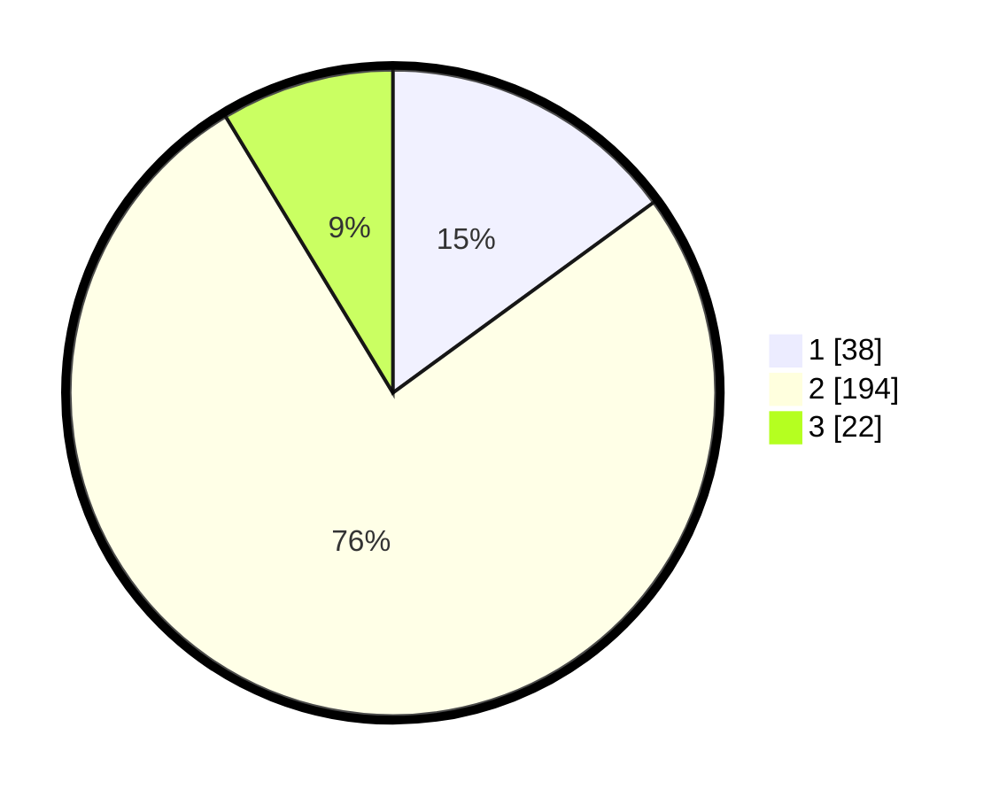

# Hasil

## Grafik

## Tabel

| No. | Nama Paslon    | Suara | Suara (raw) | Persentase |
|:--- |:-------------- | -----:| -----------:| ----------:|
| 1   | ANIES MUHAIMIN | 38    | [38][p-1]   | 14,96      |
| 2   | PRABOWO GIBRAN | 194   | [194][p-2]  | 76,38      |
| 3   | GANJAR MAHFUD  | 22    | [22][p-3]   | 8,66       |

[p-1]: https://github.com/gigit-pemilu/pemilu-2024-35-jawa-timur/blob/main/pilpres/hitung-suara/sub/35-jawa-timur/sub/07-malang/sub/29-gedangan/sub/2001-sidodadi/sub/004-tps/sub/paslon-1.txt
[p-2]: https://github.com/gigit-pemilu/pemilu-2024-35-jawa-timur/blob/main/pilpres/hitung-suara/sub/35-jawa-timur/sub/07-malang/sub/29-gedangan/sub/2001-sidodadi/sub/004-tps/sub/paslon-2.txt
[p-3]: https://github.com/gigit-pemilu/pemilu-2024-35-jawa-timur/blob/main/pilpres/hitung-suara/sub/35-jawa-timur/sub/07-malang/sub/29-gedangan/sub/2001-sidodadi/sub/004-tps/sub/paslon-3.txt

## Foto C Plano

https://sirekap-obj-formc.kpu.go.id/837d/pemilu/ppwp/35/07/29/20/01/3507292001004-20240218-181747--afb41717-1b6f-4c32-844b-8b12d31d5d4e.jpg

https://sirekap-obj-formc.kpu.go.id/837d/pemilu/ppwp/35/07/29/20/01/3507292001004-20240218-182431--d94a88e3-efca-43e8-93ab-8bde97cd317b.jpg

https://sirekap-obj-formc.kpu.go.id/837d/pemilu/ppwp/35/07/29/20/01/3507292001004-20240218-183030--fadfdffc-70ab-4983-b020-733842c3b71f.jpg

## Metadata

| Key        | Value               |
| ---------- | ------------------- |
| Time Stamp | 2024-02-19 23:00:00 |

## DATA PEMILIH TETAP

Jumlah pemilih dalam DPT: **260**.
 * L: **128**.
 * P: **132**.

## DATA PENGGUNA HAK PILIH

Jumlah pengguna hak pilih dalam DPT: **204**.
 * L: **106**.
 * P: **98**.

Jumlah pengguna hak pilih dalam DPTb: **0**.
 * L: **0**.
 * P: **0**.

Jumlah pengguna hak pilih dalam DPK: **56**.
 * L: **30**.
 * P: **26**.

Jumlah pengguna hak pilih: **260**.
 * L: **136**.
 * P: **124**.

## JUMLAH SUARA SAH DAN TIDAK SAH

JUMLAH SELURUH SUARA SAH: **254**.

JUMLAH SUARA TIDAK SAH: **6**.

JUMLAH SELURUH SUARA SAH DAN SUARA TIDAK SAH: **260**.

