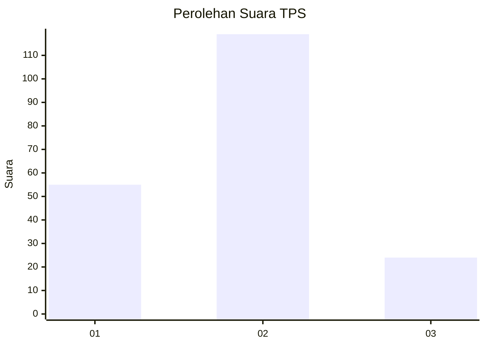
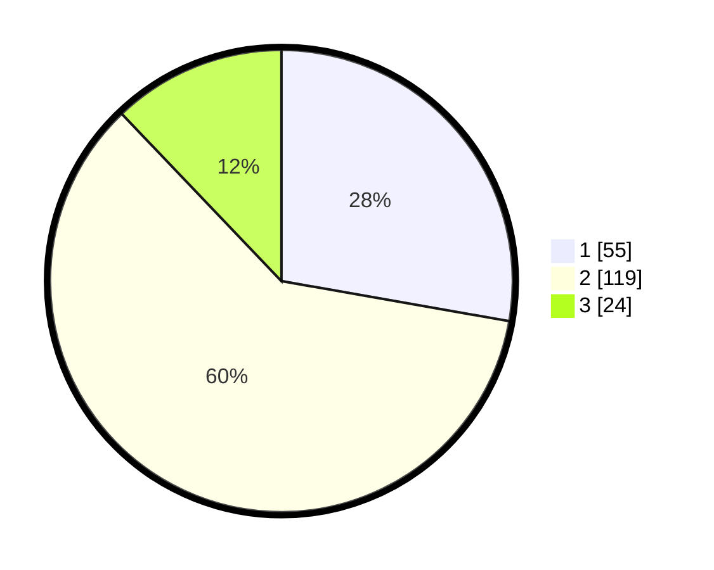

# Hasil

## Grafik

## Tabel

| No. | Nama Paslon    | Suara | Suara (raw) | Persentase |
|:--- |:-------------- | -----:| -----------:| ----------:|
| 1   | ANIES MUHAIMIN | 55    | [55][p-1]   | 27,78      |
| 2   | PRABOWO GIBRAN | 119   | [119][p-2]  | 60,10      |
| 3   | GANJAR MAHFUD  | 24    | [24][p-3]   | 12,12      |

[p-1]: https://github.com/gigit-pemilu/pemilu-2024-35-jawa-timur/blob/main/pilpres/hitung-suara/sub/35-jawa-timur/sub/07-malang/sub/29-gedangan/sub/2001-sidodadi/sub/005-tps/sub/paslon-1.txt
[p-2]: https://github.com/gigit-pemilu/pemilu-2024-35-jawa-timur/blob/main/pilpres/hitung-suara/sub/35-jawa-timur/sub/07-malang/sub/29-gedangan/sub/2001-sidodadi/sub/005-tps/sub/paslon-2.txt
[p-3]: https://github.com/gigit-pemilu/pemilu-2024-35-jawa-timur/blob/main/pilpres/hitung-suara/sub/35-jawa-timur/sub/07-malang/sub/29-gedangan/sub/2001-sidodadi/sub/005-tps/sub/paslon-3.txt

## Foto C Plano

https://sirekap-obj-formc.kpu.go.id/f118/pemilu/ppwp/35/07/29/20/01/3507292001005-20240221-134209--76b52363-0267-41c5-8e96-5e469cd9948a.jpg

https://sirekap-obj-formc.kpu.go.id/f118/pemilu/ppwp/35/07/29/20/01/3507292001005-20240221-134249--9065d3c8-9c80-4255-808a-34c65f8320c3.jpg

https://sirekap-obj-formc.kpu.go.id/f118/pemilu/ppwp/35/07/29/20/01/3507292001005-20240221-134332--30afebe7-1ea9-4862-b0cf-05c5354151b1.jpg

## Metadata

| Key        | Value               |
| ---------- | ------------------- |
| Time Stamp | 2024-02-25 15:00:00 |

