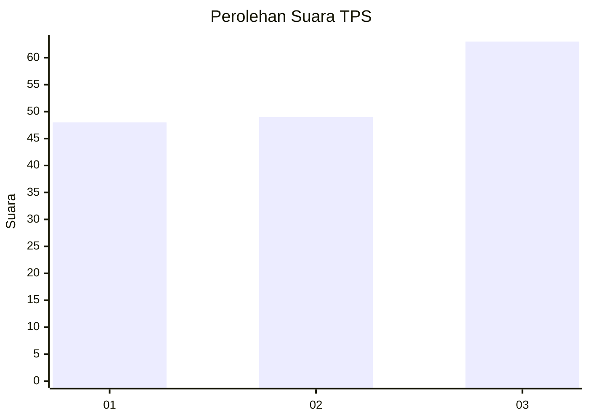
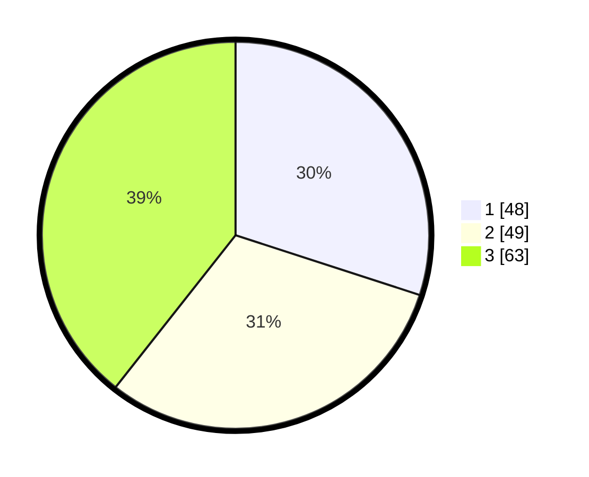

# Hasil

## Grafik

## Tabel

| No. | Nama Paslon    | Suara | Suara (raw) | Persentase |
|:--- |:-------------- | -----:| -----------:| ----------:|
| 1   | ANIES MUHAIMIN | 48    | [48][p-1]   | 30,00      |
| 2   | PRABOWO GIBRAN | 49    | [49][p-2]   | 30,63      |
| 3   | GANJAR MAHFUD  | 63    | [63][p-3]   | 39,38      |

[p-1]: https://github.com/gigit-pemilu/pemilu-2024-35-jawa-timur/blob/main/pilpres/hitung-suara/sub/35-jawa-timur/sub/07-malang/sub/29-gedangan/sub/2004-gedangan/sub/025-tps/sub/paslon-1.txt
[p-2]: https://github.com/gigit-pemilu/pemilu-2024-35-jawa-timur/blob/main/pilpres/hitung-suara/sub/35-jawa-timur/sub/07-malang/sub/29-gedangan/sub/2004-gedangan/sub/025-tps/sub/paslon-2.txt
[p-3]: https://github.com/gigit-pemilu/pemilu-2024-35-jawa-timur/blob/main/pilpres/hitung-suara/sub/35-jawa-timur/sub/07-malang/sub/29-gedangan/sub/2004-gedangan/sub/025-tps/sub/paslon-3.txt

## Foto C Plano

https://sirekap-obj-formc.kpu.go.id/1645/pemilu/ppwp/35/07/29/20/04/3507292004025-20240223-122609--20deec0f-db18-46b3-8f44-40a0e2dfba2f.jpg

https://sirekap-obj-formc.kpu.go.id/1645/pemilu/ppwp/35/07/29/20/04/3507292004025-20240223-122651--75278050-7a3d-4fd5-b323-cb892e35fe83.jpg

https://sirekap-obj-formc.kpu.go.id/1645/pemilu/ppwp/35/07/29/20/04/3507292004025-20240223-122725--694229d0-5a72-43c9-beea-9e2d9e829435.jpg

## Metadata

| Key        | Value               |
| ---------- | ------------------- |
| Time Stamp | 2024-02-24 22:31:28 |

## DATA PEMILIH TETAP

Jumlah pemilih dalam DPT: **1**.
 * L: **500**.
 * P: **50**.

## DATA PENGGUNA HAK PILIH

Jumlah pengguna hak pilih dalam DPT: **0**.
 * L: **5**.
 * P: **0**.

Jumlah pengguna hak pilih dalam DPTb: **550**.
 * L: **777**.
 * P: **755**.

Jumlah pengguna hak pilih dalam DPK: **77**.
 * L: **0**.
 * P: **0**.

Jumlah pengguna hak pilih: **230**.
 * L: **119**.
 * P: **111**.

## JUMLAH SUARA SAH DAN TIDAK SAH

JUMLAH SELURUH SUARA SAH: **220**.

JUMLAH SUARA TIDAK SAH: **10**.

JUMLAH SELURUH SUARA SAH DAN SUARA TIDAK SAH: **230**.

